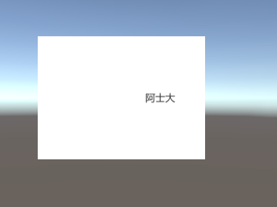
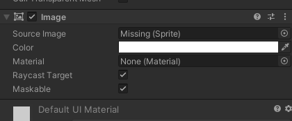

# A01-资源相关优化

- [纹理（Texture）优化]()
- [网格（Mesh）优化]()
- [动画（AnimationClip）优化]()
- [音频（AudioClip）优化]()
- [模型优化]()
- [材质（Material）优化]()
- [着色器优化（shader）]()
- [字体（Font）优化]()
- [文本（TextAsset）优化]()

纹理、网格、动画片段和音频片段是最容易造成较大内存开销的资源。

# 纹理（Texture）优化

以下来自[Unity 性能优化：资源篇](https://zhuanlan.zhihu.com/p/407249510)

纹理的资源优化主要集中于下面几点：

- 纹理大小
- 压缩格式
- 导入设置

需要遵循如下原则：

- 降低最大分辨率
- 采用二次幂压缩格式
- 制作纹理图集
- 取消勾选 Read/Write Enabled
- 禁用多余的Mip Map：Mip Map贴图在2D精灵和UI图形这类大小始终一直的纹理上并无用处

**1、降低最大分辨率**

**2、对于纹理的压缩**

注意：

除了由于压缩逻辑不同带来的加载带宽减少之外，同时还需要了解像ETC1、PVRTC4等这类在内存中不需要进行解压，而是可以直接被GPU支持，所以相比其他压缩格式通常会有最好的性能表现

**3、取消勾选Read/Write Enabled**

该功能是为了使得游戏开发者可以通过C#脚本调用对与图片的读取与写入的控制，很明显，这是由CPU来控制实现的，所以为了可以使得CPU获取数据，需要在内存中备份一份让CPU访问。同时为了图形渲染与显示，又会将其加载到显存中为GPU提供数据。简单来说，该选项会在游戏运行时，分别在CPU内存与GPU内存中备份出一张贴图，如果你并不需要对于纹理进行读写操作，可以尝试关闭该选项，这样就可以避免游戏运行时占用多余的内存

**4、禁用多余的Mip Map**

Mip Map类似于模型的LOD，同样是一种基于渲染距离改变渲染贴图精度的技术。其优势是在物体距离渲染距离比较远时，可以节省性能。但是使用Mip Map时会增大内存占用量。Mip map的技术原理是根据原始图进行2的幂次方的递减来生成一组不同精度的图片。当游戏运行时，会将这组图片加载到内存中，然后根据渲染的距离不同，来使用不同精度的图片。

**Mip map会增大多大的内存占用量呢**

在我们使用Mip map时，假设大小为256X256，并且会生成8张不同精度的图片。根据2的幂次方进行递减计算每张贴图大小并累加。这样最终得到的图片组的体积大概比原来的单张贴图大33%

而Unity所支持的纹理最小为32X32,也就是最小的纹理也会额外的产生三层低精度纹理：16X16、4X4、1X1，这就是为什么很多文章介绍到使用Map mip会说其大约会增加33%的内存占用量。虽然Mip map本身是一种性能优化的技术，但是在2D精灵或者UI元素这些不会改变渲染精度的纹理上，只会占用多余的内存，所以在2D精灵或者UI元素上使用纹理时记得不要勾选Mip map。

**5、打包图集**

图集的打包主要是优化UI图形渲染过程中Draw call的数量，其基本原理也是通过UI元素合批来减少Draw Call，进入提升CPU的性能表现

[你所需要了解的几种纹理压缩格式原理](https://blog.uwa4d.com/archives/USparkle_Texture.html)

[如何修复警告“只有宽度/高度为 4 的倍数的纹理才能压缩为 ETC2 格式”？](https://gamedev.stackexchange.com/questions/204769/how-to-fix-the-warning-only-textures-with-width-height-being-multiple-of-4-ca)

[精灵图集](https://docs.unity3d.com/cn/2020.3/Manual/class-SpriteAtlas.html)

[Unity之UGUI精灵图集(Sprite Atlas)保姆式教程](http://jingyan.idoubi.net/5318.html)

# 网格（Mesh）优化

1. Normal、Color和Tangent
    Mesh资源的数据会含有大量的Normal、Color和Tangent数据，这些数据将大幅增加Mesh资源的文件体积和内存占用，其中，Color数据和Normal数据主要为3DMax、Maya等建模软件导出时设置所生成，而Tangent一般为导入引擎时生成。
    更为麻烦的是，如果项目对Mesh进行Draw Call Batching操作的话，

# 动画（AnimationClip）优化

[Unity动画文件优化探究](https://blog.uwa4d.com/archives/Optimization_Animation.html)

[Unity性能优化 — 动画模块](https://blog.uwa4d.com/archives/UWA_ReportModule6.html)

[动画优化：关于AnimationClip的三两事](https://blog.uwa4d.com/archives/UWA_Pipeline22.html)

# 音频（AudioClip）优化

[Unity 音频优化总结](https://blog.csdn.net/chenfujun818/article/details/81710895)

[Unity音频优化实践](https://zhuanlan.zhihu.com/p/357031530)

# 模型优化

以下来自[Unity 性能优化：资源篇](https://zhuanlan.zhihu.com/p/407249510)

**1、禁用掉Reader/Write Enables:**

点击模型，可以在Inspector面板看到这些设置选项，类似于纹理，如果在游戏中，你不需要对模型进行修改，可以禁用掉Reader/Write Enables来避免数据的备份而占用多余的内存，我们可以在Unity官方文档中找到相关介绍：

翻译过来就是：

> 启用此选项后，Unity 会将 Mesh数据上传到 GPU可寻址内存，但也会将其保存在 CPU 可寻址内存中。这意味着Unity可以在运行时访问 Mesh数据，可以从脚本中访问它。
> 
> 
> 而禁用此选项后，Unity 会将 Mesh 数据上传到 GPU可寻址内存，然后将其从 CPU 可寻址内存中删除
> 
> 
> 默认情况下，此选项处于禁用状态。在大多数情况下，要节省运行时内存使用量，请禁用此选项
> 
> 
> 而对于模型本身来说，尽量避免模型留有多余的面数。尤其是移动端。因为高精度模型除了本身所带来的压力外，在其他方面也有诸多的性能挑战

注意：某些情况下禁用Reader/Write Enables会使得Mesh Collider不可用，具体信息在Unity官方文档中有提到：

**2、尽量不要勾选不需要的功能**

选项在Unity中，某些功能即使你未使用到，也会 消耗一定的资源去维护其状态。类似上面的Reader/Write Enables选项,所以用不到的功能我们可以考虑尽量的去禁用掉

**3、设置一些关于质量与性能的选项**

Unity提供了一些对模型进行优化的选项，可以查阅Unity官方文档来阅读了解他们，这里也简要的列出：

通过上面一张图片可以看出，影响模型表现与游戏性能的选项有下面几个：

- Mesh Compression：通过使用网格边界和每个组件较低的位深度来压缩网格数据，增加压缩率会降低网格的精度。最好在 Mesh 看起来与未压缩版本没有太大区别的情况下将其调得尽可能高。这对于优化游戏大小很有用
- Optimize Mesh：确定三角形在网格中列出的顺序以获得更好的 GPU 性能，默认都会勾选
- Normals:如果网格模型既不是法线贴图也不受实时光照影响，就选用None,这样也能够很好的提升性能表现

其实，Unity设置了一些通过程序控制模型质量来改变性能表现的选项，但是不建议使用，预期通过这些选项来调整性能表现，还不如直接让美术直接处理模型。毕竟他们更加专业，可以更好的保证模型的表现效果与性能表现的平衡。

**4、使用LOD**

关于LOD，其实应该在渲染这一段来讲，但是这个技术又与模型网格有很大的关系，所以提前介绍一下LOD即Levels of Detail，翻译过来就是多层次细节，类似与纹理渲染的Mip map技术，同样是一种根据渲染距离设置渲染精度的一种技术。其实现方式是在游戏开发时，美术根据不同的渲染距离制作一组不同精度的模型，导入到Unity通过LOD组件连接其这一组模型，并设置相关参数。这样在游戏运行时，就会在不同的距离有不同的渲染精度：

这是Unity官方文档的一个案例，可以看出，随着渲染距离的增加，渲染精度逐渐下降，直到最终被剔除，这样做的优势是保证游戏画面表现的同时，可以最大程度降低渲染压力。简单的理解，如果不采用LOD，随着距离增加，物体占用的屏幕像素就会越少，那么单位像素的三角面数就会越多。单位的渲染压力就会增大。画面表现需求不高的地方渲染压力反而更高，这显然是不合理的。所以就需要通过LOD来解决这样的问题。当然这种技术本身也是有相当大的缺陷的，首先就是会增大包体的体积，同时也会增加美术的工作量。所以在实际开发中，一般只会对一些重要的对象使用该技术

# 材质（Material）优化

# 着色器优化（shader）

[Shader：优化破解变体的“影分身”之术](https://zhuanlan.zhihu.com/p/337308829)

# 字体（Font）优化

# 文本（TextAsset）优化

%5BTOC%5D%0A%E7%BA%B9%E7%90%86%E3%80%81%E7%BD%91%E6%A0%BC%E3%80%81%E5%8A%A8%E7%94%BB%E7%89%87%E6%AE%B5%E5%92%8C%E9%9F%B3%E9%A2%91%E7%89%87%E6%AE%B5%E6%98%AF%E6%9C%80%E5%AE%B9%E6%98%93%E9%80%A0%E6%88%90%E8%BE%83%E5%A4%A7%E5%86%85%E5%AD%98%E5%BC%80%E9%94%80%E7%9A%84%E8%B5%84%E6%BA%90%E3%80%82%0A%23%20%E7%BA%B9%E7%90%86%EF%BC%88Texture%EF%BC%89%E4%BC%98%E5%8C%96%0A%E4%BB%A5%E4%B8%8B%E6%9D%A5%E8%87%AA%5BUnity%20%E6%80%A7%E8%83%BD%E4%BC%98%E5%8C%96%EF%BC%9A%E8%B5%84%E6%BA%90%E7%AF%87%5D(https%3A%2F%2Fzhuanlan.zhihu.com%2Fp%2F407249510)%0A%E7%BA%B9%E7%90%86%E7%9A%84%E8%B5%84%E6%BA%90%E4%BC%98%E5%8C%96%E4%B8%BB%E8%A6%81%E9%9B%86%E4%B8%AD%E4%BA%8E%E4%B8%8B%E9%9D%A2%E5%87%A0%E7%82%B9%EF%BC%9A%0A*%20%E7%BA%B9%E7%90%86%E5%A4%A7%E5%B0%8F%0A*%20%E5%8E%8B%E7%BC%A9%E6%A0%BC%E5%BC%8F%0A*%20%E5%AF%BC%E5%85%A5%E8%AE%BE%E7%BD%AE%0A%0A%E9%9C%80%E8%A6%81%E9%81%B5%E5%BE%AA%E5%A6%82%E4%B8%8B%E5%8E%9F%E5%88%99%EF%BC%9A%0A*%20%E9%99%8D%E4%BD%8E%E6%9C%80%E5%A4%A7%E5%88%86%E8%BE%A8%E7%8E%87%0A*%20%E9%87%87%E7%94%A8%E4%BA%8C%E6%AC%A1%E5%B9%82%E5%8E%8B%E7%BC%A9%E6%A0%BC%E5%BC%8F%0A*%20%E5%88%B6%E4%BD%9C%E7%BA%B9%E7%90%86%E5%9B%BE%E9%9B%86%0A*%20%E5%8F%96%E6%B6%88%E5%8B%BE%E9%80%89%20Read%2FWrite%20Enabled%0A*%20%E7%A6%81%E7%94%A8%E5%A4%9A%E4%BD%99%E7%9A%84Mip%20Map%EF%BC%9AMip%20Map%E8%B4%B4%E5%9B%BE%E5%9C%A82D%E7%B2%BE%E7%81%B5%E5%92%8CUI%E5%9B%BE%E5%BD%A2%E8%BF%99%E7%B1%BB%E5%A4%A7%E5%B0%8F%E5%A7%8B%E7%BB%88%E4%B8%80%E7%9B%B4%E7%9A%84%E7%BA%B9%E7%90%86%E4%B8%8A%E5%B9%B6%E6%97%A0%E7%94%A8%E5%A4%84%0A%0A**1%E3%80%81%E9%99%8D%E4%BD%8E%E6%9C%80%E5%A4%A7%E5%88%86%E8%BE%A8%E7%8E%87**%0A!%5B1b6a0b06684b02312fe83447bbba2536.png%5D(en-resource%3A%2F%2Fdatabase%2F1812%3A1)%0A**2%E3%80%81%E5%AF%B9%E4%BA%8E%E7%BA%B9%E7%90%86%E7%9A%84%E5%8E%8B%E7%BC%A9**%0A!%5Bfc10813d535e0e3e10063e6f1bf5995c.png%5D(en-resource%3A%2F%2Fdatabase%2F1814%3A1)%0A!%5B9b037fe144d1e8ff720467f254d1b919.png%5D(en-resource%3A%2F%2Fdatabase%2F1816%3A1)%0A%0A%E6%B3%A8%E6%84%8F%EF%BC%9A%0A%E9%99%A4%E4%BA%86%E7%94%B1%E4%BA%8E%E5%8E%8B%E7%BC%A9%E9%80%BB%E8%BE%91%E4%B8%8D%E5%90%8C%E5%B8%A6%E6%9D%A5%E7%9A%84%E5%8A%A0%E8%BD%BD%E5%B8%A6%E5%AE%BD%E5%87%8F%E5%B0%91%E4%B9%8B%E5%A4%96%EF%BC%8C%E5%90%8C%E6%97%B6%E8%BF%98%E9%9C%80%E8%A6%81%E4%BA%86%E8%A7%A3%E5%83%8FETC1%E3%80%81PVRTC4%E7%AD%89%E8%BF%99%E7%B1%BB%E5%9C%A8%E5%86%85%E5%AD%98%E4%B8%AD%E4%B8%8D%E9%9C%80%E8%A6%81%E8%BF%9B%E8%A1%8C%E8%A7%A3%E5%8E%8B%EF%BC%8C%E8%80%8C%E6%98%AF%E5%8F%AF%E4%BB%A5%E7%9B%B4%E6%8E%A5%E8%A2%ABGPU%E6%94%AF%E6%8C%81%EF%BC%8C%E6%89%80%E4%BB%A5%E7%9B%B8%E6%AF%94%E5%85%B6%E4%BB%96%E5%8E%8B%E7%BC%A9%E6%A0%BC%E5%BC%8F%E9%80%9A%E5%B8%B8%E4%BC%9A%E6%9C%89%E6%9C%80%E5%A5%BD%E7%9A%84%E6%80%A7%E8%83%BD%E8%A1%A8%E7%8E%B0%0A%0A**3%E3%80%81%E5%8F%96%E6%B6%88%E5%8B%BE%E9%80%89Read%2FWrite%20Enabled**%0A%E8%AF%A5%E5%8A%9F%E8%83%BD%E6%98%AF%E4%B8%BA%E4%BA%86%E4%BD%BF%E5%BE%97%E6%B8%B8%E6%88%8F%E5%BC%80%E5%8F%91%E8%80%85%E5%8F%AF%E4%BB%A5%E9%80%9A%E8%BF%87C%23%E8%84%9A%E6%9C%AC%E8%B0%83%E7%94%A8%E5%AF%B9%E4%B8%8E%E5%9B%BE%E7%89%87%E7%9A%84%E8%AF%BB%E5%8F%96%E4%B8%8E%E5%86%99%E5%85%A5%E7%9A%84%E6%8E%A7%E5%88%B6%EF%BC%8C%E5%BE%88%E6%98%8E%E6%98%BE%EF%BC%8C%E8%BF%99%E6%98%AF%E7%94%B1CPU%E6%9D%A5%E6%8E%A7%E5%88%B6%E5%AE%9E%E7%8E%B0%E7%9A%84%EF%BC%8C%E6%89%80%E4%BB%A5%E4%B8%BA%E4%BA%86%E5%8F%AF%E4%BB%A5%E4%BD%BF%E5%BE%97CPU%E8%8E%B7%E5%8F%96%E6%95%B0%E6%8D%AE%EF%BC%8C%E9%9C%80%E8%A6%81%E5%9C%A8%E5%86%85%E5%AD%98%E4%B8%AD%E5%A4%87%E4%BB%BD%E4%B8%80%E4%BB%BD%E8%AE%A9CPU%E8%AE%BF%E9%97%AE%E3%80%82%E5%90%8C%E6%97%B6%E4%B8%BA%E4%BA%86%E5%9B%BE%E5%BD%A2%E6%B8%B2%E6%9F%93%E4%B8%8E%E6%98%BE%E7%A4%BA%EF%BC%8C%E5%8F%88%E4%BC%9A%E5%B0%86%E5%85%B6%E5%8A%A0%E8%BD%BD%E5%88%B0%E6%98%BE%E5%AD%98%E4%B8%AD%E4%B8%BAGPU%E6%8F%90%E4%BE%9B%E6%95%B0%E6%8D%AE%E3%80%82%E7%AE%80%E5%8D%95%E6%9D%A5%E8%AF%B4%EF%BC%8C%E8%AF%A5%E9%80%89%E9%A1%B9%E4%BC%9A%E5%9C%A8%E6%B8%B8%E6%88%8F%E8%BF%90%E8%A1%8C%E6%97%B6%EF%BC%8C%E5%88%86%E5%88%AB%E5%9C%A8CPU%E5%86%85%E5%AD%98%E4%B8%8EGPU%E5%86%85%E5%AD%98%E4%B8%AD%E5%A4%87%E4%BB%BD%E5%87%BA%E4%B8%80%E5%BC%A0%E8%B4%B4%E5%9B%BE%EF%BC%8C%E5%A6%82%E6%9E%9C%E4%BD%A0%E5%B9%B6%E4%B8%8D%E9%9C%80%E8%A6%81%E5%AF%B9%E4%BA%8E%E7%BA%B9%E7%90%86%E8%BF%9B%E8%A1%8C%E8%AF%BB%E5%86%99%E6%93%8D%E4%BD%9C%EF%BC%8C%E5%8F%AF%E4%BB%A5%E5%B0%9D%E8%AF%95%E5%85%B3%E9%97%AD%E8%AF%A5%E9%80%89%E9%A1%B9%EF%BC%8C%E8%BF%99%E6%A0%B7%E5%B0%B1%E5%8F%AF%E4%BB%A5%E9%81%BF%E5%85%8D%E6%B8%B8%E6%88%8F%E8%BF%90%E8%A1%8C%E6%97%B6%E5%8D%A0%E7%94%A8%E5%A4%9A%E4%BD%99%E7%9A%84%E5%86%85%E5%AD%98%0A**4%E3%80%81%E7%A6%81%E7%94%A8%E5%A4%9A%E4%BD%99%E7%9A%84Mip%20Map**%0AMip%20Map%E7%B1%BB%E4%BC%BC%E4%BA%8E%E6%A8%A1%E5%9E%8B%E7%9A%84LOD%EF%BC%8C%E5%90%8C%E6%A0%B7%E6%98%AF%E4%B8%80%E7%A7%8D%E5%9F%BA%E4%BA%8E%E6%B8%B2%E6%9F%93%E8%B7%9D%E7%A6%BB%E6%94%B9%E5%8F%98%E6%B8%B2%E6%9F%93%E8%B4%B4%E5%9B%BE%E7%B2%BE%E5%BA%A6%E7%9A%84%E6%8A%80%E6%9C%AF%E3%80%82%E5%85%B6%E4%BC%98%E5%8A%BF%E6%98%AF%E5%9C%A8%E7%89%A9%E4%BD%93%E8%B7%9D%E7%A6%BB%E6%B8%B2%E6%9F%93%E8%B7%9D%E7%A6%BB%E6%AF%94%E8%BE%83%E8%BF%9C%E6%97%B6%EF%BC%8C%E5%8F%AF%E4%BB%A5%E8%8A%82%E7%9C%81%E6%80%A7%E8%83%BD%E3%80%82%E4%BD%86%E6%98%AF%E4%BD%BF%E7%94%A8Mip%20Map%E6%97%B6%E4%BC%9A%E5%A2%9E%E5%A4%A7%E5%86%85%E5%AD%98%E5%8D%A0%E7%94%A8%E9%87%8F%E3%80%82Mip%20map%E7%9A%84%E6%8A%80%E6%9C%AF%E5%8E%9F%E7%90%86%E6%98%AF%E6%A0%B9%E6%8D%AE%E5%8E%9F%E5%A7%8B%E5%9B%BE%E8%BF%9B%E8%A1%8C2%E7%9A%84%E5%B9%82%E6%AC%A1%E6%96%B9%E7%9A%84%E9%80%92%E5%87%8F%E6%9D%A5%E7%94%9F%E6%88%90%E4%B8%80%E7%BB%84%E4%B8%8D%E5%90%8C%E7%B2%BE%E5%BA%A6%E7%9A%84%E5%9B%BE%E7%89%87%E3%80%82%E5%BD%93%E6%B8%B8%E6%88%8F%E8%BF%90%E8%A1%8C%E6%97%B6%EF%BC%8C%E4%BC%9A%E5%B0%86%E8%BF%99%E7%BB%84%E5%9B%BE%E7%89%87%E5%8A%A0%E8%BD%BD%E5%88%B0%E5%86%85%E5%AD%98%E4%B8%AD%EF%BC%8C%E7%84%B6%E5%90%8E%E6%A0%B9%E6%8D%AE%E6%B8%B2%E6%9F%93%E7%9A%84%E8%B7%9D%E7%A6%BB%E4%B8%8D%E5%90%8C%EF%BC%8C%E6%9D%A5%E4%BD%BF%E7%94%A8%E4%B8%8D%E5%90%8C%E7%B2%BE%E5%BA%A6%E7%9A%84%E5%9B%BE%E7%89%87%E3%80%82%0A**Mip%20map%E4%BC%9A%E5%A2%9E%E5%A4%A7%E5%A4%9A%E5%A4%A7%E7%9A%84%E5%86%85%E5%AD%98%E5%8D%A0%E7%94%A8%E9%87%8F%E5%91%A2**%0A%E5%9C%A8%E6%88%91%E4%BB%AC%E4%BD%BF%E7%94%A8Mip%20map%E6%97%B6%EF%BC%8C%E5%81%87%E8%AE%BE%E5%A4%A7%E5%B0%8F%E4%B8%BA256X256%EF%BC%8C%E5%B9%B6%E4%B8%94%E4%BC%9A%E7%94%9F%E6%88%908%E5%BC%A0%E4%B8%8D%E5%90%8C%E7%B2%BE%E5%BA%A6%E7%9A%84%E5%9B%BE%E7%89%87%E3%80%82%E6%A0%B9%E6%8D%AE2%E7%9A%84%E5%B9%82%E6%AC%A1%E6%96%B9%E8%BF%9B%E8%A1%8C%E9%80%92%E5%87%8F%E8%AE%A1%E7%AE%97%E6%AF%8F%E5%BC%A0%E8%B4%B4%E5%9B%BE%E5%A4%A7%E5%B0%8F%E5%B9%B6%E7%B4%AF%E5%8A%A0%E3%80%82%E8%BF%99%E6%A0%B7%E6%9C%80%E7%BB%88%E5%BE%97%E5%88%B0%E7%9A%84%E5%9B%BE%E7%89%87%E7%BB%84%E7%9A%84%E4%BD%93%E7%A7%AF%E5%A4%A7%E6%A6%82%E6%AF%94%E5%8E%9F%E6%9D%A5%E7%9A%84%E5%8D%95%E5%BC%A0%E8%B4%B4%E5%9B%BE%E5%A4%A733%25%0A%E8%80%8CUnity%E6%89%80%E6%94%AF%E6%8C%81%E7%9A%84%E7%BA%B9%E7%90%86%E6%9C%80%E5%B0%8F%E4%B8%BA32X32%2C%E4%B9%9F%E5%B0%B1%E6%98%AF%E6%9C%80%E5%B0%8F%E7%9A%84%E7%BA%B9%E7%90%86%E4%B9%9F%E4%BC%9A%E9%A2%9D%E5%A4%96%E7%9A%84%E4%BA%A7%E7%94%9F%E4%B8%89%E5%B1%82%E4%BD%8E%E7%B2%BE%E5%BA%A6%E7%BA%B9%E7%90%86%EF%BC%9A16X16%E3%80%814X4%E3%80%811X1%EF%BC%8C%E8%BF%99%E5%B0%B1%E6%98%AF%E4%B8%BA%E4%BB%80%E4%B9%88%E5%BE%88%E5%A4%9A%E6%96%87%E7%AB%A0%E4%BB%8B%E7%BB%8D%E5%88%B0%E4%BD%BF%E7%94%A8Map%20mip%E4%BC%9A%E8%AF%B4%E5%85%B6%E5%A4%A7%E7%BA%A6%E4%BC%9A%E5%A2%9E%E5%8A%A033%25%E7%9A%84%E5%86%85%E5%AD%98%E5%8D%A0%E7%94%A8%E9%87%8F%E3%80%82%E8%99%BD%E7%84%B6Mip%20map%E6%9C%AC%E8%BA%AB%E6%98%AF%E4%B8%80%E7%A7%8D%E6%80%A7%E8%83%BD%E4%BC%98%E5%8C%96%E7%9A%84%E6%8A%80%E6%9C%AF%EF%BC%8C%E4%BD%86%E6%98%AF%E5%9C%A82D%E7%B2%BE%E7%81%B5%E6%88%96%E8%80%85UI%E5%85%83%E7%B4%A0%E8%BF%99%E4%BA%9B%E4%B8%8D%E4%BC%9A%E6%94%B9%E5%8F%98%E6%B8%B2%E6%9F%93%E7%B2%BE%E5%BA%A6%E7%9A%84%E7%BA%B9%E7%90%86%E4%B8%8A%EF%BC%8C%E5%8F%AA%E4%BC%9A%E5%8D%A0%E7%94%A8%E5%A4%9A%E4%BD%99%E7%9A%84%E5%86%85%E5%AD%98%EF%BC%8C%E6%89%80%E4%BB%A5%E5%9C%A82D%E7%B2%BE%E7%81%B5%E6%88%96%E8%80%85UI%E5%85%83%E7%B4%A0%E4%B8%8A%E4%BD%BF%E7%94%A8%E7%BA%B9%E7%90%86%E6%97%B6%E8%AE%B0%E5%BE%97%E4%B8%8D%E8%A6%81%E5%8B%BE%E9%80%89Mip%20map%E3%80%82%0A**5%E3%80%81%E6%89%93%E5%8C%85%E5%9B%BE%E9%9B%86**%0A%E5%9B%BE%E9%9B%86%E7%9A%84%E6%89%93%E5%8C%85%E4%B8%BB%E8%A6%81%E6%98%AF%E4%BC%98%E5%8C%96UI%E5%9B%BE%E5%BD%A2%E6%B8%B2%E6%9F%93%E8%BF%87%E7%A8%8B%E4%B8%ADDraw%20call%E7%9A%84%E6%95%B0%E9%87%8F%EF%BC%8C%E5%85%B6%E5%9F%BA%E6%9C%AC%E5%8E%9F%E7%90%86%E4%B9%9F%E6%98%AF%E9%80%9A%E8%BF%87UI%E5%85%83%E7%B4%A0%E5%90%88%E6%89%B9%E6%9D%A5%E5%87%8F%E5%B0%91Draw%20Call%EF%BC%8C%E8%BF%9B%E5%85%A5%E6%8F%90%E5%8D%87CPU%E7%9A%84%E6%80%A7%E8%83%BD%E8%A1%A8%E7%8E%B0%0A%0A%5B%E4%BD%A0%E6%89%80%E9%9C%80%E8%A6%81%E4%BA%86%E8%A7%A3%E7%9A%84%E5%87%A0%E7%A7%8D%E7%BA%B9%E7%90%86%E5%8E%8B%E7%BC%A9%E6%A0%BC%E5%BC%8F%E5%8E%9F%E7%90%86%5D(https%3A%2F%2Fblog.uwa4d.com%2Farchives%2FUSparkle_Texture.html)%0A%5B%E5%A6%82%E4%BD%95%E4%BF%AE%E5%A4%8D%E8%AD%A6%E5%91%8A%E2%80%9C%E5%8F%AA%E6%9C%89%E5%AE%BD%E5%BA%A6%2F%E9%AB%98%E5%BA%A6%E4%B8%BA%204%20%E7%9A%84%E5%80%8D%E6%95%B0%E7%9A%84%E7%BA%B9%E7%90%86%E6%89%8D%E8%83%BD%E5%8E%8B%E7%BC%A9%E4%B8%BA%20ETC2%20%E6%A0%BC%E5%BC%8F%E2%80%9D%EF%BC%9F%5D(https%3A%2F%2Fgamedev.stackexchange.com%2Fquestions%2F204769%2Fhow-to-fix-the-warning-only-textures-with-width-height-being-multiple-of-4-ca)%0A%5B%E7%B2%BE%E7%81%B5%E5%9B%BE%E9%9B%86%5D(https%3A%2F%2Fdocs.unity3d.com%2Fcn%2F2020.3%2FManual%2Fclass-SpriteAtlas.html)%0A%5BUnity%E4%B9%8BUGUI%E7%B2%BE%E7%81%B5%E5%9B%BE%E9%9B%86(Sprite%20Atlas)%E4%BF%9D%E5%A7%86%E5%BC%8F%E6%95%99%E7%A8%8B%5D(http%3A%2F%2Fjingyan.idoubi.net%2F5318.html)%0A%23%20%E7%BD%91%E6%A0%BC%EF%BC%88Mesh%EF%BC%89%E4%BC%98%E5%8C%96%0A1.%20Normal%E3%80%81Color%E5%92%8CTangent%0AMesh%E8%B5%84%E6%BA%90%E7%9A%84%E6%95%B0%E6%8D%AE%E4%BC%9A%E5%90%AB%E6%9C%89%E5%A4%A7%E9%87%8F%E7%9A%84Normal%E3%80%81Color%E5%92%8CTangent%E6%95%B0%E6%8D%AE%EF%BC%8C%E8%BF%99%E4%BA%9B%E6%95%B0%E6%8D%AE%E5%B0%86%E5%A4%A7%E5%B9%85%E5%A2%9E%E5%8A%A0Mesh%E8%B5%84%E6%BA%90%E7%9A%84%E6%96%87%E4%BB%B6%E4%BD%93%E7%A7%AF%E5%92%8C%E5%86%85%E5%AD%98%E5%8D%A0%E7%94%A8%EF%BC%8C%E5%85%B6%E4%B8%AD%EF%BC%8CColor%E6%95%B0%E6%8D%AE%E5%92%8CNormal%E6%95%B0%E6%8D%AE%E4%B8%BB%E8%A6%81%E4%B8%BA3DMax%E3%80%81Maya%E7%AD%89%E5%BB%BA%E6%A8%A1%E8%BD%AF%E4%BB%B6%E5%AF%BC%E5%87%BA%E6%97%B6%E8%AE%BE%E7%BD%AE%E6%89%80%E7%94%9F%E6%88%90%EF%BC%8C%E8%80%8CTangent%E4%B8%80%E8%88%AC%E4%B8%BA%E5%AF%BC%E5%85%A5%E5%BC%95%E6%93%8E%E6%97%B6%E7%94%9F%E6%88%90%E3%80%82%0A%E6%9B%B4%E4%B8%BA%E9%BA%BB%E7%83%A6%E7%9A%84%E6%98%AF%EF%BC%8C%E5%A6%82%E6%9E%9C%E9%A1%B9%E7%9B%AE%E5%AF%B9Mesh%E8%BF%9B%E8%A1%8CDraw%20Call%20Batching%E6%93%8D%E4%BD%9C%E7%9A%84%E8%AF%9D%EF%BC%8C%0A%0A%23%20%E5%8A%A8%E7%94%BB%EF%BC%88AnimationClip%EF%BC%89%E4%BC%98%E5%8C%96%0A%5BUnity%E5%8A%A8%E7%94%BB%E6%96%87%E4%BB%B6%E4%BC%98%E5%8C%96%E6%8E%A2%E7%A9%B6%5D(https%3A%2F%2Fblog.uwa4d.com%2Farchives%2FOptimization_Animation.html)%0A%0A%5BUnity%E6%80%A7%E8%83%BD%E4%BC%98%E5%8C%96%20%E2%80%94%20%E5%8A%A8%E7%94%BB%E6%A8%A1%E5%9D%97%5D(https%3A%2F%2Fblog.uwa4d.com%2Farchives%2FUWA_ReportModule6.html)%0A%0A%5B%E5%8A%A8%E7%94%BB%E4%BC%98%E5%8C%96%EF%BC%9A%E5%85%B3%E4%BA%8EAnimationClip%E7%9A%84%E4%B8%89%E4%B8%A4%E4%BA%8B%5D(https%3A%2F%2Fblog.uwa4d.com%2Farchives%2FUWA_Pipeline22.html)%0A%23%20%E9%9F%B3%E9%A2%91%EF%BC%88AudioClip%EF%BC%89%E4%BC%98%E5%8C%96%0A%5BUnity%20%E9%9F%B3%E9%A2%91%E4%BC%98%E5%8C%96%E6%80%BB%E7%BB%93%5D(https%3A%2F%2Fblog.csdn.net%2Fchenfujun818%2Farticle%2Fdetails%2F81710895)%0A%5BUnity%E9%9F%B3%E9%A2%91%E4%BC%98%E5%8C%96%E5%AE%9E%E8%B7%B5%5D(https%3A%2F%2Fzhuanlan.zhihu.com%2Fp%2F357031530)%0A%23%20%E6%A8%A1%E5%9E%8B%E4%BC%98%E5%8C%96%0A%E4%BB%A5%E4%B8%8B%E6%9D%A5%E8%87%AA%5BUnity%20%E6%80%A7%E8%83%BD%E4%BC%98%E5%8C%96%EF%BC%9A%E8%B5%84%E6%BA%90%E7%AF%87%5D(https%3A%2F%2Fzhuanlan.zhihu.com%2Fp%2F407249510)%0A!%5B40282abfd361ae5772afe406ca5f3d7f.png%5D(en-resource%3A%2F%2Fdatabase%2F1820%3A1)%0A**1%E3%80%81%E7%A6%81%E7%94%A8%E6%8E%89Reader%2FWrite%20Enables%3A**%0A%E7%82%B9%E5%87%BB%E6%A8%A1%E5%9E%8B%EF%BC%8C%E5%8F%AF%E4%BB%A5%E5%9C%A8Inspector%E9%9D%A2%E6%9D%BF%E7%9C%8B%E5%88%B0%E8%BF%99%E4%BA%9B%E8%AE%BE%E7%BD%AE%E9%80%89%E9%A1%B9%EF%BC%8C%E7%B1%BB%E4%BC%BC%E4%BA%8E%E7%BA%B9%E7%90%86%EF%BC%8C%E5%A6%82%E6%9E%9C%E5%9C%A8%E6%B8%B8%E6%88%8F%E4%B8%AD%EF%BC%8C%E4%BD%A0%E4%B8%8D%E9%9C%80%E8%A6%81%E5%AF%B9%E6%A8%A1%E5%9E%8B%E8%BF%9B%E8%A1%8C%E4%BF%AE%E6%94%B9%EF%BC%8C%E5%8F%AF%E4%BB%A5%E7%A6%81%E7%94%A8%E6%8E%89Reader%2FWrite%20Enables%E6%9D%A5%E9%81%BF%E5%85%8D%E6%95%B0%E6%8D%AE%E7%9A%84%E5%A4%87%E4%BB%BD%E8%80%8C%E5%8D%A0%E7%94%A8%E5%A4%9A%E4%BD%99%E7%9A%84%E5%86%85%E5%AD%98%EF%BC%8C%E6%88%91%E4%BB%AC%E5%8F%AF%E4%BB%A5%E5%9C%A8Unity%E5%AE%98%E6%96%B9%E6%96%87%E6%A1%A3%E4%B8%AD%E6%89%BE%E5%88%B0%E7%9B%B8%E5%85%B3%E4%BB%8B%E7%BB%8D%EF%BC%9A%0A%E7%BF%BB%E8%AF%91%E8%BF%87%E6%9D%A5%E5%B0%B1%E6%98%AF%EF%BC%9A%0A%3E%E5%90%AF%E7%94%A8%E6%AD%A4%E9%80%89%E9%A1%B9%E5%90%8E%EF%BC%8CUnity%C2%A0%E4%BC%9A%E5%B0%86%C2%A0Mesh%E6%95%B0%E6%8D%AE%E4%B8%8A%E4%BC%A0%E5%88%B0%C2%A0GPU%E5%8F%AF%E5%AF%BB%E5%9D%80%E5%86%85%E5%AD%98%EF%BC%8C%E4%BD%86%E4%B9%9F%E4%BC%9A%E5%B0%86%E5%85%B6%E4%BF%9D%E5%AD%98%E5%9C%A8%C2%A0CPU%C2%A0%E5%8F%AF%E5%AF%BB%E5%9D%80%E5%86%85%E5%AD%98%E4%B8%AD%E3%80%82%E8%BF%99%E6%84%8F%E5%91%B3%E7%9D%80Unity%E5%8F%AF%E4%BB%A5%E5%9C%A8%E8%BF%90%E8%A1%8C%E6%97%B6%E8%AE%BF%E9%97%AE%C2%A0Mesh%E6%95%B0%E6%8D%AE%EF%BC%8C%E5%8F%AF%E4%BB%A5%E4%BB%8E%E8%84%9A%E6%9C%AC%E4%B8%AD%E8%AE%BF%E9%97%AE%E5%AE%83%E3%80%82%0A%3E%E8%80%8C%E7%A6%81%E7%94%A8%E6%AD%A4%E9%80%89%E9%A1%B9%E5%90%8E%EF%BC%8CUnity%C2%A0%E4%BC%9A%E5%B0%86%C2%A0Mesh%C2%A0%E6%95%B0%E6%8D%AE%E4%B8%8A%E4%BC%A0%E5%88%B0%C2%A0GPU%E5%8F%AF%E5%AF%BB%E5%9D%80%E5%86%85%E5%AD%98%EF%BC%8C%E7%84%B6%E5%90%8E%E5%B0%86%E5%85%B6%E4%BB%8E%C2%A0CPU%C2%A0%E5%8F%AF%E5%AF%BB%E5%9D%80%E5%86%85%E5%AD%98%E4%B8%AD%E5%88%A0%E9%99%A4%0A%3E%E9%BB%98%E8%AE%A4%E6%83%85%E5%86%B5%E4%B8%8B%EF%BC%8C%E6%AD%A4%E9%80%89%E9%A1%B9%E5%A4%84%E4%BA%8E%E7%A6%81%E7%94%A8%E7%8A%B6%E6%80%81%E3%80%82%E5%9C%A8%E5%A4%A7%E5%A4%9A%E6%95%B0%E6%83%85%E5%86%B5%E4%B8%8B%EF%BC%8C%E8%A6%81%E8%8A%82%E7%9C%81%E8%BF%90%E8%A1%8C%E6%97%B6%E5%86%85%E5%AD%98%E4%BD%BF%E7%94%A8%E9%87%8F%EF%BC%8C%E8%AF%B7%E7%A6%81%E7%94%A8%E6%AD%A4%E9%80%89%E9%A1%B9%0A%E8%80%8C%E5%AF%B9%E4%BA%8E%E6%A8%A1%E5%9E%8B%E6%9C%AC%E8%BA%AB%E6%9D%A5%E8%AF%B4%EF%BC%8C%E5%B0%BD%E9%87%8F%E9%81%BF%E5%85%8D%E6%A8%A1%E5%9E%8B%E7%95%99%E6%9C%89%E5%A4%9A%E4%BD%99%E7%9A%84%E9%9D%A2%E6%95%B0%E3%80%82%E5%B0%A4%E5%85%B6%E6%98%AF%E7%A7%BB%E5%8A%A8%E7%AB%AF%E3%80%82%E5%9B%A0%E4%B8%BA%E9%AB%98%E7%B2%BE%E5%BA%A6%E6%A8%A1%E5%9E%8B%E9%99%A4%E4%BA%86%E6%9C%AC%E8%BA%AB%E6%89%80%E5%B8%A6%E6%9D%A5%E7%9A%84%E5%8E%8B%E5%8A%9B%E5%A4%96%EF%BC%8C%E5%9C%A8%E5%85%B6%E4%BB%96%E6%96%B9%E9%9D%A2%E4%B9%9F%E6%9C%89%E8%AF%B8%E5%A4%9A%E7%9A%84%E6%80%A7%E8%83%BD%E6%8C%91%E6%88%98%0A%0A%E6%B3%A8%E6%84%8F%EF%BC%9A%E6%9F%90%E4%BA%9B%E6%83%85%E5%86%B5%E4%B8%8B%E7%A6%81%E7%94%A8Reader%2FWrite%20Enables%E4%BC%9A%E4%BD%BF%E5%BE%97Mesh%20Collider%E4%B8%8D%E5%8F%AF%E7%94%A8%EF%BC%8C%E5%85%B7%E4%BD%93%E4%BF%A1%E6%81%AF%E5%9C%A8Unity%E5%AE%98%E6%96%B9%E6%96%87%E6%A1%A3%E4%B8%AD%E6%9C%89%E6%8F%90%E5%88%B0%EF%BC%9A%0A!%5Bfd492a2ee931e08b577f294c441ac679.png%5D(en-resource%3A%2F%2Fdatabase%2F1822%3A1)%0A%0A**2%E3%80%81%E5%B0%BD%E9%87%8F%E4%B8%8D%E8%A6%81%E5%8B%BE%E9%80%89%E4%B8%8D%E9%9C%80%E8%A6%81%E7%9A%84%E5%8A%9F%E8%83%BD**%0A%E9%80%89%E9%A1%B9%E5%9C%A8Unity%E4%B8%AD%EF%BC%8C%E6%9F%90%E4%BA%9B%E5%8A%9F%E8%83%BD%E5%8D%B3%E4%BD%BF%E4%BD%A0%E6%9C%AA%E4%BD%BF%E7%94%A8%E5%88%B0%EF%BC%8C%E4%B9%9F%E4%BC%9A%20%E6%B6%88%E8%80%97%E4%B8%80%E5%AE%9A%E7%9A%84%E8%B5%84%E6%BA%90%E5%8E%BB%E7%BB%B4%E6%8A%A4%E5%85%B6%E7%8A%B6%E6%80%81%E3%80%82%E7%B1%BB%E4%BC%BC%E4%B8%8A%E9%9D%A2%E7%9A%84Reader%2FWrite%20Enables%E9%80%89%E9%A1%B9%2C%E6%89%80%E4%BB%A5%E7%94%A8%E4%B8%8D%E5%88%B0%E7%9A%84%E5%8A%9F%E8%83%BD%E6%88%91%E4%BB%AC%E5%8F%AF%E4%BB%A5%E8%80%83%E8%99%91%E5%B0%BD%E9%87%8F%E7%9A%84%E5%8E%BB%E7%A6%81%E7%94%A8%E6%8E%89%0A%0A**3%E3%80%81%E8%AE%BE%E7%BD%AE%E4%B8%80%E4%BA%9B%E5%85%B3%E4%BA%8E%E8%B4%A8%E9%87%8F%E4%B8%8E%E6%80%A7%E8%83%BD%E7%9A%84%E9%80%89%E9%A1%B9**%0AUnity%E6%8F%90%E4%BE%9B%E4%BA%86%E4%B8%80%E4%BA%9B%E5%AF%B9%E6%A8%A1%E5%9E%8B%E8%BF%9B%E8%A1%8C%E4%BC%98%E5%8C%96%E7%9A%84%E9%80%89%E9%A1%B9%EF%BC%8C%E5%8F%AF%E4%BB%A5%E6%9F%A5%E9%98%85Unity%E5%AE%98%E6%96%B9%E6%96%87%E6%A1%A3%E6%9D%A5%E9%98%85%E8%AF%BB%E4%BA%86%E8%A7%A3%E4%BB%96%E4%BB%AC%EF%BC%8C%E8%BF%99%E9%87%8C%E4%B9%9F%E7%AE%80%E8%A6%81%E7%9A%84%E5%88%97%E5%87%BA%EF%BC%9A%0A!%5Bcfbcfd63a82236c9fd55671f0312dc32.png%5D(en-resource%3A%2F%2Fdatabase%2F1824%3A1)%0A%E9%80%9A%E8%BF%87%E4%B8%8A%E9%9D%A2%E4%B8%80%E5%BC%A0%E5%9B%BE%E7%89%87%E5%8F%AF%E4%BB%A5%E7%9C%8B%E5%87%BA%EF%BC%8C%E5%BD%B1%E5%93%8D%E6%A8%A1%E5%9E%8B%E8%A1%A8%E7%8E%B0%E4%B8%8E%E6%B8%B8%E6%88%8F%E6%80%A7%E8%83%BD%E7%9A%84%E9%80%89%E9%A1%B9%E6%9C%89%E4%B8%8B%E9%9D%A2%E5%87%A0%E4%B8%AA%EF%BC%9A%0A*%20Mesh%20Compression%EF%BC%9A%E9%80%9A%E8%BF%87%E4%BD%BF%E7%94%A8%E7%BD%91%E6%A0%BC%E8%BE%B9%E7%95%8C%E5%92%8C%E6%AF%8F%E4%B8%AA%E7%BB%84%E4%BB%B6%E8%BE%83%E4%BD%8E%E7%9A%84%E4%BD%8D%E6%B7%B1%E5%BA%A6%E6%9D%A5%E5%8E%8B%E7%BC%A9%E7%BD%91%E6%A0%BC%E6%95%B0%E6%8D%AE%EF%BC%8C%E5%A2%9E%E5%8A%A0%E5%8E%8B%E7%BC%A9%E7%8E%87%E4%BC%9A%E9%99%8D%E4%BD%8E%E7%BD%91%E6%A0%BC%E7%9A%84%E7%B2%BE%E5%BA%A6%E3%80%82%E6%9C%80%E5%A5%BD%E5%9C%A8%C2%A0Mesh%C2%A0%E7%9C%8B%E8%B5%B7%E6%9D%A5%E4%B8%8E%E6%9C%AA%E5%8E%8B%E7%BC%A9%E7%89%88%E6%9C%AC%E6%B2%A1%E6%9C%89%E5%A4%AA%E5%A4%A7%E5%8C%BA%E5%88%AB%E7%9A%84%E6%83%85%E5%86%B5%E4%B8%8B%E5%B0%86%E5%85%B6%E8%B0%83%E5%BE%97%E5%B0%BD%E5%8F%AF%E8%83%BD%E9%AB%98%E3%80%82%E8%BF%99%E5%AF%B9%E4%BA%8E%E4%BC%98%E5%8C%96%E6%B8%B8%E6%88%8F%E5%A4%A7%E5%B0%8F%E5%BE%88%E6%9C%89%E7%94%A8%0A*%20Optimize%20Mesh%EF%BC%9A%E7%A1%AE%E5%AE%9A%E4%B8%89%E8%A7%92%E5%BD%A2%E5%9C%A8%E7%BD%91%E6%A0%BC%E4%B8%AD%E5%88%97%E5%87%BA%E7%9A%84%E9%A1%BA%E5%BA%8F%E4%BB%A5%E8%8E%B7%E5%BE%97%E6%9B%B4%E5%A5%BD%E7%9A%84%C2%A0GPU%C2%A0%E6%80%A7%E8%83%BD%EF%BC%8C%E9%BB%98%E8%AE%A4%E9%83%BD%E4%BC%9A%E5%8B%BE%E9%80%89%0A*%20Normals%3A%E5%A6%82%E6%9E%9C%E7%BD%91%E6%A0%BC%E6%A8%A1%E5%9E%8B%E6%97%A2%E4%B8%8D%E6%98%AF%E6%B3%95%E7%BA%BF%E8%B4%B4%E5%9B%BE%E4%B9%9F%E4%B8%8D%E5%8F%97%E5%AE%9E%E6%97%B6%E5%85%89%E7%85%A7%E5%BD%B1%E5%93%8D%EF%BC%8C%E5%B0%B1%E9%80%89%E7%94%A8None%2C%E8%BF%99%E6%A0%B7%E4%B9%9F%E8%83%BD%E5%A4%9F%E5%BE%88%E5%A5%BD%E7%9A%84%E6%8F%90%E5%8D%87%E6%80%A7%E8%83%BD%E8%A1%A8%E7%8E%B0%0A%0A%E5%85%B6%E5%AE%9E%EF%BC%8CUnity%E8%AE%BE%E7%BD%AE%E4%BA%86%E4%B8%80%E4%BA%9B%E9%80%9A%E8%BF%87%E7%A8%8B%E5%BA%8F%E6%8E%A7%E5%88%B6%E6%A8%A1%E5%9E%8B%E8%B4%A8%E9%87%8F%E6%9D%A5%E6%94%B9%E5%8F%98%E6%80%A7%E8%83%BD%E8%A1%A8%E7%8E%B0%E7%9A%84%E9%80%89%E9%A1%B9%EF%BC%8C%E4%BD%86%E6%98%AF%E4%B8%8D%E5%BB%BA%E8%AE%AE%E4%BD%BF%E7%94%A8%EF%BC%8C%E9%A2%84%E6%9C%9F%E9%80%9A%E8%BF%87%E8%BF%99%E4%BA%9B%E9%80%89%E9%A1%B9%E6%9D%A5%E8%B0%83%E6%95%B4%E6%80%A7%E8%83%BD%E8%A1%A8%E7%8E%B0%EF%BC%8C%E8%BF%98%E4%B8%8D%E5%A6%82%E7%9B%B4%E6%8E%A5%E8%AE%A9%E7%BE%8E%E6%9C%AF%E7%9B%B4%E6%8E%A5%E5%A4%84%E7%90%86%E6%A8%A1%E5%9E%8B%E3%80%82%E6%AF%95%E7%AB%9F%E4%BB%96%E4%BB%AC%E6%9B%B4%E5%8A%A0%E4%B8%93%E4%B8%9A%EF%BC%8C%E5%8F%AF%E4%BB%A5%E6%9B%B4%E5%A5%BD%E7%9A%84%E4%BF%9D%E8%AF%81%E6%A8%A1%E5%9E%8B%E7%9A%84%E8%A1%A8%E7%8E%B0%E6%95%88%E6%9E%9C%E4%B8%8E%E6%80%A7%E8%83%BD%E8%A1%A8%E7%8E%B0%E7%9A%84%E5%B9%B3%E8%A1%A1%E3%80%82%0A%0A**4%E3%80%81%E4%BD%BF%E7%94%A8LOD**%0A%E5%85%B3%E4%BA%8ELOD%EF%BC%8C%E5%85%B6%E5%AE%9E%E5%BA%94%E8%AF%A5%E5%9C%A8%E6%B8%B2%E6%9F%93%E8%BF%99%E4%B8%80%E6%AE%B5%E6%9D%A5%E8%AE%B2%EF%BC%8C%E4%BD%86%E6%98%AF%E8%BF%99%E4%B8%AA%E6%8A%80%E6%9C%AF%E5%8F%88%E4%B8%8E%E6%A8%A1%E5%9E%8B%E7%BD%91%E6%A0%BC%E6%9C%89%E5%BE%88%E5%A4%A7%E7%9A%84%E5%85%B3%E7%B3%BB%EF%BC%8C%E6%89%80%E4%BB%A5%E6%8F%90%E5%89%8D%E4%BB%8B%E7%BB%8D%E4%B8%80%E4%B8%8BLOD%E5%8D%B3Levels%20of%20Detail%EF%BC%8C%E7%BF%BB%E8%AF%91%E8%BF%87%E6%9D%A5%E5%B0%B1%E6%98%AF%E5%A4%9A%E5%B1%82%E6%AC%A1%E7%BB%86%E8%8A%82%EF%BC%8C%E7%B1%BB%E4%BC%BC%E4%B8%8E%E7%BA%B9%E7%90%86%E6%B8%B2%E6%9F%93%E7%9A%84Mip%20map%E6%8A%80%E6%9C%AF%EF%BC%8C%E5%90%8C%E6%A0%B7%E6%98%AF%E4%B8%80%E7%A7%8D%E6%A0%B9%E6%8D%AE%E6%B8%B2%E6%9F%93%E8%B7%9D%E7%A6%BB%E8%AE%BE%E7%BD%AE%E6%B8%B2%E6%9F%93%E7%B2%BE%E5%BA%A6%E7%9A%84%E4%B8%80%E7%A7%8D%E6%8A%80%E6%9C%AF%E3%80%82%E5%85%B6%E5%AE%9E%E7%8E%B0%E6%96%B9%E5%BC%8F%E6%98%AF%E5%9C%A8%E6%B8%B8%E6%88%8F%E5%BC%80%E5%8F%91%E6%97%B6%EF%BC%8C%E7%BE%8E%E6%9C%AF%E6%A0%B9%E6%8D%AE%E4%B8%8D%E5%90%8C%E7%9A%84%E6%B8%B2%E6%9F%93%E8%B7%9D%E7%A6%BB%E5%88%B6%E4%BD%9C%E4%B8%80%E7%BB%84%E4%B8%8D%E5%90%8C%E7%B2%BE%E5%BA%A6%E7%9A%84%E6%A8%A1%E5%9E%8B%EF%BC%8C%E5%AF%BC%E5%85%A5%E5%88%B0Unity%E9%80%9A%E8%BF%87LOD%E7%BB%84%E4%BB%B6%E8%BF%9E%E6%8E%A5%E5%85%B6%E8%BF%99%E4%B8%80%E7%BB%84%E6%A8%A1%E5%9E%8B%EF%BC%8C%E5%B9%B6%E8%AE%BE%E7%BD%AE%E7%9B%B8%E5%85%B3%E5%8F%82%E6%95%B0%E3%80%82%E8%BF%99%E6%A0%B7%E5%9C%A8%E6%B8%B8%E6%88%8F%E8%BF%90%E8%A1%8C%E6%97%B6%EF%BC%8C%E5%B0%B1%E4%BC%9A%E5%9C%A8%E4%B8%8D%E5%90%8C%E7%9A%84%E8%B7%9D%E7%A6%BB%E6%9C%89%E4%B8%8D%E5%90%8C%E7%9A%84%E6%B8%B2%E6%9F%93%E7%B2%BE%E5%BA%A6%EF%BC%9A%0A!%5B3ef8482f5ca5604cded1cff558480566.png%5D(en-resource%3A%2F%2Fdatabase%2F1826%3A1)%0A%E8%BF%99%E6%98%AFUnity%E5%AE%98%E6%96%B9%E6%96%87%E6%A1%A3%E7%9A%84%E4%B8%80%E4%B8%AA%E6%A1%88%E4%BE%8B%EF%BC%8C%E5%8F%AF%E4%BB%A5%E7%9C%8B%E5%87%BA%EF%BC%8C%E9%9A%8F%E7%9D%80%E6%B8%B2%E6%9F%93%E8%B7%9D%E7%A6%BB%E7%9A%84%E5%A2%9E%E5%8A%A0%EF%BC%8C%E6%B8%B2%E6%9F%93%E7%B2%BE%E5%BA%A6%E9%80%90%E6%B8%90%E4%B8%8B%E9%99%8D%EF%BC%8C%E7%9B%B4%E5%88%B0%E6%9C%80%E7%BB%88%E8%A2%AB%E5%89%94%E9%99%A4%EF%BC%8C%E8%BF%99%E6%A0%B7%E5%81%9A%E7%9A%84%E4%BC%98%E5%8A%BF%E6%98%AF%E4%BF%9D%E8%AF%81%E6%B8%B8%E6%88%8F%E7%94%BB%E9%9D%A2%E8%A1%A8%E7%8E%B0%E7%9A%84%E5%90%8C%E6%97%B6%EF%BC%8C%E5%8F%AF%E4%BB%A5%E6%9C%80%E5%A4%A7%E7%A8%8B%E5%BA%A6%E9%99%8D%E4%BD%8E%E6%B8%B2%E6%9F%93%E5%8E%8B%E5%8A%9B%E3%80%82%E7%AE%80%E5%8D%95%E7%9A%84%E7%90%86%E8%A7%A3%EF%BC%8C%E5%A6%82%E6%9E%9C%E4%B8%8D%E9%87%87%E7%94%A8LOD%EF%BC%8C%E9%9A%8F%E7%9D%80%E8%B7%9D%E7%A6%BB%E5%A2%9E%E5%8A%A0%EF%BC%8C%E7%89%A9%E4%BD%93%E5%8D%A0%E7%94%A8%E7%9A%84%E5%B1%8F%E5%B9%95%E5%83%8F%E7%B4%A0%E5%B0%B1%E4%BC%9A%E8%B6%8A%E5%B0%91%EF%BC%8C%E9%82%A3%E4%B9%88%E5%8D%95%E4%BD%8D%E5%83%8F%E7%B4%A0%E7%9A%84%E4%B8%89%E8%A7%92%E9%9D%A2%E6%95%B0%E5%B0%B1%E4%BC%9A%E8%B6%8A%E5%A4%9A%E3%80%82%E5%8D%95%E4%BD%8D%E7%9A%84%E6%B8%B2%E6%9F%93%E5%8E%8B%E5%8A%9B%E5%B0%B1%E4%BC%9A%E5%A2%9E%E5%A4%A7%E3%80%82%E7%94%BB%E9%9D%A2%E8%A1%A8%E7%8E%B0%E9%9C%80%E6%B1%82%E4%B8%8D%E9%AB%98%E7%9A%84%E5%9C%B0%E6%96%B9%E6%B8%B2%E6%9F%93%E5%8E%8B%E5%8A%9B%E5%8F%8D%E8%80%8C%E6%9B%B4%E9%AB%98%EF%BC%8C%E8%BF%99%E6%98%BE%E7%84%B6%E6%98%AF%E4%B8%8D%E5%90%88%E7%90%86%E7%9A%84%E3%80%82%E6%89%80%E4%BB%A5%E5%B0%B1%E9%9C%80%E8%A6%81%E9%80%9A%E8%BF%87LOD%E6%9D%A5%E8%A7%A3%E5%86%B3%E8%BF%99%E6%A0%B7%E7%9A%84%E9%97%AE%E9%A2%98%E3%80%82%E5%BD%93%E7%84%B6%E8%BF%99%E7%A7%8D%E6%8A%80%E6%9C%AF%E6%9C%AC%E8%BA%AB%E4%B9%9F%E6%98%AF%E6%9C%89%E7%9B%B8%E5%BD%93%E5%A4%A7%E7%9A%84%E7%BC%BA%E9%99%B7%E7%9A%84%EF%BC%8C%E9%A6%96%E5%85%88%E5%B0%B1%E6%98%AF%E4%BC%9A%E5%A2%9E%E5%A4%A7%E5%8C%85%E4%BD%93%E7%9A%84%E4%BD%93%E7%A7%AF%EF%BC%8C%E5%90%8C%E6%97%B6%E4%B9%9F%E4%BC%9A%E5%A2%9E%E5%8A%A0%E7%BE%8E%E6%9C%AF%E7%9A%84%E5%B7%A5%E4%BD%9C%E9%87%8F%E3%80%82%E6%89%80%E4%BB%A5%E5%9C%A8%E5%AE%9E%E9%99%85%E5%BC%80%E5%8F%91%E4%B8%AD%EF%BC%8C%E4%B8%80%E8%88%AC%E5%8F%AA%E4%BC%9A%E5%AF%B9%E4%B8%80%E4%BA%9B%E9%87%8D%E8%A6%81%E7%9A%84%E5%AF%B9%E8%B1%A1%E4%BD%BF%E7%94%A8%E8%AF%A5%E6%8A%80%E6%9C%AF%0A%0A%0A%0A%23%20%E6%9D%90%E8%B4%A8%EF%BC%88Material%EF%BC%89%E4%BC%98%E5%8C%96%0A%0A%23%20%E7%9D%80%E8%89%B2%E5%99%A8%E4%BC%98%E5%8C%96%EF%BC%88shader%EF%BC%89%0A%5BShader%EF%BC%9A%E4%BC%98%E5%8C%96%E7%A0%B4%E8%A7%A3%E5%8F%98%E4%BD%93%E7%9A%84%E2%80%9C%E5%BD%B1%E5%88%86%E8%BA%AB%E2%80%9D%E4%B9%8B%E6%9C%AF%5D(https%3A%2F%2Fzhuanlan.zhihu.com%2Fp%2F337308829)%0A%0A%23%20%E5%AD%97%E4%BD%93%EF%BC%88Font%EF%BC%89%E4%BC%98%E5%8C%96%0A%0A%23%20%E6%96%87%E6%9C%AC%EF%BC%88TextAsset%EF%BC%89%E4%BC%98%E5%8C%96
