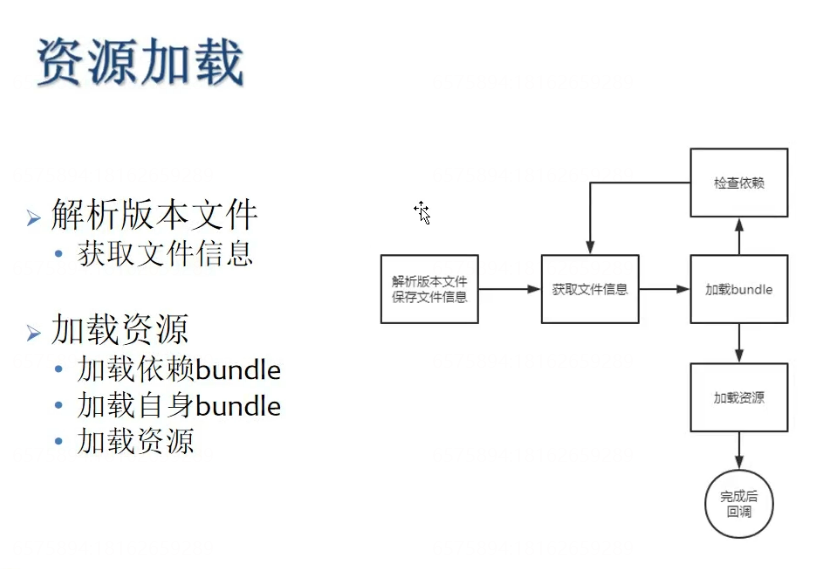

# AssetBundle

[Unity手游�战：�0开始SLG——资�管�系统-基础篇（三）AssetBundle��](https://zhuanlan.zhihu.com/p/97551363)

[Unity的AssetBundle之间的引用关系是如何�解的？](https://www.zhihu.com/question/58097894/answer/156682400)

[Unity官方文档](https://docs.unity3d.com/cn/current/Manual/AssetBundlesIntro.html)

[AssetBundle�赖打包有哪些注�点](https://blog.uwa4d.com/archives/TechSharing_318.html)

[AssetBundle 全解�](https://zhuanlan.zhihu.com/p/557805161)

[Unity资�加载大师]()

---

- [以下笔记�自Unity独立游�开�之AssetBundle�入门到��]()
    - [02-AssetBundle的定义�作用]()
    - [03-什么是AssetBundle]()
    - [04-AssetBundle使用�程]()
    - [05-使用代�打包AssetBundle]()
    - [06-AssetBundle打包注�事项]()
    - [07-AssetBundle的加载和使用]()
    - [08-AssetBundle分组策略]()
    - [09-AssetBundle分组策略总结]()
    - [10-ä¾�赖打åŒ]()…
    - [11-打包选项（AssetBundle�缩方�）]()
    - [12-Manifest文件是干什么的]()
    - [13-资�的�赖关系]()
    - [14-�内存里�加载AssetBundle]()
    - [15-使用WWW.LoadFromCacheOrDownload下载并加载AssetBundle]()
    - [16-�建简�server�务器]()
    - [17-��务器端下载AssetBundle]()
    - [18-使用UnityWebRequest下载AssetBundle]()
    - [19-�AssetBundle里�加载资�]()
    - [20-通过Manifest文件得到�个包的�赖]()
    - [21-AssetBundle的�载]()
    - [22-关�文件校验]()
    - [23-AssetBundle使用的一些问题]()
    - [24-AssetBundle�览工具]()

# 以下笔记�自[Unity独立游�开�之AssetBundle�入门到��](https://www.bilibili.com/video/BV1Yb4y1U7nt/?spm_id_from=333.1007.top_right_bar_window_custom_collection.content.click&vd_source=b5993c1050361f86e5f8f306b9340ae8)

## 02-AssetBundle的定义�作用

## 03-什么是AssetBundle

## 04-AssetBundle使用�程

## 05-使用代�打包AssetBundle

命�空间

UnityEditor

System.IO

特性

MenuItem

Unity API

BuildPipeline

## 06-AssetBundle打包注�事项

## 07-AssetBundle的加载和使用

Unity API

AssetBundle.LoadFromFile()

## 08-AssetBundle分组策略

## 09-AssetBundle分组策略总结

## 10-�赖打包

## 11-打包选项（AssetBundle�缩方�）

## 12-Manifest文件是干什么的

CRC校验�（类似MD5）

Assets

Dependencies

## 13-资�的�赖关系

AssetBundle包的加载顺�无所谓，但是在加载具体资�之�，必须把�赖的AssetBundle包加载好

## 14-�内存里�加载AssetBundle

IEnumerator

AssetBundle.LoadFromMemoryAsync

## 15-使用WWW.LoadFromCacheOrDownload下载并加载AssetBundle

yield break

string.IsNullOrEmpty(www.error

## 16-�建简�server�务器

## 17-��务器端下载AssetBundle

## 18-使用UnityWebRequest下载AssetBundle

UnityWebRequestAssetBundle.GetAssetBundle

DownloadHandlerAssetBundle.GetContent

## 19-�AssetBundle里�加载资�

## 20-通过Manifest文件得到�个包的�赖

## 21-AssetBundle的�载

## 22-关�文件校验

## 23-AssetBundle使用的一些问题

## 24-AssetBundle�览工具

%5BUnity%E6%89%8B%E6%B8%B8%E5%AE%9E%E6%88%98%EF%BC%9A%E4%BB%8E0%E5%BC%80%E5%A7%8BSLG%E2%80%94%E2%80%94%E8%B5%84%E6%BA%90%E7%AE%A1%E7%90%86%E7%B3%BB%E7%BB%9F-%E5%9F%BA%E7%A1%80%E7%AF%87%EF%BC%88%E4%B8%89%EF%BC%89AssetBundle%E5%8E%9F%E7%90%86%5D(https%3A%2F%2Fzhuanlan.zhihu.com%2Fp%2F97551363)%0A%0A%5BUnity%E7%9A%84AssetBundle%E4%B9%8B%E9%97%B4%E7%9A%84%E5%BC%95%E7%94%A8%E5%85%B3%E7%B3%BB%E6%98%AF%E5%A6%82%E4%BD%95%E7%90%86%E8%A7%A3%E7%9A%84%EF%BC%9F%5D(https%3A%2F%2Fwww.zhihu.com%2Fquestion%2F58097894%2Fanswer%2F156682400)%0A%0A%5BUnity%E5%AE%98%E6%96%B9%E6%96%87%E6%A1%A3%5D(https%3A%2F%2Fdocs.unity3d.com%2Fcn%2Fcurrent%2FManual%2FAssetBundlesIntro.html)%0A%0A%5BAssetBundle%E4%BE%9D%E8%B5%96%E6%89%93%E5%8C%85%E6%9C%89%E5%93%AA%E4%BA%9B%E6%B3%A8%E6%84%8F%E7%82%B9%5D(https%3A%2F%2Fblog.uwa4d.com%2Farchives%2FTechSharing_318.html)%0A%0A%5BAssetBundle%C2%A0%E5%85%A8%E8%A7%A3%E6%9E%90%5D(https%3A%2F%2Fzhuanlan.zhihu.com%2Fp%2F557805161)%0A%0A%5BUnity%E8%B5%84%E6%BA%90%E5%8A%A0%E8%BD%BD%E5%A4%A7%E5%B8%88%5D(https%3A%2F%2Fwww.unitybundlemaster.com%2F%3Fp%3D79)%0A%0A***%0A%0A%5BTOC%5D%0A%23%20%E4%BB%A5%E4%B8%8B%E7%AC%94%E8%AE%B0%E6%9D%A5%E8%87%AA%5BUnity%E7%8B%AC%E7%AB%8B%E6%B8%B8%E6%88%8F%E5%BC%80%E5%8F%91%E4%B9%8BAssetBundle%E4%BB%8E%E5%85%A5%E9%97%A8%E5%88%B0%E6%8E%8C%E6%8F%A1%5D(https%3A%2F%2Fwww.bilibili.com%2Fvideo%2FBV1Yb4y1U7nt%2F%3Fspm_id_from%3D333.1007.top_right_bar_window_custom_collection.content.click%26vd_source%3Db5993c1050361f86e5f8f306b9340ae8)%0A%23%23%2002-AssetBundle%E7%9A%84%E5%AE%9A%E4%B9%89%E4%B8%8E%E4%BD%9C%E7%94%A8%0A!%5B2d52160f83ad5ecaae2f2ffa46e76d6d.png%5D(en-resource%3A%2F%2Fdatabase%2F727%3A1)%0A%23%23%2003-%E4%BB%80%E4%B9%88%E6%98%AFAssetBundle%0A!%5Bce4cff47bbfd0edd666ecb430e597094.png%5D(en-resource%3A%2F%2Fdatabase%2F728%3A1)%0A!%5B9bd31599a7f02d22fd21bc970d51351e.png%5D(en-resource%3A%2F%2Fdatabase%2F729%3A1)%0A%23%23%2004-AssetBundle%E4%BD%BF%E7%94%A8%E6%B5%81%E7%A8%8B%0A!%5B186bf291f2f98e67591ece275ae3d301.png%5D(en-resource%3A%2F%2Fdatabase%2F730%3A1)%0A%23%23%2005-%E4%BD%BF%E7%94%A8%E4%BB%A3%E7%A0%81%E6%89%93%E5%8C%85AssetBundle%0A%E5%91%BD%E5%90%8D%E7%A9%BA%E9%97%B4%0AUnityEditor%0ASystem.IO%0A%E7%89%B9%E6%80%A7%0AMenuItem%0AUnity%20API%0ABuildPipeline%0A%23%23%2006-AssetBundle%E6%89%93%E5%8C%85%E6%B3%A8%E6%84%8F%E4%BA%8B%E9%A1%B9%0A%23%23%2007-AssetBundle%E7%9A%84%E5%8A%A0%E8%BD%BD%E5%92%8C%E4%BD%BF%E7%94%A8%0AUnity%20API%0AAssetBundle.LoadFromFile()%0A%23%23%2008-AssetBundle%E5%88%86%E7%BB%84%E7%AD%96%E7%95%A5%0A!%5B086517a0b077e4394ef9699441acb3da.png%5D(en-resource%3A%2F%2Fdatabase%2F731%3A1)%0A%23%23%2009-AssetBundle%E5%88%86%E7%BB%84%E7%AD%96%E7%95%A5%E6%80%BB%E7%BB%93%0A!%5Ba162a68297739fbeee7ce8c6adfd9f91.png%5D(en-resource%3A%2F%2Fdatabase%2F732%3A1)%0A%23%23%2010-%E4%BE%9D%E8%B5%96%E6%89%93%E5%8C%85%0A!%5B5cf189c8550cb9a5519685ffa8d45a61.png%5D(en-resource%3A%2F%2Fdatabase%2F733%3A1)%0A%23%23%2011-%E6%89%93%E5%8C%85%E9%80%89%E9%A1%B9%EF%BC%88AssetBundle%E5%8E%8B%E7%BC%A9%E6%96%B9%E5%BC%8F%EF%BC%89%0A!%5B1a20b9dd87ad24fabed3d286bcb31769.png%5D(en-resource%3A%2F%2Fdatabase%2F734%3A1)%0A%23%23%2012-Manifest%E6%96%87%E4%BB%B6%E6%98%AF%E5%B9%B2%E4%BB%80%E4%B9%88%E7%9A%84%0ACRC%E6%A0%A1%E9%AA%8C%E7%A0%81%EF%BC%88%E7%B1%BB%E4%BC%BCMD5%EF%BC%89%0AAssets%0ADependencies%0A%23%23%2013-%E8%B5%84%E6%BA%90%E7%9A%84%E4%BE%9D%E8%B5%96%E5%85%B3%E7%B3%BB%0AAssetBundle%E5%8C%85%E7%9A%84%E5%8A%A0%E8%BD%BD%E9%A1%BA%E5%BA%8F%E6%97%A0%E6%89%80%E8%B0%93%EF%BC%8C%E4%BD%86%E6%98%AF%E5%9C%A8%E5%8A%A0%E8%BD%BD%E5%85%B7%E4%BD%93%E8%B5%84%E6%BA%90%E4%B9%8B%E5%89%8D%EF%BC%8C%E5%BF%85%E9%A1%BB%E6%8A%8A%E4%BE%9D%E8%B5%96%E7%9A%84AssetBundle%E5%8C%85%E5%8A%A0%E8%BD%BD%E5%A5%BD%0A%23%23%2014-%E4%BB%8E%E5%86%85%E5%AD%98%E9%87%8C%E9%9D%A2%E5%8A%A0%E8%BD%BDAssetBundle%0A!%5B5719bffe4f277383776593978a5668c2.png%5D(en-resource%3A%2F%2Fdatabase%2F735%3A1)%0AIEnumerator%0AAssetBundle.LoadFromMemoryAsync%0A%23%23%2015-%E4%BD%BF%E7%94%A8WWW.LoadFromCacheOrDownload%E4%B8%8B%E8%BD%BD%E5%B9%B6%E5%8A%A0%E8%BD%BDAssetBundle%0Ayield%20break%0Astring.IsNullOrEmpty(www.error%0A%23%23%2016-%E6%90%AD%E5%BB%BA%E7%AE%80%E5%8D%95server%E6%9C%8D%E5%8A%A1%E5%99%A8%0A%23%23%2017-%E4%BB%8E%E6%9C%8D%E5%8A%A1%E5%99%A8%E7%AB%AF%E4%B8%8B%E8%BD%BDAssetBundle%0A%23%23%2018-%E4%BD%BF%E7%94%A8UnityWebRequest%E4%B8%8B%E8%BD%BDAssetBundle%0AUnityWebRequestAssetBundle.GetAssetBundle%0ADownloadHandlerAssetBundle.GetContent%0A%23%23%2019-%E4%BB%8EAssetBundle%E9%87%8C%E9%9D%A2%E5%8A%A0%E8%BD%BD%E8%B5%84%E6%BA%90%0A%23%23%2020-%E9%80%9A%E8%BF%87Manifest%E6%96%87%E4%BB%B6%E5%BE%97%E5%88%B0%E6%9F%90%E4%B8%AA%E5%8C%85%E7%9A%84%E4%BE%9D%E8%B5%96%0A%23%23%2021-AssetBundle%E7%9A%84%E5%8D%B8%E8%BD%BD%0A!%5Bbed1248d038995a3c04afceae34f9983.png%5D(en-resource%3A%2F%2Fdatabase%2F736%3A1)%0A%23%23%2022-%E5%85%B3%E4%BA%8E%E6%96%87%E4%BB%B6%E6%A0%A1%E9%AA%8C%0A!%5B672e7f05900729ef93f7dee824d5555a.png%5D(en-resource%3A%2F%2Fdatabase%2F737%3A1)%0A%23%23%2023-AssetBundle%E4%BD%BF%E7%94%A8%E7%9A%84%E4%B8%80%E4%BA%9B%E9%97%AE%E9%A2%98%0A!%5Bc6a4ffd4b71332aa54b41136b9d95379.png%5D(en-resource%3A%2F%2Fdatabase%2F738%3A1)%0A%23%23%2024-AssetBundle%E6%B5%8F%E8%A7%88%E5%B7%A5%E5%85%B7
