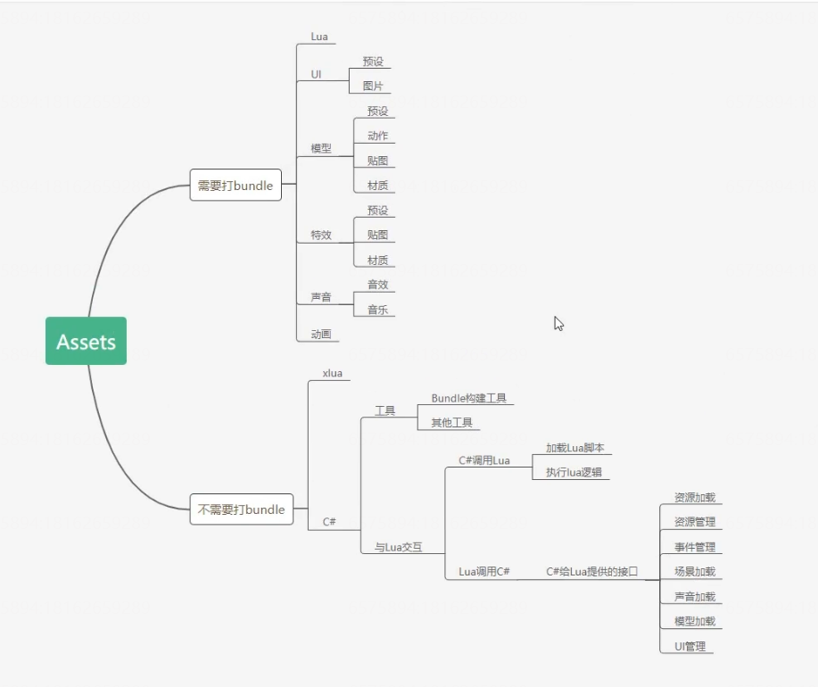
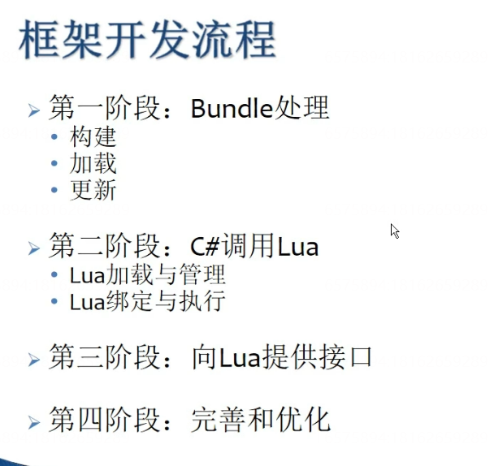

# （视频）Unity2D农场RPG游戏开发教程(Unity_2D_Game_Developer_Course_Farming_RPG)

[Unity2D农场RPG游戏开发教程(Unity_2D_Game_Developer_Course_Farming_RPG)](https://www.bilibili.com/video/BV1qi4y1k7ix/?p=1&share_medium=android&share_plat=android&share_session_id=08f5ed1f-8603-4060-861c-362660a5f6a5&share_source=WEIXIN&share_tag=s_i&timestamp=1650688935&unique_k=QCcWIUJ&vd_source=a3f2cfaa857c9cb58c5c0ae53ab6d254)

---

- [1-001 Course Introduction]()
- [2-001 Unity and Visual Studio Installation]()
- [3-002 SourceTree Installation and Using SourceTree With The Supplied Unity Project]()
- [4-001 Game Architecture and Course Structure]()
- [5-001 Project Creation]()
- [6-002 Review Custom Package]()
- [7-001 Player Gameobject Set-Up]()
- [8-002 Player Class and Abstract Singleton Class]()
- [9-003 Player Animation Controllers]()
- [10-004 Events and Event Handler]()
- [11-005 Player Animation Test Harness]()
- [12-006 Basic Player Movement]()
- [13-001 Game Location Scenes]()
- [14-002 Create Farmyard Scene]()
- [15-003 Add Farmhouse and Collision Tiles]()
- [16-004 Add Scenery]()
- [17-005 Add Cinemachine Confiner]()
- [18-006 Scenery Fader]()
- [19-001 Item Details Class]()
- [20-002 Scriptable Object Item List]()
- [21-003 Item Class and Commodity Prefabs]()
- [22-004 InventoryManager Class]()
- [23-005 Custom Property Attribute Drawer]()
- [24-006 Create Item Nudge Class]()
- [25-007 Player Item Pickup]()
- [26-008 Player Inventory Bar UI]()
- [27-009 Add Collected Items To Inventory Bar]()
- [28-010 Drop Items From Inventory Bar]()
- [29-011 Reorder Items In Inventory Bar]()
- [30-012 Item Description Pop Ups]()
- [31-013 More Items In The Scene]()

# 1-001 Course Introduction

# 2-001 Unity and Visual Studio Installation

VS看类成员等的插件 CodeNav

语义着色插件 SemanticColorizer

# 3-002 SourceTree Installation and Using SourceTree With The Supplied Unity Project

SourceTree使用

# 4-001 Game Architecture and Course Structure

# 5-001 Project Creation

- 项目创建
- 导入资源包
- 项目设置
    - Quality，anti aliasing（抗锯齿），
    - Graphics，Transparency Sort Mode（设置沿Y轴排序展示2D游戏的深度）
- 设置vs为外部脚本编辑器
- 设置持久化场景
- 添加虚拟摄像机
    - 修改正投影大小
    - 修改Body属性
    - 添加Pixel Perfect Camera
- 设置 Grid and Snap

# 6-002 Review Custom Package

对每个文件夹的作用进行讲解

# 7-001 Player Gameobject Set-Up

设置 Player

新建Instances层级

添加刚体组件

添加 Sorting Group（可以将玩家的不同部分归类为一个实体）

# 8-002 Player Class and Abstract Singleton Class

单例模式

# 9-003 Player Animation Controllers

给身体的每一个部件添加动画控制器

# 10-004 Events and Event Handler

事件类 发布者和订阅者模式

# 11-005 Player Animation Test Harness

创建与字符串参数相关的散列值

# 12-006 Basic Player Movement

# 13-001 Game Location Scenes

Tilemap

# 14-002 Create Farmyard Scene

Tilemap创建设置

不需要Collider Type

# 15-003 Add Farmhouse and Collision Tiles

添加农场房子和碰撞

优化项：设置复合碰撞器

# 16-004 Add Scenery

添加场景装饰

# 17-005 Add Cinemachine Confiner

添加摄像机的区域

# 18-006 Scenery Fader

场景装饰的淡入淡出

# 19-001 Item Details Class

物品的属性细节

# 20-002 Scriptable Object Item List

编辑 item scriptobject

# 21-003 Item Class and Commodity Prefabs

制作 item Prefab

# 22-004 InventoryManager Class

测试触发打印物品信息

# 23-005 Custom Property Attribute Drawer

自定义属性

# 24-006 Create Item Nudge Class

添加走过装饰物造成晃动效果

# 25-007 Player Item Pickup

让玩家走过时能够捡起物品

# 26-008 Player Inventory Bar UI

# 27-009 Add Collected Items To Inventory Bar

# 28-010 Drop Items From Inventory Bar

将物品从物品栏丢出

# 29-011 Reorder Items In Inventory Bar

交换物品位置

# 30-012 Item Description Pop Ups

# 31-013 More Items In The Scene

%5BUnity2D%E5%86%9C%E5%9C%BARPG%E6%B8%B8%E6%88%8F%E5%BC%80%E5%8F%91%E6%95%99%E7%A8%8B(Unity_2D_Game_Developer_Course_Farming_RPG)%5D(https%3A%2F%2Fwww.bilibili.com%2Fvideo%2FBV1qi4y1k7ix%2F%3Fp%3D1%26share_medium%3Dandroid%26share_plat%3Dandroid%26share_session_id%3D08f5ed1f-8603-4060-861c-362660a5f6a5%26share_source%3DWEIXIN%26share_tag%3Ds_i%26timestamp%3D1650688935%26unique_k%3DQCcWIUJ%26vd_source%3Da3f2cfaa857c9cb58c5c0ae53ab6d254)%0A***%0A%5BTOC%5D%0A%23%201-001%20Course%20Introduction%0A%23%202-001%20Unity%20and%20Visual%20Studio%20Installation%0AVS%E7%9C%8B%E7%B1%BB%E6%88%90%E5%91%98%E7%AD%89%E7%9A%84%E6%8F%92%E4%BB%B6%20CodeNav%0A%E8%AF%AD%E4%B9%89%E7%9D%80%E8%89%B2%E6%8F%92%E4%BB%B6%20SemanticColorizer%0A%23%203-002%20SourceTree%20Installation%20and%20Using%20SourceTree%20With%20The%20Supplied%20Unity%20Project%0ASourceTree%E4%BD%BF%E7%94%A8%0A%23%204-001%20Game%20Architecture%20and%20Course%20Structure%0A!%5B62ae3fbdc81162634f0085ceb3a1d9b7.png%5D(en-resource%3A%2F%2Fdatabase%2F2135%3A1)%0A%23%205-001%20Project%20Creation%0A*%20%E9%A1%B9%E7%9B%AE%E5%88%9B%E5%BB%BA%0A*%20%E5%AF%BC%E5%85%A5%E8%B5%84%E6%BA%90%E5%8C%85%0A*%20%E9%A1%B9%E7%9B%AE%E8%AE%BE%E7%BD%AE%0A%20%20%20%20*%20Quality%EF%BC%8Canti%20aliasing%EF%BC%88%E6%8A%97%E9%94%AF%E9%BD%BF%EF%BC%89%EF%BC%8C%0A%20%20%20%20*%20Graphics%EF%BC%8CTransparency%20Sort%20Mode%EF%BC%88%E8%AE%BE%E7%BD%AE%E6%B2%BFY%E8%BD%B4%E6%8E%92%E5%BA%8F%E5%B1%95%E7%A4%BA2D%E6%B8%B8%E6%88%8F%E7%9A%84%E6%B7%B1%E5%BA%A6%EF%BC%89%0A*%20%E8%AE%BE%E7%BD%AEvs%E4%B8%BA%E5%A4%96%E9%83%A8%E8%84%9A%E6%9C%AC%E7%BC%96%E8%BE%91%E5%99%A8%0A*%20%E8%AE%BE%E7%BD%AE%E6%8C%81%E4%B9%85%E5%8C%96%E5%9C%BA%E6%99%AF%0A*%20%E6%B7%BB%E5%8A%A0%E8%99%9A%E6%8B%9F%E6%91%84%E5%83%8F%E6%9C%BA%0A%20%20%20%20*%20%E4%BF%AE%E6%94%B9%E6%AD%A3%E6%8A%95%E5%BD%B1%E5%A4%A7%E5%B0%8F%0A%20%20%20%20*%20%E4%BF%AE%E6%94%B9Body%E5%B1%9E%E6%80%A7%0A%20%20%20%20*%20%E6%B7%BB%E5%8A%A0Pixel%20Perfect%20Camera%0A*%20%E8%AE%BE%E7%BD%AE%20Grid%20and%20Snap%0A%23%206-002%20Review%20Custom%20Package%0A%E5%AF%B9%E6%AF%8F%E4%B8%AA%E6%96%87%E4%BB%B6%E5%A4%B9%E7%9A%84%E4%BD%9C%E7%94%A8%E8%BF%9B%E8%A1%8C%E8%AE%B2%E8%A7%A3%0A%23%207-001%20Player%20Gameobject%20Set-Up%0A%E8%AE%BE%E7%BD%AE%20Player%20%0A%E6%96%B0%E5%BB%BAInstances%E5%B1%82%E7%BA%A7%0A%E6%B7%BB%E5%8A%A0%E5%88%9A%E4%BD%93%E7%BB%84%E4%BB%B6%0A%E6%B7%BB%E5%8A%A0%20Sorting%20Group%EF%BC%88%E5%8F%AF%E4%BB%A5%E5%B0%86%E7%8E%A9%E5%AE%B6%E7%9A%84%E4%B8%8D%E5%90%8C%E9%83%A8%E5%88%86%E5%BD%92%E7%B1%BB%E4%B8%BA%E4%B8%80%E4%B8%AA%E5%AE%9E%E4%BD%93%EF%BC%89%0A%23%208-002%20Player%20Class%20and%20Abstract%20Singleton%20Class%0A%E5%8D%95%E4%BE%8B%E6%A8%A1%E5%BC%8F%0A%23%209-003%20Player%20Animation%20Controllers%0A%E7%BB%99%E8%BA%AB%E4%BD%93%E7%9A%84%E6%AF%8F%E4%B8%80%E4%B8%AA%E9%83%A8%E4%BB%B6%E6%B7%BB%E5%8A%A0%E5%8A%A8%E7%94%BB%E6%8E%A7%E5%88%B6%E5%99%A8%0A%23%2010-004%20Events%20and%20Event%20Handler%0A%E4%BA%8B%E4%BB%B6%E7%B1%BB%20%E5%8F%91%E5%B8%83%E8%80%85%E5%92%8C%E8%AE%A2%E9%98%85%E8%80%85%E6%A8%A1%E5%BC%8F%0A!%5B13974ed0ee1ef79c7129e97dadf153d6.png%5D(en-resource%3A%2F%2Fdatabase%2F2139%3A1)%0A%23%2011-005%20Player%20Animation%20Test%20Harness%0A%E5%88%9B%E5%BB%BA%E4%B8%8E%E5%AD%97%E7%AC%A6%E4%B8%B2%E5%8F%82%E6%95%B0%E7%9B%B8%E5%85%B3%E7%9A%84%E6%95%A3%E5%88%97%E5%80%BC%0A%23%2012-006%20Basic%20Player%20Movement%0A%23%2013-001%20Game%20Location%20Scenes%0ATilemap%0A!%5Bc43bdec8fb65ee1ebe6b5175418745ee.png%5D(en-resource%3A%2F%2Fdatabase%2F2145%3A1)%0A%23%2014-002%20Create%20Farmyard%20Scene%0ATilemap%E5%88%9B%E5%BB%BA%E8%AE%BE%E7%BD%AE%0A%E4%B8%8D%E9%9C%80%E8%A6%81Collider%20Type%0A%23%2015-003%20Add%20Farmhouse%20and%20Collision%20Tiles%0A%E6%B7%BB%E5%8A%A0%E5%86%9C%E5%9C%BA%E6%88%BF%E5%AD%90%E5%92%8C%E7%A2%B0%E6%92%9E%0A%E4%BC%98%E5%8C%96%E9%A1%B9%EF%BC%9A%E8%AE%BE%E7%BD%AE%E5%A4%8D%E5%90%88%E7%A2%B0%E6%92%9E%E5%99%A8%0A%23%2016-004%20Add%20Scenery%0A%E6%B7%BB%E5%8A%A0%E5%9C%BA%E6%99%AF%E8%A3%85%E9%A5%B0%0A%23%2017-005%20Add%20Cinemachine%20Confiner%0A%E6%B7%BB%E5%8A%A0%E6%91%84%E5%83%8F%E6%9C%BA%E7%9A%84%E5%8C%BA%E5%9F%9F%0A%23%2018-006%20Scenery%20Fader%0A%E5%9C%BA%E6%99%AF%E8%A3%85%E9%A5%B0%E7%9A%84%E6%B7%A1%E5%85%A5%E6%B7%A1%E5%87%BA%0A%23%2019-001%20Item%20Details%20Class%0A%E7%89%A9%E5%93%81%E7%9A%84%E5%B1%9E%E6%80%A7%E7%BB%86%E8%8A%82%0A%23%2020-002%20Scriptable%20Object%20Item%20List%0A%E7%BC%96%E8%BE%91%20item%20scriptobject%0A%23%2021-003%20Item%20Class%20and%20Commodity%20Prefabs%0A%E5%88%B6%E4%BD%9C%20item%20Prefab%0A%23%2022-004%20InventoryManager%20Class%0A%E6%B5%8B%E8%AF%95%E8%A7%A6%E5%8F%91%E6%89%93%E5%8D%B0%E7%89%A9%E5%93%81%E4%BF%A1%E6%81%AF%0A%23%2023-005%20Custom%20Property%20Attribute%20Drawer%0A%E8%87%AA%E5%AE%9A%E4%B9%89%E5%B1%9E%E6%80%A7%0A%23%2024-006%20Create%20Item%20Nudge%20Class%0A%E6%B7%BB%E5%8A%A0%E8%B5%B0%E8%BF%87%E8%A3%85%E9%A5%B0%E7%89%A9%E9%80%A0%E6%88%90%E6%99%83%E5%8A%A8%E6%95%88%E6%9E%9C%0A%23%2025-007%20Player%20Item%20Pickup%0A%E8%AE%A9%E7%8E%A9%E5%AE%B6%E8%B5%B0%E8%BF%87%E6%97%B6%E8%83%BD%E5%A4%9F%E6%8D%A1%E8%B5%B7%E7%89%A9%E5%93%81%0A%23%2026-008%20Player%20Inventory%20Bar%20UI%0A%23%2027-009%20Add%20Collected%20Items%20To%20Inventory%20Bar%0A%23%2028-010%20Drop%20Items%20From%20Inventory%20Bar%0A%E5%B0%86%E7%89%A9%E5%93%81%E4%BB%8E%E7%89%A9%E5%93%81%E6%A0%8F%E4%B8%A2%E5%87%BA%0A%23%2029-011%20Reorder%20Items%20In%20Inventory%20Bar%0A%E4%BA%A4%E6%8D%A2%E7%89%A9%E5%93%81%E4%BD%8D%E7%BD%AE%0A%23%2030-012%20Item%20Description%20Pop%20Ups%0A%23%2031-013%20More%20Items%20In%20The%20Scene
