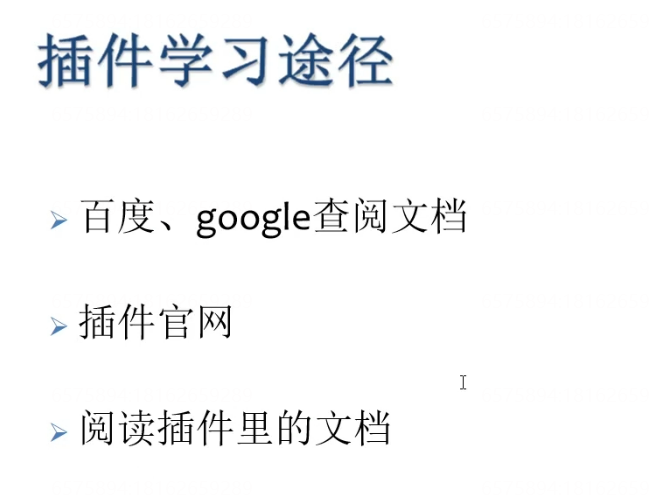
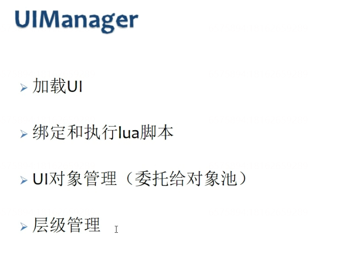
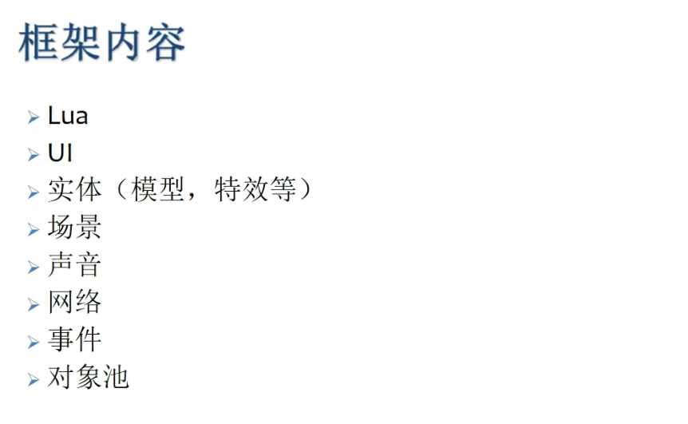
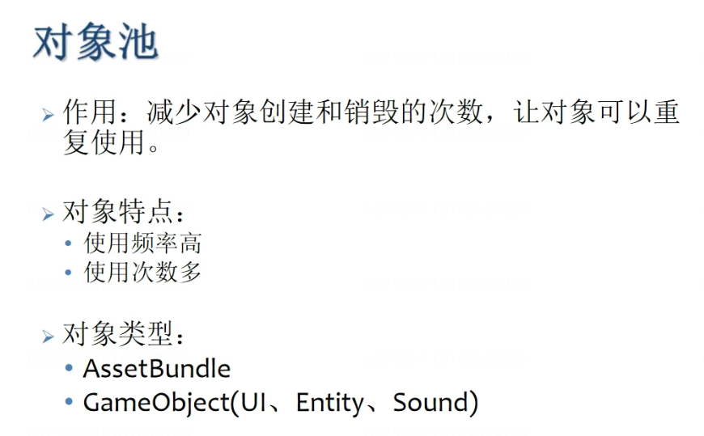
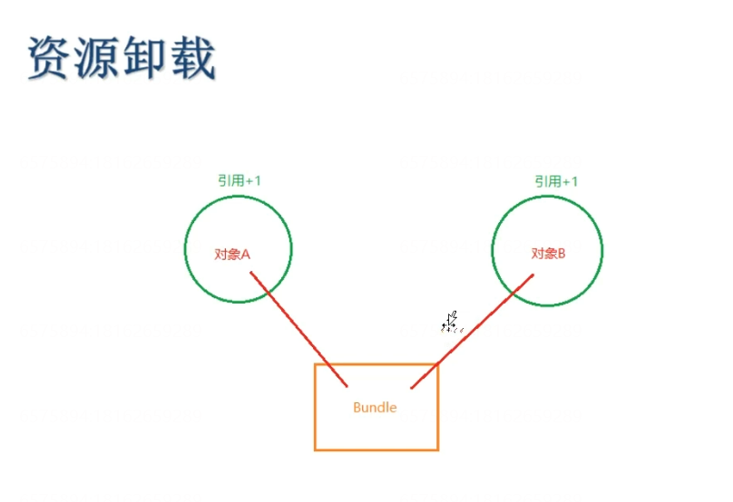
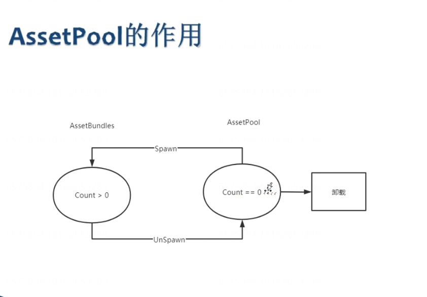
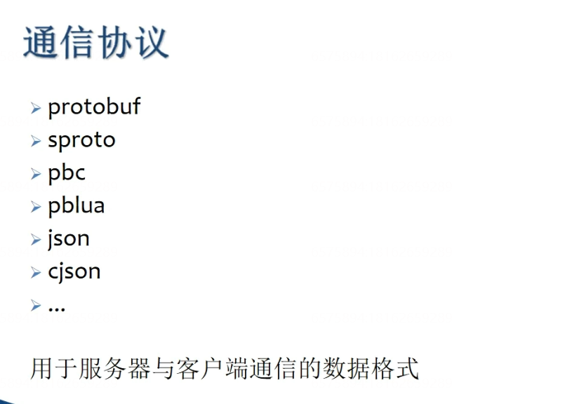
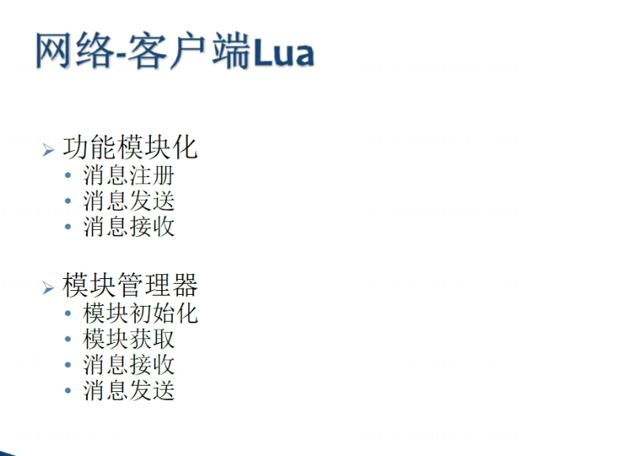

# （视频）【热更新专题】从0搭建XLua热更新框架

- [1.资源目录划分]()
    - [热更新]()
- [2.Bundle构建工具]()
- [3.完善BuildTool]()
- [4.资源加载]()
- [5.资源路径规划]()
- [6.编辑器模式加载资源]()
- [7-1.热更新流程]()
- [7-2.热更新细节分析]()
- [7-3.热更新需要做哪些事]()
- [7-5.热更新测试]()
- [8.Lua管理器]()
- [9-1.LuaBehaviour]()
- [9-2.UILogic]()
- [9-3.UI层级]()
- [10-1.实体管理与场景管理]()
- [10-2.场景管理测试]()
- [11.声音管理器_1]()
- [12.事件管理器_1]()
- [13-1.对象池_1]()
- [13-2.对象池测试_1]()
- [13-3.AssetBundle卸载_1]()
- [14-1.编译Xlua第三方库_1]()
- [14-2.网络客户端（C#）_1]()
- [14-3.网络客户端（Lua）_1]()
- [14-4.测试网络部分_1]()
- [15-1.真机调试（1）_1]()
- [15-2.真机调试（2）_1]()

# 1.资源目录划分

## 热更新

# 2.Bundle构建工具

# 3.完善BuildTool

加载的资源图片是丢失的

# 4.资源加载

# 5.资源路径规划

# 6.编辑器模式加载资源

# 7-1.热更新流程

# 7-2.热更新细节分析

# 7-3.热更新需要做哪些事

# 7-5.热更新测试

可读写目录：

C:\Users\xuhang\AppData\LocalLow\DefaultCompany\XLuaFrameWork

# 8.Lua管理器

# 9-1.LuaBehaviour

# 9-2.UILogic

# 9-3.UI层级

# 10-1.实体管理与场景管理

# 10-2.场景管理测试

# 11.声音管理器_1

# 12.事件管理器_1

# 13-1.对象池_1

# 13-2.对象池测试_1

# 13-3.AssetBundle卸载_1

# 14-1.编译Xlua第三方库_1

# 14-2.网络客户端（C#）_1

# 14-3.网络客户端（Lua）_1

# 14-4.测试网络部分_1

# 15-1.真机调试（1）_1

# 15-2.真机调试（2）_1

%5BTOC%5D%0A%23%201.%E8%B5%84%E6%BA%90%E7%9B%AE%E5%BD%95%E5%88%92%E5%88%86%0A%23%23%20%E7%83%AD%E6%9B%B4%E6%96%B0%0A!%5Bc71bad61064af6c57fd27475a320b39e.png%5D(en-resource%3A%2F%2Fdatabase%2F1513%3A1)%0A!%5Ba2a57a5fbe4593662e268d5f23a7d84a.png%5D(en-resource%3A%2F%2Fdatabase%2F1515%3A1)%0A%23%202.Bundle%E6%9E%84%E5%BB%BA%E5%B7%A5%E5%85%B7%0A!%5B8738dd48fcf17986f830d8c3bd63dfdc.png%5D(en-resource%3A%2F%2Fdatabase%2F2161%3A1)%0A!%5Bbd1cf01f2f598e1646a88b687c3f56dc.png%5D(en-resource%3A%2F%2Fdatabase%2F2163%3A1)%0A!%5B8124d7b18e4eec7908aeeedc6e17753d.png%5D(en-resource%3A%2F%2Fdatabase%2F2165%3A1)%0A%23%203.%E5%AE%8C%E5%96%84BuildTool%0A%E5%8A%A0%E8%BD%BD%E7%9A%84%E8%B5%84%E6%BA%90%E5%9B%BE%E7%89%87%E6%98%AF%E4%B8%A2%E5%A4%B1%E7%9A%84!%5B1fd4dafa2910676e29402f66b7160c50.png%5D(en-resource%3A%2F%2Fdatabase%2F2167%3A1)%0A!%5Bd651a40bfae589ea7ff84116b3383732.png%5D(en-resource%3A%2F%2Fdatabase%2F2169%3A1)%0A!%5B4346e8e799a4bb392e0c7576492b9055.png%5D(en-resource%3A%2F%2Fdatabase%2F2171%3A1)%0A%23%204.%E8%B5%84%E6%BA%90%E5%8A%A0%E8%BD%BD%0A!%5B695772806248b202bb3d5337af4f0ee1.png%5D(en-resource%3A%2F%2Fdatabase%2F2173%3A1)%0A%23%205.%E8%B5%84%E6%BA%90%E8%B7%AF%E5%BE%84%E8%A7%84%E5%88%92%0A%23%206.%E7%BC%96%E8%BE%91%E5%99%A8%E6%A8%A1%E5%BC%8F%E5%8A%A0%E8%BD%BD%E8%B5%84%E6%BA%90%0A%23%207-1.%E7%83%AD%E6%9B%B4%E6%96%B0%E6%B5%81%E7%A8%8B%0A!%5B9d59c6b82f682dc3a18c69cfabd0cfaa.png%5D(en-resource%3A%2F%2Fdatabase%2F2175%3A1)%0A!%5B7eaa7028368dc872a4bf73a0d3095381.png%5D(en-resource%3A%2F%2Fdatabase%2F2177%3A1)%0A%23%207-2.%E7%83%AD%E6%9B%B4%E6%96%B0%E7%BB%86%E8%8A%82%E5%88%86%E6%9E%90%0A!%5B1303e9f29ded91fbd17a0603e1ebd81d.png%5D(en-resource%3A%2F%2Fdatabase%2F2179%3A1)%0A!%5Bc74edea024bae8e6fd426f24d43fd066.png%5D(en-resource%3A%2F%2Fdatabase%2F2181%3A1)%0A!%5Bad23a234f1e7c46e6ccc11794cbcbe9a.png%5D(en-resource%3A%2F%2Fdatabase%2F2183%3A1)%0A%23%207-3.%E7%83%AD%E6%9B%B4%E6%96%B0%E9%9C%80%E8%A6%81%E5%81%9A%E5%93%AA%E4%BA%9B%E4%BA%8B%0A!%5B8d84c06130acac03b9670dedddd65e4b.png%5D(en-resource%3A%2F%2Fdatabase%2F2185%3A1)%0A%23%207-5.%E7%83%AD%E6%9B%B4%E6%96%B0%E6%B5%8B%E8%AF%95%0A%E5%8F%AF%E8%AF%BB%E5%86%99%E7%9B%AE%E5%BD%95%EF%BC%9A%0AC%3A%5CUsers%5Cxuhang%5CAppData%5CLocalLow%5CDefaultCompany%5CXLuaFrameWork%0A%23%208.Lua%E7%AE%A1%E7%90%86%E5%99%A8%0A!%5Bf321a5e80351deb048f5c9dfa764b74a.png%5D(en-resource%3A%2F%2Fdatabase%2F2187%3A1)%0A!%5B308215c49ca271647de6354749a57cfc.png%5D(en-resource%3A%2F%2Fdatabase%2F2189%3A1)%0A%23%209-1.LuaBehaviour%0A%23%209-2.UILogic%0A%23%209-3.UI%E5%B1%82%E7%BA%A7%0A!%5B183f29f9a41176246942d98980777e1b.png%5D(en-resource%3A%2F%2Fdatabase%2F2191%3A1)%0A!%5B9057ecfa9ba06c94ed0c56b138e6c5b3.png%5D(en-resource%3A%2F%2Fdatabase%2F2193%3A1)%0A%23%2010-1.%E5%AE%9E%E4%BD%93%E7%AE%A1%E7%90%86%E4%B8%8E%E5%9C%BA%E6%99%AF%E7%AE%A1%E7%90%86%0A!%5B953fbc93349a267d19684dfeea9fa157.png%5D(en-resource%3A%2F%2Fdatabase%2F2195%3A1)%0A!%5Bda42898750d0e52bc92d0d77bb040bb0.png%5D(en-resource%3A%2F%2Fdatabase%2F2197%3A1)%0A%23%2010-2.%E5%9C%BA%E6%99%AF%E7%AE%A1%E7%90%86%E6%B5%8B%E8%AF%95%0A%23%2011.%E5%A3%B0%E9%9F%B3%E7%AE%A1%E7%90%86%E5%99%A8_1%0A!%5B36735a01aa0de6ee20363d96224f27b3.png%5D(en-resource%3A%2F%2Fdatabase%2F2199%3A1)%0A%23%2012.%E4%BA%8B%E4%BB%B6%E7%AE%A1%E7%90%86%E5%99%A8_1%0A%23%2013-1.%E5%AF%B9%E8%B1%A1%E6%B1%A0_1%0A!%5B08db0e901ce048a600c2f9150f65afd4.png%5D(en-resource%3A%2F%2Fdatabase%2F2201%3A1)%0A!%5Bca821483e657c7ea129faefc336a36ee.png%5D(en-resource%3A%2F%2Fdatabase%2F2203%3A1)%0A%23%2013-2.%E5%AF%B9%E8%B1%A1%E6%B1%A0%E6%B5%8B%E8%AF%95_1%0A%23%2013-3.AssetBundle%E5%8D%B8%E8%BD%BD_1%0A!%5Bd78ba04ba5278a373b5643c57a9b716e.png%5D(en-resource%3A%2F%2Fdatabase%2F2205%3A1)%0A!%5Bda53468a5aa4e1360097c68b068a91cf.png%5D(en-resource%3A%2F%2Fdatabase%2F2207%3A1)%0A%23%2014-1.%E7%BC%96%E8%AF%91Xlua%E7%AC%AC%E4%B8%89%E6%96%B9%E5%BA%93_1%0A!%5Be3b6e1052086bdbcedf5916b149c0701.png%5D(en-resource%3A%2F%2Fdatabase%2F2209%3A1)%0A!%5B83ebc8eb7cdd617d0e190216dca3b8da.png%5D(en-resource%3A%2F%2Fdatabase%2F2211%3A1)%0A%23%2014-2.%E7%BD%91%E7%BB%9C%E5%AE%A2%E6%88%B7%E7%AB%AF%EF%BC%88C%23%EF%BC%89_1%0A%23%2014-3.%E7%BD%91%E7%BB%9C%E5%AE%A2%E6%88%B7%E7%AB%AF%EF%BC%88Lua%EF%BC%89_1%0A!%5Becb7eb10ce6b6410a95f8686de461fc0.png%5D(en-resource%3A%2F%2Fdatabase%2F1634%3A1)%0A%23%2014-4.%E6%B5%8B%E8%AF%95%E7%BD%91%E7%BB%9C%E9%83%A8%E5%88%86_1%0A%23%2015-1.%E7%9C%9F%E6%9C%BA%E8%B0%83%E8%AF%95%EF%BC%881%EF%BC%89_1%0A%23%2015-2.%E7%9C%9F%E6%9C%BA%E8%B0%83%E8%AF%95%EF%BC%882%EF%BC%89_1
