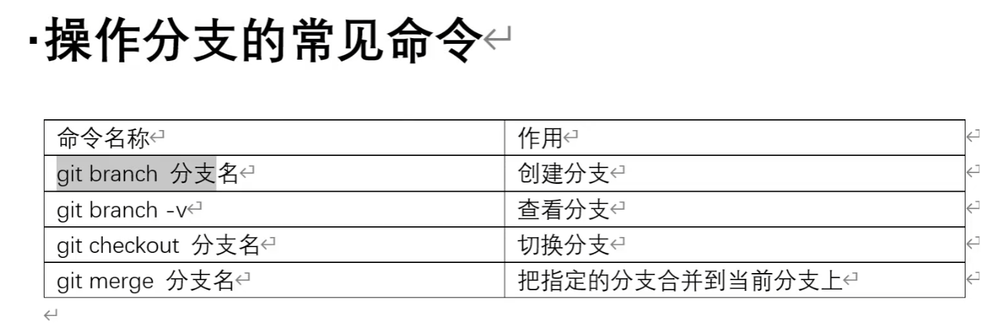
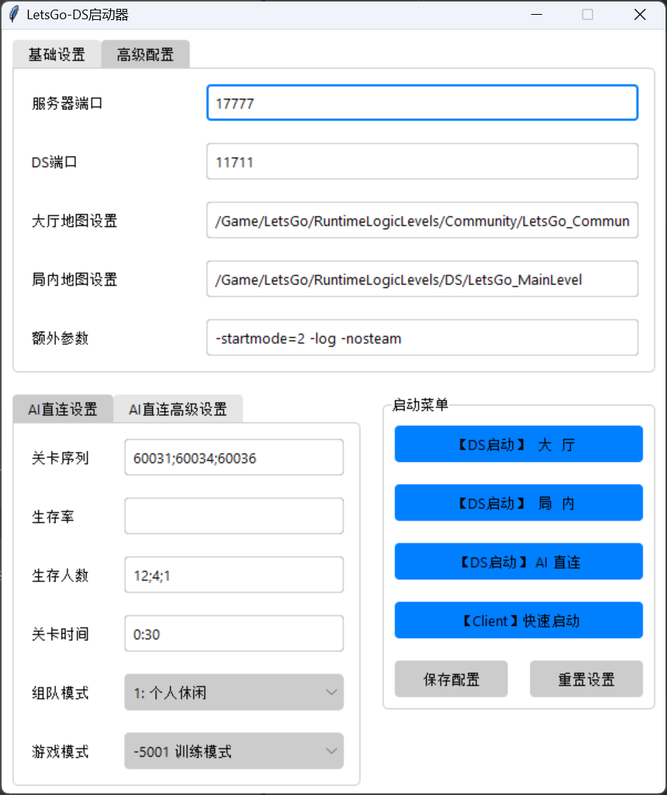
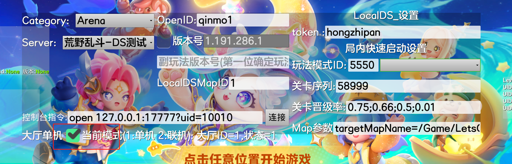
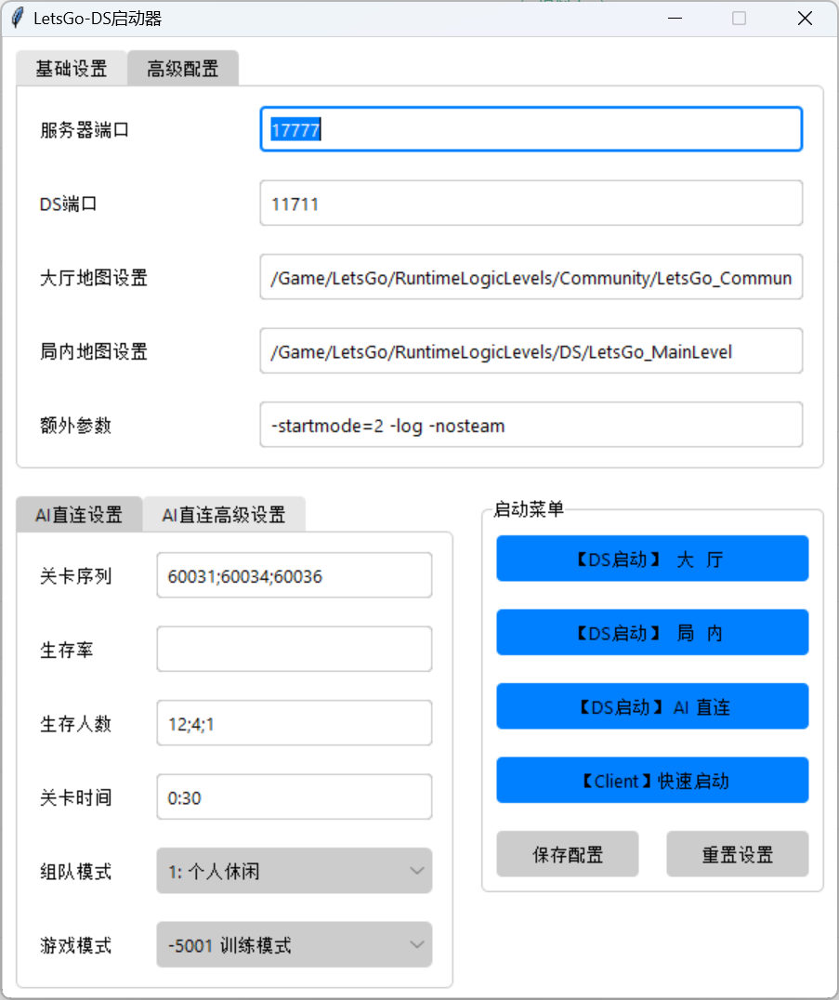
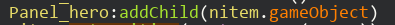

# 项目注�事项

- [字体]()
- [DoTween]()
- [Unity设置]()
- [资�更新]()
- [打åŒ]()…
- [Animator动画]()
- [修改命令行�数]()
- [lua工程设置]()

# 字体

[unity的ugui-3.生�图片字体](https://blog.csdn.net/weixin_44453949/article/details/116175680)

**使用字体**：

艺术字体转�工具







字体跟�质是自己创建

# DoTween

**Dotween**

�装好的：

AnimateHelp.lua

用法：

UICityActivity.lua

胡淘瑜 2022/5/17 15:57:28

```
local tween = self.Button_records_show:GetRectTransform():DOPivot(Vector2.New(5,5),5):OnComplete(function()
logError(123)
end)
tweener.OnComplete():动画结�时触�。
tweener.OnPlay():动画开始播放时触�。
tweener.OnStart():动画被创建时触�。
tweener.OnKill():动画被销�时触�。

local tween = self.Button_records_show.transform:DOMove(Vector2.New(5,5),5):OnComplete(function()
logError(123)
end)

local mySequence = DG.Tweening.DOTween.Sequence()
mySequence:Append(self.Button_records_show.transform:DOMove(Vector2.New(5,5),5))
mySequence:Append(self.Button_records_show.transform:DOMove(Vector2.New(1,1),2))
mySequence:OnComplete(function()
logError(123)
end)

local tween = self.Button_records_show.transform:DOMove(Vector2.New(5,5),5))
tween:SetLoops(-1,DG.Tweening.LoopType.Yoyo)

这样就是设置他的模�
Yoyo就是��
```

[相��晚�Unity�件——DoTween介�](https://blog.csdn.net/m0_46378049/article/details/106251926)

[Unity——Dotween常用方法详解](https://blog.csdn.net/weixin_43945471/article/details/112982356)

[DOTween��解�](https://www.likecs.com/show-204123315.html)

[DoTween 教程](http://t.zoukankan.com/jiangshuai52511-p-6110199.html)

[�Unity3D�件】DoTween�件研究](https://blog.51cto.com/u_15296123/3370184?b=totalstatistic)

# Unity设置



把这个设置为 disable , 平时�行时会快些

# 资�更新

项目工程：BleachAwaken_客户端\trunk\BleachAwakenClient

转�工程：BleachAwaken_�术\Tools\CCS2UGUI

项目工程的图片�图片meta是最新的

1.�术工程 BleachAwaken_�术\UI\cocosstudio\ccs 文件覆盖到转�工程


2.项目工程资� BleachAwakenClient\Assets\Builds\UI 覆盖到转�工程





# 打包

# Animator动画

# 修改命令行�数


# lua工程设置


�管IOS还是Android, 都�在这里加上 -s �数

-s �数�以��xxxx.lua.bytes 里�的文件路径

这样�使改�工程路径，打出�的lua bundle也�会�化

%5BTOC%5D%0A%0A%23%20%E5%AD%97%E4%BD%93%0A%5Bunity%E7%9A%84ugui-3.%E7%94%9F%E6%88%90%E5%9B%BE%E7%89%87%E5%AD%97%E4%BD%93%5D(https%3A%2F%2Fblog.csdn.net%2Fweixin_44453949%2Farticle%2Fdetails%2F116175680)%0A**%E4%BD%BF%E7%94%A8%E5%AD%97%E4%BD%93**%EF%BC%9A%0A%E8%89%BA%E6%9C%AF%E5%AD%97%E4%BD%93%E8%BD%AC%E6%8D%A2%E5%B7%A5%E5%85%B7%0A!%5B67c42271c3158ff1d6fdc30ca44708d1.png%5D(en-resource%3A%2F%2Fdatabase%2F806%3A1)%0A!%5Ba29c255437e89043f9bd90af23369759.png%5D(en-resource%3A%2F%2Fdatabase%2F808%3A1)%0A!%5Bec95ee70b55b445bab6be75c3e49028c.png%5D(en-resource%3A%2F%2Fdatabase%2F810%3A1)%0A!%5B225d2f7ca5581ae136ede567ceee7799.png%5D(en-resource%3A%2F%2Fdatabase%2F804%3A1)%0A%E5%AD%97%E4%BD%93%E8%B7%9F%E6%9D%90%E8%B4%A8%E6%98%AF%E8%87%AA%E5%B7%B1%E5%88%9B%E5%BB%BA%0A%0A%23%20DoTween%0A**Dotween**%0A%E5%B0%81%E8%A3%85%E5%A5%BD%E7%9A%84%EF%BC%9A%0AAnimateHelp.lua%0A%E7%94%A8%E6%B3%95%EF%BC%9A%0AUICityActivity.lua%0A%E8%83%A1%E6%B7%98%E7%91%9C%C2%A02022%2F5%2F17%2015%3A57%3A28%0A%60%60%60%0Alocal%C2%A0tween%C2%A0%3D%C2%A0self.Button_records_show%3AGetRectTransform()%3ADOPivot(Vector2.New(5%2C5)%2C5)%3AOnComplete(function()%0AlogError(123)%0Aend)%0Atweener.OnComplete()%3A%E5%8A%A8%E7%94%BB%E7%BB%93%E6%9D%9F%E6%97%B6%E8%A7%A6%E5%8F%91%E3%80%82%0Atweener.OnPlay()%3A%E5%8A%A8%E7%94%BB%E5%BC%80%E5%A7%8B%E6%92%AD%E6%94%BE%E6%97%B6%E8%A7%A6%E5%8F%91%E3%80%82%0Atweener.OnStart()%3A%E5%8A%A8%E7%94%BB%E8%A2%AB%E5%88%9B%E5%BB%BA%E6%97%B6%E8%A7%A6%E5%8F%91%E3%80%82%0Atweener.OnKill()%3A%E5%8A%A8%E7%94%BB%E8%A2%AB%E9%94%80%E6%AF%81%E6%97%B6%E8%A7%A6%E5%8F%91%E3%80%82%0A%0Alocal%C2%A0tween%C2%A0%3D%C2%A0self.Button_records_show.transform%3ADOMove(Vector2.New(5%2C5)%2C5)%3AOnComplete(function()%0AlogError(123)%0Aend)%0A%0Alocal%C2%A0mySequence%C2%A0%3D%C2%A0DG.Tweening.DOTween.Sequence()%0AmySequence%3AAppend(self.Button_records_show.transform%3ADOMove(Vector2.New(5%2C5)%2C5))%0AmySequence%3AAppend(self.Button_records_show.transform%3ADOMove(Vector2.New(1%2C1)%2C2))%0AmySequence%3AOnComplete(function()%0AlogError(123)%0Aend)%0A%0Alocal%C2%A0tween%C2%A0%3D%C2%A0self.Button_records_show.transform%3ADOMove(Vector2.New(5%2C5)%2C5))%0Atween%3ASetLoops(-1%2CDG.Tweening.LoopType.Yoyo)%0A%0A%E8%BF%99%E6%A0%B7%E5%B0%B1%E6%98%AF%E8%AE%BE%E7%BD%AE%E4%BB%96%E7%9A%84%E6%A8%A1%E5%BC%8F%0AYoyo%E5%B0%B1%E6%98%AF%E6%9D%A5%E5%9B%9E%0A%60%60%60%0A%0A%5B%E7%9B%B8%E8%A7%81%E6%81%A8%E6%99%9A%EF%BC%81Unity%E6%8F%92%E4%BB%B6%E2%80%94%E2%80%94DoTween%E4%BB%8B%E7%BB%8D%5D(https%3A%2F%2Fblog.csdn.net%2Fm0_46378049%2Farticle%2Fdetails%2F106251926)%0A%5BUnity%E2%80%94%E2%80%94Dotween%E5%B8%B8%E7%94%A8%E6%96%B9%E6%B3%95%E8%AF%A6%E8%A7%A3%5D(https%3A%2F%2Fblog.csdn.net%2Fweixin_43945471%2Farticle%2Fdetails%2F112982356)%0A%5BDOTween%E6%BA%90%E7%A0%81%E8%A7%A3%E6%9E%90%5D(https%3A%2F%2Fwww.likecs.com%2Fshow-204123315.html)%0A%5BDoTween%20%E6%95%99%E7%A8%8B%5D(http%3A%2F%2Ft.zoukankan.com%2Fjiangshuai52511-p-6110199.html)%0A%5B%E3%80%90Unity3D%E6%8F%92%E4%BB%B6%E3%80%91DoTween%E6%8F%92%E4%BB%B6%E7%A0%94%E7%A9%B6%5D(https%3A%2F%2Fblog.51cto.com%2Fu_15296123%2F3370184%3Fb%3Dtotalstatistic)%0A%0A%23%20Unity%E8%AE%BE%E7%BD%AE%0A!%5Bf154fa9bb368f6c9dce8a2a1de6c817d.png%5D(en-resource%3A%2F%2Fdatabase%2F1154%3A1)%0A%E6%8A%8A%E8%BF%99%E4%B8%AA%E8%AE%BE%E7%BD%AE%E4%B8%BA%C2%A0disable%C2%A0%2C%C2%A0%E5%B9%B3%E6%97%B6%E8%BF%90%E8%A1%8C%E6%97%B6%E4%BC%9A%E5%BF%AB%E4%BA%9B%0A%0A%23%20%E8%B5%84%E6%BA%90%E6%9B%B4%E6%96%B0%0A%E9%A1%B9%E7%9B%AE%E5%B7%A5%E7%A8%8B%EF%BC%9ABleachAwaken_%E5%AE%A2%E6%88%B7%E7%AB%AF%5Ctrunk%5CBleachAwakenClient%0A%E8%BD%AC%E6%8D%A2%E5%B7%A5%E7%A8%8B%EF%BC%9ABleachAwaken_%E7%BE%8E%E6%9C%AF%5CTools%5CCCS2UGUI%0A%E9%A1%B9%E7%9B%AE%E5%B7%A5%E7%A8%8B%E7%9A%84%E5%9B%BE%E7%89%87%E3%80%81%E5%9B%BE%E7%89%87meta%E6%98%AF%E6%9C%80%E6%96%B0%E7%9A%84%0A1.%E7%BE%8E%E6%9C%AF%E5%B7%A5%E7%A8%8B%20BleachAwaken_%E7%BE%8E%E6%9C%AF%5CUI%5Ccocosstudio%5Cccs%20%E6%96%87%E4%BB%B6%E8%A6%86%E7%9B%96%E5%88%B0%E8%BD%AC%E6%8D%A2%E5%B7%A5%E7%A8%8B%0A!%5Bd1f38482f3c7dc35c28c460ae7efb2fa.png%5D(en-resource%3A%2F%2Fdatabase%2F1164%3A1)%0A2.%E9%A1%B9%E7%9B%AE%E5%B7%A5%E7%A8%8B%E8%B5%84%E6%BA%90%20BleachAwakenClient%5CAssets%5CBuilds%5CUI%20%E8%A6%86%E7%9B%96%E5%88%B0%E8%BD%AC%E6%8D%A2%E5%B7%A5%E7%A8%8B%0A!%5B15461fe8cac3ea938a31c2f7b6ab105d.png%5D(en-resource%3A%2F%2Fdatabase%2F1166%3A1)%0A!%5B872f9ac868129a92272e90b4f5f8aa61.png%5D(en-resource%3A%2F%2Fdatabase%2F1168%3A1)%0A%0A%23%20%E6%89%93%E5%8C%85%0A%0A%0A%23%20Animator%E5%8A%A8%E7%94%BB%0A%0A%23%20%E4%BF%AE%E6%94%B9%E5%91%BD%E4%BB%A4%E8%A1%8C%E5%8F%82%E6%95%B0%0A!%5B31eed7fd8a685c03b40aec728094fc3d.png%5D(en-resource%3A%2F%2Fdatabase%2F1639%3A1)%0A%0A%23%20lua%E5%B7%A5%E7%A8%8B%E8%AE%BE%E7%BD%AE%0A!%5B6eeddd9bd832fd8af6cb974a2ae38dfd.png%5D(en-resource%3A%2F%2Fdatabase%2F1641%3A1)%0A%E4%B8%8D%E7%AE%A1IOS%E8%BF%98%E6%98%AFAndroid%2C%C2%A0%E9%83%BD%E8%A6%81%E5%9C%A8%E8%BF%99%E9%87%8C%E5%8A%A0%E4%B8%8A%C2%A0-s%C2%A0%E5%8F%82%E6%95%B0%0A-s%C2%A0%E5%8F%82%E6%95%B0%E5%8F%AF%E4%BB%A5%E9%9A%90%E8%97%8Fxxxx.lua.bytes%C2%A0%E9%87%8C%E9%9D%A2%E7%9A%84%E6%96%87%E4%BB%B6%E8%B7%AF%E5%BE%84%0A%E8%BF%99%E6%A0%B7%E5%8D%B3%E4%BD%BF%E6%94%B9%E5%8F%98%E5%B7%A5%E7%A8%8B%E8%B7%AF%E5%BE%84%EF%BC%8C%E6%89%93%E5%87%BA%E6%9D%A5%E7%9A%84lua%20bundle%E4%B9%9F%E4%B8%8D%E4%BC%9A%E5%8F%98%E5%8C%96
