# 项目相关问题

**问题描述**：

使用Unity时打开C# 弹出opening visual studio一直停在这个界面

**解决方案**：

- 查看项目路径是否有中文
- 工程比较大，里面有一些文件错了，导致这里卡住建议先关闭unity，然后把Library文件夹，obj文件夹全部删除掉，然后重新打开
- 先打开visual studio，再双击打开c#

---

**问题描述**：

修改lua UI代码后没生效

**解决方案**：

需要在initUI()里添加

---

**问题描述**：

Unity报错

**解决方案**：

因为打开的prefab没有被正确释放，没有被unity正确的Destroy掉，所以报错

重新启动游戏即可

---

**问题描述**：

点击事件无反应

**解决方案**：

添加ListItem的时候要给生成出来的Item添加点击事件，而不是预制体上的

---

**问题描述**：

研究所点击后不断报错

**解决方案**：

不需要调用removeAllChildren方法

---

**问题描述**：

addChild参数错误

**解决方案**：

使用gameObject

---

**问题描述**：

图片显示较暗，字未显示

**解决方案**：

字体问题是因为字体框大小太小了，

图片显示问题需要调整Button的Transition模式（调成纯白）

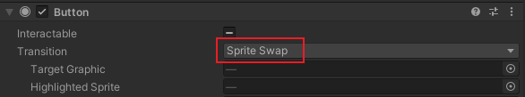

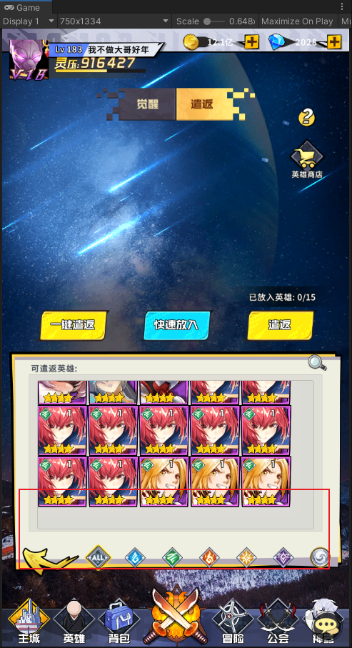

然后再修改回SpriteSwap

---

**问题描述**：

虚拟列表最下面一排没有平滑显现出来

**解决方案**：

因为列表子项位置和锚点有问题，在子项中添加Vertical layout Group来自动排版

---

**问题描述**：

UI打不开，发现场景里有同名空物体

**解决方案**：

因为在initUI处createNode的时候，如果没找到prefab，会直接创建一个空物体出来，代码写好，重新启动客户端即可

---

**问题描述**：

打开时空转换报错

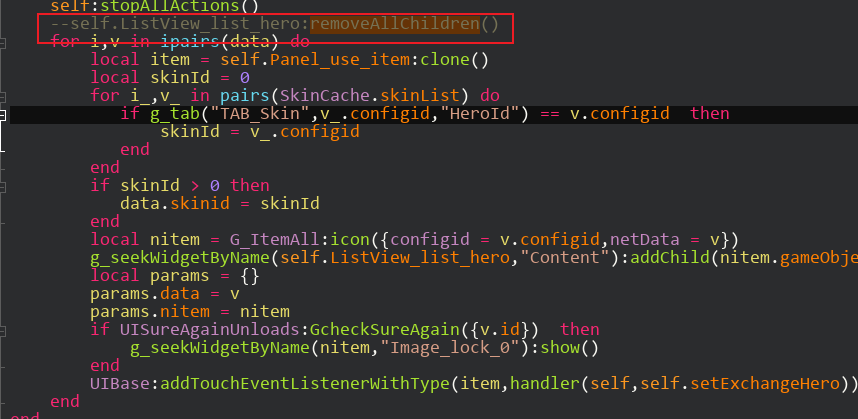

**解决方案**：

还没加载完就给删掉了，找不到对象所以报错

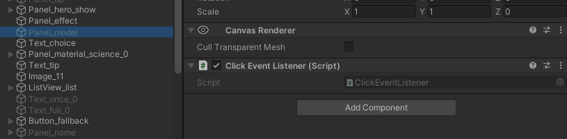

---

**问题描述**：

时空转换中Panel_model点击没反应

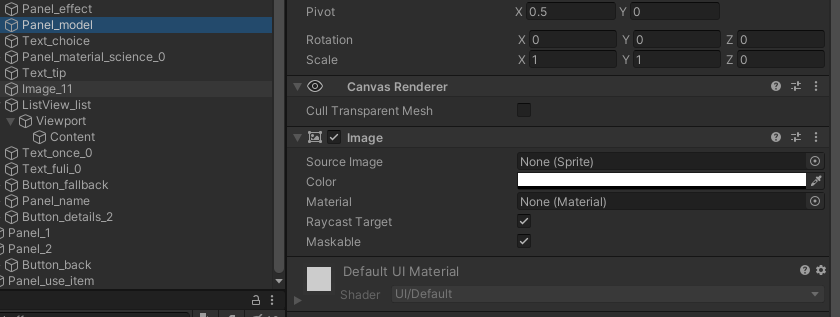

**解决方案**：

点击节点是个空节点，射线检测属性检测不到

加个透明的image即可

**相关信息**：

[Unity 之 UGUI Button 点击无响应问题汇总](https://blog.csdn.net/weixin_43149049/article/details/108420831)

---

**问题描述**：

图片显示奇怪

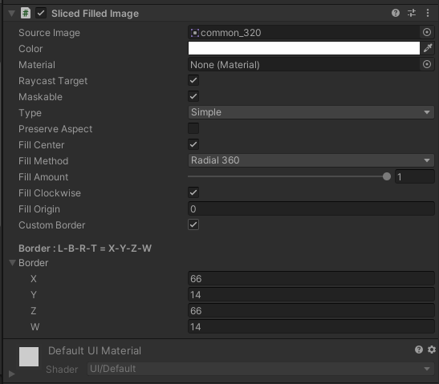

**解决方案**：

删除Sliced Filled Image组件

新加个image用之前的图片即可

---

**问题描述**：

UGUI中Text文本框的自动调整，字体大小的自适应调节

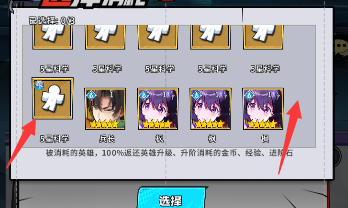

**解决方案**：

[UGUI中Text文本框的自动调整，字体大小的自适应调节](https://blog.csdn.net/mo_qi_qi/article/details/108071822)

1. UGUI text框大小固定，里面字体大小随着文字增多逐渐变小的设置（很简单）
2. UGUI text框大小不固定，text框随着字数增加逐渐拉长但是字体的大小不变,无背景（需要用到Content Size Fitter组件）
3. UGUI text框大小不固定，text框随着字数增加逐渐拉长字体的大小不变，有背景（需要用到Content Size Fitter和Vertical Layout Group组件）

---

**问题描述**：

列表项未对齐

**解决方案**：

列表子项大小是0.8不是原大小，此处Vertical Layout Group组件要勾选Use Child Scale选项

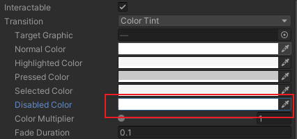

---

**问题描述**：

contentsizefitter会延迟刷新，导致无法及时获得当前属性

**解决方案**：

用LayoutRebuilder.ForceRebuildLayoutImmediate方法刷新后再获取

[Unity功能 解决使用 contentsizefitter 组件后不能获取大小的问题](https://blog.csdn.net/cuijiahao/article/details/109259425)

---

**问题描述**：

设置坐标与显示坐标不一致

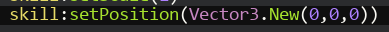

**解决方案**：

原理是因为父物体锚点和子物体锚点不一致

1. Inspector面板中Transform的位置信息显示的是localPosition
2. Inspector面板中RectTransform的位置信息显示的是anchoredPosition3D

[RectTransform中localPosition与anchoredPosition的区别](https://blog.csdn.net/weixin_43112045/article/details/89105049?spm=1001.2101.3001.6650.1&utm_medium=distribute.pc_relevant.none-task-blog-2%7Edefault%7ECTRLIST%7ERate-1-89105049-blog-98485356.pc_relevant_antiscanv2&depth_1-utm_source=distribute.pc_relevant.none-task-blog-2%7Edefault%7ECTRLIST%7ERate-1-89105049-blog-98485356.pc_relevant_antiscanv2&utm_relevant_index=2)

---

**问题描述**：

获取text对象并setString时对象为空

但是能获取到image对象且能hide()

**解决方案**：

原理是因为setString函数没有返回值，而hide()函数有返回值

修改setString返回值为gameObject即可

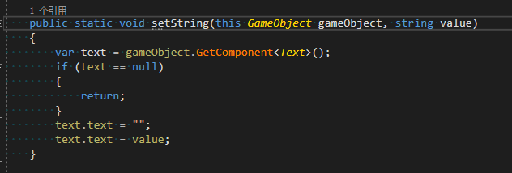

---

**问题描述**：

排序顺序错乱

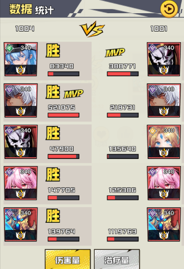

**解决方案**：

排序依据的伤害值是string类型，所以跟预想的顺序不一致

**问题描述**：

LoopGridView刷新后顺序反了

**解决方案**：

因为用的对象池，所以会有残留变化，需要在updateItem时将物体都重新刷掉

**问题描述**：

带空格的文本到unity显示时会变成换行

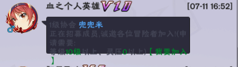

**解决方案**：

这个功能是Unity用于英语等西文的，是为了保证单词不会分开显示，所以第一行空格后面的字被Unity当成一个单词给换行处理了

[Unity Text添加空格导致换行问题](http://t.zoukankan.com/Fflyqaq-p-13545797.html)

**%E9%97%AE%E9%A2%98%E6%8F%8F%E8%BF%B0**%EF%BC%9A%0A%E4%BD%BF%E7%94%A8Unity%E6%97%B6%E6%89%93%E5%BC%80C%23%20%E5%BC%B9%E5%87%BAopening%20visual%20studio%E4%B8%80%E7%9B%B4%E5%81%9C%E5%9C%A8%E8%BF%99%E4%B8%AA%E7%95%8C%E9%9D%A2%0A!%5B4bd271700c05f4bdb9ef3434cc214370.png%5D(en-resource%3A%2F%2Fdatabase%2F1003%3A1)%0A**%E8%A7%A3%E5%86%B3%E6%96%B9%E6%A1%88**%EF%BC%9A%0A*%20%E6%9F%A5%E7%9C%8B%E9%A1%B9%E7%9B%AE%E8%B7%AF%E5%BE%84%E6%98%AF%E5%90%A6%E6%9C%89%E4%B8%AD%E6%96%87%0A*%20%E5%B7%A5%E7%A8%8B%E6%AF%94%E8%BE%83%E5%A4%A7%EF%BC%8C%E9%87%8C%E9%9D%A2%E6%9C%89%E4%B8%80%E4%BA%9B%E6%96%87%E4%BB%B6%E9%94%99%E4%BA%86%EF%BC%8C%E5%AF%BC%E8%87%B4%E8%BF%99%E9%87%8C%E5%8D%A1%E4%BD%8F%E5%BB%BA%E8%AE%AE%E5%85%88%E5%85%B3%E9%97%ADunity%EF%BC%8C%E7%84%B6%E5%90%8E%E6%8A%8ALibrary%E6%96%87%E4%BB%B6%E5%A4%B9%EF%BC%8Cobj%E6%96%87%E4%BB%B6%E5%A4%B9%E5%85%A8%E9%83%A8%E5%88%A0%E9%99%A4%E6%8E%89%EF%BC%8C%E7%84%B6%E5%90%8E%E9%87%8D%E6%96%B0%E6%89%93%E5%BC%80%0A*%20%E5%85%88%E6%89%93%E5%BC%80visual%20studio%EF%BC%8C%E5%86%8D%E5%8F%8C%E5%87%BB%E6%89%93%E5%BC%80c%23%0A%0A*%20*%20*%0A%0A**%E9%97%AE%E9%A2%98%E6%8F%8F%E8%BF%B0**%EF%BC%9A%0A%E4%BF%AE%E6%94%B9lua%20UI%E4%BB%A3%E7%A0%81%E5%90%8E%E6%B2%A1%E7%94%9F%E6%95%88%0A!%5Bc59f3ef56d7aa558962e0dd01ac5209e.png%5D(en-resource%3A%2F%2Fdatabase%2F1007%3A1)%0A**%E8%A7%A3%E5%86%B3%E6%96%B9%E6%A1%88**%EF%BC%9A%0A%E9%9C%80%E8%A6%81%E5%9C%A8initUI()%E9%87%8C%E6%B7%BB%E5%8A%A0%0A%0A*%20*%20*%0A%0A**%E9%97%AE%E9%A2%98%E6%8F%8F%E8%BF%B0**%EF%BC%9A%0AUnity%E6%8A%A5%E9%94%99%0A!%5B2f661949c9719101bc8ebb6c9da012ea.png%5D(en-resource%3A%2F%2Fdatabase%2F1008%3A1)%0A**%E8%A7%A3%E5%86%B3%E6%96%B9%E6%A1%88**%EF%BC%9A%0A%E5%9B%A0%E4%B8%BA%E6%89%93%E5%BC%80%E7%9A%84prefab%E6%B2%A1%E6%9C%89%E8%A2%AB%E6%AD%A3%E7%A1%AE%E9%87%8A%E6%94%BE%EF%BC%8C%E6%B2%A1%E6%9C%89%E8%A2%ABunity%E6%AD%A3%E7%A1%AE%E7%9A%84Destroy%E6%8E%89%EF%BC%8C%E6%89%80%E4%BB%A5%E6%8A%A5%E9%94%99%0A%E9%87%8D%E6%96%B0%E5%90%AF%E5%8A%A8%E6%B8%B8%E6%88%8F%E5%8D%B3%E5%8F%AF%0A%0A*%20*%20*%0A%0A**%E9%97%AE%E9%A2%98%E6%8F%8F%E8%BF%B0**%EF%BC%9A%0A%E7%82%B9%E5%87%BB%E4%BA%8B%E4%BB%B6%E6%97%A0%E5%8F%8D%E5%BA%94%0A**%E8%A7%A3%E5%86%B3%E6%96%B9%E6%A1%88**%EF%BC%9A%0A%E6%B7%BB%E5%8A%A0ListItem%E7%9A%84%E6%97%B6%E5%80%99%E8%A6%81%E7%BB%99%E7%94%9F%E6%88%90%E5%87%BA%E6%9D%A5%E7%9A%84Item%E6%B7%BB%E5%8A%A0%E7%82%B9%E5%87%BB%E4%BA%8B%E4%BB%B6%EF%BC%8C%E8%80%8C%E4%B8%8D%E6%98%AF%E9%A2%84%E5%88%B6%E4%BD%93%E4%B8%8A%E7%9A%84%0A!%5B9ede850a54020f7fcd776160751ef884.png%5D(en-resource%3A%2F%2Fdatabase%2F1009%3A1)%0A%0A*%20*%20*%0A%0A**%E9%97%AE%E9%A2%98%E6%8F%8F%E8%BF%B0**%EF%BC%9A%0A%E7%A0%94%E7%A9%B6%E6%89%80%E7%82%B9%E5%87%BB%E5%90%8E%E4%B8%8D%E6%96%AD%E6%8A%A5%E9%94%99%0A!%5Bdf18a16cb90e0449fa68955d71e02159.png%5D(en-resource%3A%2F%2Fdatabase%2F1019%3A1)%0A**%E8%A7%A3%E5%86%B3%E6%96%B9%E6%A1%88**%EF%BC%9A%0A%E4%B8%8D%E9%9C%80%E8%A6%81%E8%B0%83%E7%94%A8removeAllChildren%E6%96%B9%E6%B3%95%0A!%5Be95caee46826b415e22ebf006d7687c7.png%5D(en-resource%3A%2F%2Fdatabase%2F1020%3A1)%0A%0A*%20*%20*%0A%0A**%E9%97%AE%E9%A2%98%E6%8F%8F%E8%BF%B0**%EF%BC%9A%0AaddChild%E5%8F%82%E6%95%B0%E9%94%99%E8%AF%AF%0A!%5Bbbbb4b5f67d44314b961cb68e95e7505.png%5D(en-resource%3A%2F%2Fdatabase%2F1021%3A1)%0A**%E8%A7%A3%E5%86%B3%E6%96%B9%E6%A1%88**%EF%BC%9A%0A%E4%BD%BF%E7%94%A8gameObject%0A!%5B1388af250f6795eaebee7e9f433da06a.png%5D(en-resource%3A%2F%2Fdatabase%2F1022%3A1)%0A%0A*%20*%20*%0A%0A**%E9%97%AE%E9%A2%98%E6%8F%8F%E8%BF%B0**%EF%BC%9A%0A%E5%9B%BE%E7%89%87%E6%98%BE%E7%A4%BA%E8%BE%83%E6%9A%97%EF%BC%8C%E5%AD%97%E6%9C%AA%E6%98%BE%E7%A4%BA%0A!%5Bbb962a156ab55957a2326d8444cd2d32.png%5D(en-resource%3A%2F%2Fdatabase%2F1023%3A1)%0A!%5B6615a778f466368b60cab3d4369e4add.png%5D(en-resource%3A%2F%2Fdatabase%2F1024%3A1)%0A**%E8%A7%A3%E5%86%B3%E6%96%B9%E6%A1%88**%EF%BC%9A%0A%E5%AD%97%E4%BD%93%E9%97%AE%E9%A2%98%E6%98%AF%E5%9B%A0%E4%B8%BA%E5%AD%97%E4%BD%93%E6%A1%86%E5%A4%A7%E5%B0%8F%E5%A4%AA%E5%B0%8F%E4%BA%86%EF%BC%8C%0A%E5%9B%BE%E7%89%87%E6%98%BE%E7%A4%BA%E9%97%AE%E9%A2%98%E9%9C%80%E8%A6%81%E8%B0%83%E6%95%B4Button%E7%9A%84Transition%E6%A8%A1%E5%BC%8F%EF%BC%88%E8%B0%83%E6%88%90%E7%BA%AF%E7%99%BD%EF%BC%89%0A!%5B46e227cea407726a965288a25b0ba6bf.png%5D(en-resource%3A%2F%2Fdatabase%2F1025%3A1)%0A!%5B50df8988607b7c09d027d57e5d224a01.png%5D(en-resource%3A%2F%2Fdatabase%2F1283%3A1)%0A%E7%84%B6%E5%90%8E%E5%86%8D%E4%BF%AE%E6%94%B9%E5%9B%9ESpriteSwap%0A%0A*%20*%20*%0A%0A**%E9%97%AE%E9%A2%98%E6%8F%8F%E8%BF%B0**%EF%BC%9A%0A%E8%99%9A%E6%8B%9F%E5%88%97%E8%A1%A8%E6%9C%80%E4%B8%8B%E9%9D%A2%E4%B8%80%E6%8E%92%E6%B2%A1%E6%9C%89%E5%B9%B3%E6%BB%91%E6%98%BE%E7%8E%B0%E5%87%BA%E6%9D%A5%0A!%5B25750d858a84eb4210006e19521416a9.png%5D(en-resource%3A%2F%2Fdatabase%2F1034%3A1)%0A**%E8%A7%A3%E5%86%B3%E6%96%B9%E6%A1%88**%EF%BC%9A%0A%E5%9B%A0%E4%B8%BA%E5%88%97%E8%A1%A8%E5%AD%90%E9%A1%B9%E4%BD%8D%E7%BD%AE%E5%92%8C%E9%94%9A%E7%82%B9%E6%9C%89%E9%97%AE%E9%A2%98%EF%BC%8C%E5%9C%A8%E5%AD%90%E9%A1%B9%E4%B8%AD%E6%B7%BB%E5%8A%A0Vertical%20layout%20Group%E6%9D%A5%E8%87%AA%E5%8A%A8%E6%8E%92%E7%89%88%0A!%5Bb4220c8c237d5735c1dc46921d338d66.png%5D(en-resource%3A%2F%2Fdatabase%2F1035%3A1)%0A%0A*%20*%20*%0A%0A**%E9%97%AE%E9%A2%98%E6%8F%8F%E8%BF%B0**%EF%BC%9A%0AUI%E6%89%93%E4%B8%8D%E5%BC%80%EF%BC%8C%E5%8F%91%E7%8E%B0%E5%9C%BA%E6%99%AF%E9%87%8C%E6%9C%89%E5%90%8C%E5%90%8D%E7%A9%BA%E7%89%A9%E4%BD%93%0A!%5Be96feb97906d57743e98bd4c49c392e8.png%5D(en-resource%3A%2F%2Fdatabase%2F1137%3A1)%0A**%E8%A7%A3%E5%86%B3%E6%96%B9%E6%A1%88**%EF%BC%9A%0A%E5%9B%A0%E4%B8%BA%E5%9C%A8initUI%E5%A4%84createNode%E7%9A%84%E6%97%B6%E5%80%99%EF%BC%8C%E5%A6%82%E6%9E%9C%E6%B2%A1%E6%89%BE%E5%88%B0prefab%EF%BC%8C%E4%BC%9A%E7%9B%B4%E6%8E%A5%E5%88%9B%E5%BB%BA%E4%B8%80%E4%B8%AA%E7%A9%BA%E7%89%A9%E4%BD%93%E5%87%BA%E6%9D%A5%EF%BC%8C%E4%BB%A3%E7%A0%81%E5%86%99%E5%A5%BD%EF%BC%8C%E9%87%8D%E6%96%B0%E5%90%AF%E5%8A%A8%E5%AE%A2%E6%88%B7%E7%AB%AF%E5%8D%B3%E5%8F%AF%0A%0A*%20*%20*%0A%0A**%E9%97%AE%E9%A2%98%E6%8F%8F%E8%BF%B0**%EF%BC%9A%0A%E6%89%93%E5%BC%80%E6%97%B6%E7%A9%BA%E8%BD%AC%E6%8D%A2%E6%8A%A5%E9%94%99%0A!%5B3ed39eb796e572b0dc03b2b2a3558810.png%5D(en-resource%3A%2F%2Fdatabase%2F1138%3A1)%0A**%E8%A7%A3%E5%86%B3%E6%96%B9%E6%A1%88**%EF%BC%9A%0A%E8%BF%98%E6%B2%A1%E5%8A%A0%E8%BD%BD%E5%AE%8C%E5%B0%B1%E7%BB%99%E5%88%A0%E6%8E%89%E4%BA%86%EF%BC%8C%E6%89%BE%E4%B8%8D%E5%88%B0%E5%AF%B9%E8%B1%A1%E6%89%80%E4%BB%A5%E6%8A%A5%E9%94%99%0A!%5Bdb6fcfcc176624a73fc5aa7439c0c61a.png%5D(en-resource%3A%2F%2Fdatabase%2F1139%3A1)%0A%0A*%20*%20*%0A%0A**%E9%97%AE%E9%A2%98%E6%8F%8F%E8%BF%B0**%EF%BC%9A%0A%E6%97%B6%E7%A9%BA%E8%BD%AC%E6%8D%A2%E4%B8%ADPanel_model%E7%82%B9%E5%87%BB%E6%B2%A1%E5%8F%8D%E5%BA%94%0A!%5B874d11ce6973602845b7178685d363dc.png%5D(en-resource%3A%2F%2Fdatabase%2F1162%3A1)%0A!%5Bca26c11e8f869a6e80e851194930e97f.png%5D(en-resource%3A%2F%2Fdatabase%2F1161%3A1)%0A**%E8%A7%A3%E5%86%B3%E6%96%B9%E6%A1%88**%EF%BC%9A%0A%E7%82%B9%E5%87%BB%E8%8A%82%E7%82%B9%E6%98%AF%E4%B8%AA%E7%A9%BA%E8%8A%82%E7%82%B9%EF%BC%8C%E5%B0%84%E7%BA%BF%E6%A3%80%E6%B5%8B%E5%B1%9E%E6%80%A7%E6%A3%80%E6%B5%8B%E4%B8%8D%E5%88%B0%0A%E5%8A%A0%E4%B8%AA%E9%80%8F%E6%98%8E%E7%9A%84image%E5%8D%B3%E5%8F%AF%0A!%5Ba613dde9de78352e56fc4221f48a84b8.png%5D(en-resource%3A%2F%2Fdatabase%2F1163%3A1)%0A**%E7%9B%B8%E5%85%B3%E4%BF%A1%E6%81%AF**%EF%BC%9A%0A%5BUnity%20%E4%B9%8B%20UGUI%20Button%20%E7%82%B9%E5%87%BB%E6%97%A0%E5%93%8D%E5%BA%94%E9%97%AE%E9%A2%98%E6%B1%87%E6%80%BB%5D(https%3A%2F%2Fblog.csdn.net%2Fweixin_43149049%2Farticle%2Fdetails%2F108420831)%0A%0A*%20*%20*%0A%0A**%E9%97%AE%E9%A2%98%E6%8F%8F%E8%BF%B0**%EF%BC%9A%0A%E5%9B%BE%E7%89%87%E6%98%BE%E7%A4%BA%E5%A5%87%E6%80%AA%0A!%5B81b0d02b0135dfb5c38a5d13ec7cbda2.png%5D(en-resource%3A%2F%2Fdatabase%2F1164%3A1)%0A**%E8%A7%A3%E5%86%B3%E6%96%B9%E6%A1%88**%EF%BC%9A%0A%E5%88%A0%E9%99%A4Sliced%20Filled%20Image%E7%BB%84%E4%BB%B6%0A%E6%96%B0%E5%8A%A0%E4%B8%AAimage%E7%94%A8%E4%B9%8B%E5%89%8D%E7%9A%84%E5%9B%BE%E7%89%87%E5%8D%B3%E5%8F%AF%0A!%5B8efb3fa186758ba7d7988d9c1890a831.png%5D(en-resource%3A%2F%2Fdatabase%2F1165%3A1)%0A%0A*%20*%20*%0A%0A**%E9%97%AE%E9%A2%98%E6%8F%8F%E8%BF%B0**%EF%BC%9A%0AUGUI%E4%B8%ADText%E6%96%87%E6%9C%AC%E6%A1%86%E7%9A%84%E8%87%AA%E5%8A%A8%E8%B0%83%E6%95%B4%EF%BC%8C%E5%AD%97%E4%BD%93%E5%A4%A7%E5%B0%8F%E7%9A%84%E8%87%AA%E9%80%82%E5%BA%94%E8%B0%83%E8%8A%82%0A!%5B42d438d746a81b7acf371b4cd79f0fbb.png%5D(en-resource%3A%2F%2Fdatabase%2F1166%3A1)%0A**%E8%A7%A3%E5%86%B3%E6%96%B9%E6%A1%88**%EF%BC%9A%0A%5BUGUI%E4%B8%ADText%E6%96%87%E6%9C%AC%E6%A1%86%E7%9A%84%E8%87%AA%E5%8A%A8%E8%B0%83%E6%95%B4%EF%BC%8C%E5%AD%97%E4%BD%93%E5%A4%A7%E5%B0%8F%E7%9A%84%E8%87%AA%E9%80%82%E5%BA%94%E8%B0%83%E8%8A%82%5D(https%3A%2F%2Fblog.csdn.net%2Fmo_qi_qi%2Farticle%2Fdetails%2F108071822)%0A1.%20UGUI%20text%E6%A1%86%E5%A4%A7%E5%B0%8F%E5%9B%BA%E5%AE%9A%EF%BC%8C%E9%87%8C%E9%9D%A2%E5%AD%97%E4%BD%93%E5%A4%A7%E5%B0%8F%E9%9A%8F%E7%9D%80%E6%96%87%E5%AD%97%E5%A2%9E%E5%A4%9A%E9%80%90%E6%B8%90%E5%8F%98%E5%B0%8F%E7%9A%84%E8%AE%BE%E7%BD%AE%EF%BC%88%E5%BE%88%E7%AE%80%E5%8D%95%EF%BC%89%0A2.%20UGUI%20text%E6%A1%86%E5%A4%A7%E5%B0%8F%E4%B8%8D%E5%9B%BA%E5%AE%9A%EF%BC%8Ctext%E6%A1%86%E9%9A%8F%E7%9D%80%E5%AD%97%E6%95%B0%E5%A2%9E%E5%8A%A0%E9%80%90%E6%B8%90%E6%8B%89%E9%95%BF%E4%BD%86%E6%98%AF%E5%AD%97%E4%BD%93%E7%9A%84%E5%A4%A7%E5%B0%8F%E4%B8%8D%E5%8F%98%2C%E6%97%A0%E8%83%8C%E6%99%AF%EF%BC%88%E9%9C%80%E8%A6%81%E7%94%A8%E5%88%B0Content%20Size%20Fitter%E7%BB%84%E4%BB%B6%EF%BC%89%0A3.%20UGUI%20text%E6%A1%86%E5%A4%A7%E5%B0%8F%E4%B8%8D%E5%9B%BA%E5%AE%9A%EF%BC%8Ctext%E6%A1%86%E9%9A%8F%E7%9D%80%E5%AD%97%E6%95%B0%E5%A2%9E%E5%8A%A0%E9%80%90%E6%B8%90%E6%8B%89%E9%95%BF%E5%AD%97%E4%BD%93%E7%9A%84%E5%A4%A7%E5%B0%8F%E4%B8%8D%E5%8F%98%EF%BC%8C%E6%9C%89%E8%83%8C%E6%99%AF%EF%BC%88%E9%9C%80%E8%A6%81%E7%94%A8%E5%88%B0Content%20Size%20Fitter%E5%92%8CVertical%20Layout%20Group%E7%BB%84%E4%BB%B6%EF%BC%89%0A%0A*%20*%20*%0A%0A**%E9%97%AE%E9%A2%98%E6%8F%8F%E8%BF%B0**%EF%BC%9A%0A%E5%88%97%E8%A1%A8%E9%A1%B9%E6%9C%AA%E5%AF%B9%E9%BD%90%0A!%5B83ce5df8b232de5578204c194f3253b4.png%5D(en-resource%3A%2F%2Fdatabase%2F1167%3A1)%0A**%E8%A7%A3%E5%86%B3%E6%96%B9%E6%A1%88**%EF%BC%9A%0A%E5%88%97%E8%A1%A8%E5%AD%90%E9%A1%B9%E5%A4%A7%E5%B0%8F%E6%98%AF0.8%E4%B8%8D%E6%98%AF%E5%8E%9F%E5%A4%A7%E5%B0%8F%EF%BC%8C%E6%AD%A4%E5%A4%84Vertical%20Layout%20Group%E7%BB%84%E4%BB%B6%E8%A6%81%E5%8B%BE%E9%80%89Use%20Child%20Scale%E9%80%89%E9%A1%B9%0A!%5B928cac14794cdcd618946ec6596ffd4a.png%5D(en-resource%3A%2F%2Fdatabase%2F1168%3A1)%0A!%5B1429c833d5062ba1e644400953a07ad7.png%5D(en-resource%3A%2F%2Fdatabase%2F1169%3A1)%0A%0A*%20*%20*%0A%0A**%E9%97%AE%E9%A2%98%E6%8F%8F%E8%BF%B0**%EF%BC%9A%0Acontentsizefitter%E4%BC%9A%E5%BB%B6%E8%BF%9F%E5%88%B7%E6%96%B0%EF%BC%8C%E5%AF%BC%E8%87%B4%E6%97%A0%E6%B3%95%E5%8F%8A%E6%97%B6%E8%8E%B7%E5%BE%97%E5%BD%93%E5%89%8D%E5%B1%9E%E6%80%A7%0A**%E8%A7%A3%E5%86%B3%E6%96%B9%E6%A1%88**%EF%BC%9A%0A%E7%94%A8LayoutRebuilder.ForceRebuildLayoutImmediate%E6%96%B9%E6%B3%95%E5%88%B7%E6%96%B0%E5%90%8E%E5%86%8D%E8%8E%B7%E5%8F%96%0A%5BUnity%E5%8A%9F%E8%83%BD%20%E8%A7%A3%E5%86%B3%E4%BD%BF%E7%94%A8%20contentsizefitter%20%E7%BB%84%E4%BB%B6%E5%90%8E%E4%B8%8D%E8%83%BD%E8%8E%B7%E5%8F%96%E5%A4%A7%E5%B0%8F%E7%9A%84%E9%97%AE%E9%A2%98%5D(https%3A%2F%2Fblog.csdn.net%2Fcuijiahao%2Farticle%2Fdetails%2F109259425)%0A%0A*%20*%20*%0A%0A**%E9%97%AE%E9%A2%98%E6%8F%8F%E8%BF%B0**%EF%BC%9A%0A%E8%AE%BE%E7%BD%AE%E5%9D%90%E6%A0%87%E4%B8%8E%E6%98%BE%E7%A4%BA%E5%9D%90%E6%A0%87%E4%B8%8D%E4%B8%80%E8%87%B4%0A!%5B545256822a454511b4d5390a4302fbe3.png%5D(en-resource%3A%2F%2Fdatabase%2F1285%3A1)%0A!%5B968dbc6e9e3000c54dcc930684a36946.png%5D(en-resource%3A%2F%2Fdatabase%2F1286%3A1)%0A**%E8%A7%A3%E5%86%B3%E6%96%B9%E6%A1%88**%EF%BC%9A%0A%E5%8E%9F%E7%90%86%E6%98%AF%E5%9B%A0%E4%B8%BA%E7%88%B6%E7%89%A9%E4%BD%93%E9%94%9A%E7%82%B9%E5%92%8C%E5%AD%90%E7%89%A9%E4%BD%93%E9%94%9A%E7%82%B9%E4%B8%8D%E4%B8%80%E8%87%B4%0A1.%20Inspector%E9%9D%A2%E6%9D%BF%E4%B8%ADTransform%E7%9A%84%E4%BD%8D%E7%BD%AE%E4%BF%A1%E6%81%AF%E6%98%BE%E7%A4%BA%E7%9A%84%E6%98%AFlocalPosition%0A2.%20Inspector%E9%9D%A2%E6%9D%BF%E4%B8%ADRectTransform%E7%9A%84%E4%BD%8D%E7%BD%AE%E4%BF%A1%E6%81%AF%E6%98%BE%E7%A4%BA%E7%9A%84%E6%98%AFanchoredPosition3D%0A%5BRectTransform%E4%B8%ADlocalPosition%E4%B8%8EanchoredPosition%E7%9A%84%E5%8C%BA%E5%88%AB%5D(https%3A%2F%2Fblog.csdn.net%2Fweixin_43112045%2Farticle%2Fdetails%2F89105049%3Fspm%3D1001.2101.3001.6650.1%26utm_medium%3Ddistribute.pc_relevant.none-task-blog-2%257Edefault%257ECTRLIST%257ERate-1-89105049-blog-98485356.pc_relevant_antiscanv2%26depth_1-utm_source%3Ddistribute.pc_relevant.none-task-blog-2%257Edefault%257ECTRLIST%257ERate-1-89105049-blog-98485356.pc_relevant_antiscanv2%26utm_relevant_index%3D2)%0A%0A*%20*%20*%0A%0A**%E9%97%AE%E9%A2%98%E6%8F%8F%E8%BF%B0**%EF%BC%9A%0A%E8%8E%B7%E5%8F%96text%E5%AF%B9%E8%B1%A1%E5%B9%B6setString%E6%97%B6%E5%AF%B9%E8%B1%A1%E4%B8%BA%E7%A9%BA%0A%E4%BD%86%E6%98%AF%E8%83%BD%E8%8E%B7%E5%8F%96%E5%88%B0image%E5%AF%B9%E8%B1%A1%E4%B8%94%E8%83%BDhide()%0A!%5Bba8bc9ac343731adeb1d6ca69dbd956a.png%5D(en-resource%3A%2F%2Fdatabase%2F1287%3A1)%0A**%E8%A7%A3%E5%86%B3%E6%96%B9%E6%A1%88**%EF%BC%9A%0A%E5%8E%9F%E7%90%86%E6%98%AF%E5%9B%A0%E4%B8%BAsetString%E5%87%BD%E6%95%B0%E6%B2%A1%E6%9C%89%E8%BF%94%E5%9B%9E%E5%80%BC%EF%BC%8C%E8%80%8Chide()%E5%87%BD%E6%95%B0%E6%9C%89%E8%BF%94%E5%9B%9E%E5%80%BC%0A%E4%BF%AE%E6%94%B9setString%E8%BF%94%E5%9B%9E%E5%80%BC%E4%B8%BAgameObject%E5%8D%B3%E5%8F%AF%0A!%5Bb159bc5d936779b9a6b0b4c5db8b325a.png%5D(en-resource%3A%2F%2Fdatabase%2F1288%3A1)%0A!%5B8195bae2304d4c39111f039f28c9b4fd.png%5D(en-resource%3A%2F%2Fdatabase%2F1289%3A1)%0A%0A*%20*%20*%0A%0A**%E9%97%AE%E9%A2%98%E6%8F%8F%E8%BF%B0**%EF%BC%9A%0A%E6%8E%92%E5%BA%8F%E9%A1%BA%E5%BA%8F%E9%94%99%E4%B9%B1%0A!%5B410fbd596c3069840d0edb4c73974d66.png%5D(en-resource%3A%2F%2Fdatabase%2F1449%3A1)%0A**%E8%A7%A3%E5%86%B3%E6%96%B9%E6%A1%88**%EF%BC%9A%0A%E6%8E%92%E5%BA%8F%E4%BE%9D%E6%8D%AE%E7%9A%84%E4%BC%A4%E5%AE%B3%E5%80%BC%E6%98%AFstring%E7%B1%BB%E5%9E%8B%EF%BC%8C%E6%89%80%E4%BB%A5%E8%B7%9F%E9%A2%84%E6%83%B3%E7%9A%84%E9%A1%BA%E5%BA%8F%E4%B8%8D%E4%B8%80%E8%87%B4%0A%0A**%E9%97%AE%E9%A2%98%E6%8F%8F%E8%BF%B0**%EF%BC%9A%0ALoopGridView%E5%88%B7%E6%96%B0%E5%90%8E%E9%A1%BA%E5%BA%8F%E5%8F%8D%E4%BA%86%0A!%5B493df9fbaf7ff3a2ab121ef25e7e430f.png%5D(en-resource%3A%2F%2Fdatabase%2F1483%3A1)%0A!%5Bcf014ce2ad6a5c782600dba7ee2b2642.png%5D(en-resource%3A%2F%2Fdatabase%2F1484%3A1)%0A**%E8%A7%A3%E5%86%B3%E6%96%B9%E6%A1%88**%EF%BC%9A%0A%E5%9B%A0%E4%B8%BA%E7%94%A8%E7%9A%84%E5%AF%B9%E8%B1%A1%E6%B1%A0%EF%BC%8C%E6%89%80%E4%BB%A5%E4%BC%9A%E6%9C%89%E6%AE%8B%E7%95%99%E5%8F%98%E5%8C%96%EF%BC%8C%E9%9C%80%E8%A6%81%E5%9C%A8updateItem%E6%97%B6%E5%B0%86%E7%89%A9%E4%BD%93%E9%83%BD%E9%87%8D%E6%96%B0%E5%88%B7%E6%8E%89%0A%0A**%E9%97%AE%E9%A2%98%E6%8F%8F%E8%BF%B0**%EF%BC%9A%0A%E5%B8%A6%E7%A9%BA%E6%A0%BC%E7%9A%84%E6%96%87%E6%9C%AC%E5%88%B0unity%E6%98%BE%E7%A4%BA%E6%97%B6%E4%BC%9A%E5%8F%98%E6%88%90%E6%8D%A2%E8%A1%8C%0A!%5Be084b69def68770e9a8c266267d4eb27.png%5D(en-resource%3A%2F%2Fdatabase%2F1574%3A0)%0A!%5B23bff310cecbd3b7dd6b040d29917ae5.png%5D(en-resource%3A%2F%2Fdatabase%2F1576%3A0)%0A**%E8%A7%A3%E5%86%B3%E6%96%B9%E6%A1%88**%EF%BC%9A%0A%E8%BF%99%E4%B8%AA%E5%8A%9F%E8%83%BD%E6%98%AFUnity%E7%94%A8%E4%BA%8E%E8%8B%B1%E8%AF%AD%E7%AD%89%E8%A5%BF%E6%96%87%E7%9A%84%EF%BC%8C%E6%98%AF%E4%B8%BA%E4%BA%86%E4%BF%9D%E8%AF%81%E5%8D%95%E8%AF%8D%E4%B8%8D%E4%BC%9A%E5%88%86%E5%BC%80%E6%98%BE%E7%A4%BA%EF%BC%8C%E6%89%80%E4%BB%A5%E7%AC%AC%E4%B8%80%E8%A1%8C%E7%A9%BA%E6%A0%BC%E5%90%8E%E9%9D%A2%E7%9A%84%E5%AD%97%E8%A2%ABUnity%E5%BD%93%E6%88%90%E4%B8%80%E4%B8%AA%E5%8D%95%E8%AF%8D%E7%BB%99%E6%8D%A2%E8%A1%8C%E5%A4%84%E7%90%86%E4%BA%86%0A%5BUnity%20Text%E6%B7%BB%E5%8A%A0%E7%A9%BA%E6%A0%BC%E5%AF%BC%E8%87%B4%E6%8D%A2%E8%A1%8C%E9%97%AE%E9%A2%98%5D(http%3A%2F%2Ft.zoukankan.com%2FFflyqaq-p-13545797.html)%0A
