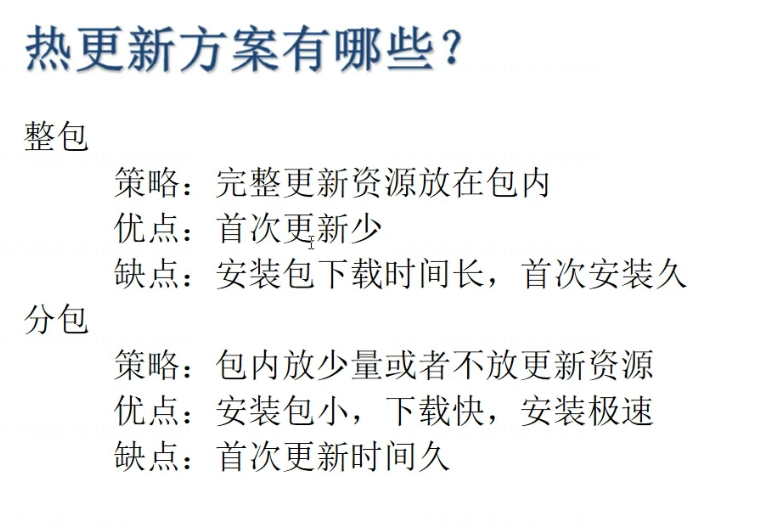
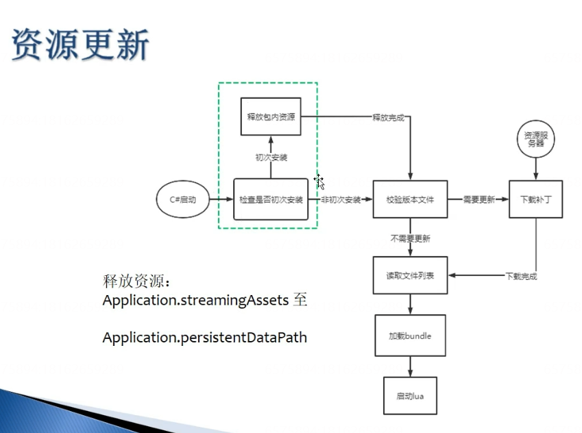
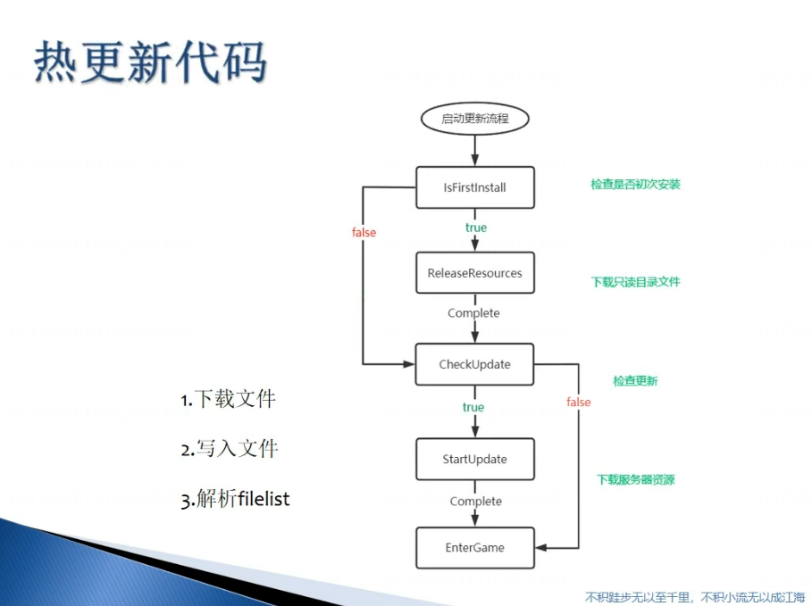

---
layout: post
title: AssetBundle
categories: [unity,游戏开发]
date: 2026-01-31
---

# AssetBundle

[Unity手游实战：从0开始SLG——资源管理系统-基础篇（三）AssetBundle原理](https://zhuanlan.zhihu.com/p/97551363)

[Unity的AssetBundle之间的引用关系是如何理解的？](https://www.zhihu.com/question/58097894/answer/156682400)

[Unity官方文档](https://docs.unity3d.com/cn/current/Manual/AssetBundlesIntro.html)

[AssetBundle依赖打包有哪些注意点](https://blog.uwa4d.com/archives/TechSharing_318.html)

[AssetBundle 全解析](https://zhuanlan.zhihu.com/p/557805161)

[Unity资源加载大师]()

---

- [以下笔记来自Unity独立游戏开发之AssetBundle从入门到掌握]()
    - [02-AssetBundle的定义与作用]()
    - [03-什么是AssetBundle]()
    - [04-AssetBundle使用流程]()
    - [05-使用代码打包AssetBundle]()
    - [06-AssetBundle打包注意事项]()
    - [07-AssetBundle的加载和使用]()
    - [08-AssetBundle分组策略]()
    - [09-AssetBundle分组策略总结]()
    - [10-依赖打�]()�
    - [11-打包选项（AssetBundle压缩方式）]()
    - [12-Manifest文件是干什么的]()
    - [13-资源的依赖关系]()
    - [14-从内存里面加载AssetBundle]()
    - [15-使用WWW.LoadFromCacheOrDownload下载并加载AssetBundle]()
    - [16-搭建简单server服务器]()
    - [17-从服务器端下载AssetBundle]()
    - [18-使用UnityWebRequest下载AssetBundle]()
    - [19-从AssetBundle里面加载资源]()
    - [20-通过Manifest文件得到某个包的依赖]()
    - [21-AssetBundle的卸载]()
    - [22-关于文件校验]()
    - [23-AssetBundle使用的一些问题]()
    - [24-AssetBundle浏览工具]()

# 以下笔记来自[Unity独立游戏开发之AssetBundle从入门到掌握](https://www.bilibili.com/video/BV1Yb4y1U7nt/?spm_id_from=333.1007.top_right_bar_window_custom_collection.content.click&vd_source=b5993c1050361f86e5f8f306b9340ae8)

## 02-AssetBundle的定义与作用

## 03-什么是AssetBundle

## 04-AssetBundle使用流程

## 05-使用代码打包AssetBundle

命名空间

UnityEditor

System.IO

特性

MenuItem

Unity API

BuildPipeline

## 06-AssetBundle打包注意事项

## 07-AssetBundle的加载和使用

Unity API

AssetBundle.LoadFromFile()

## 08-AssetBundle分组策略

## 09-AssetBundle分组策略总结

## 10-依赖打包

## 11-打包选项（AssetBundle压缩方式）

## 12-Manifest文件是干什么的

CRC校验码（类似MD5）

Assets

Dependencies

## 13-资源的依赖关系

AssetBundle包的加载顺序无所谓，但是在加载具体资源之前，必须把依赖的AssetBundle包加载好

## 14-从内存里面加载AssetBundle

IEnumerator

AssetBundle.LoadFromMemoryAsync

## 15-使用WWW.LoadFromCacheOrDownload下载并加载AssetBundle

yield break

string.IsNullOrEmpty(www.error

## 16-搭建简单server服务器

## 17-从服务器端下载AssetBundle

## 18-使用UnityWebRequest下载AssetBundle

UnityWebRequestAssetBundle.GetAssetBundle

DownloadHandlerAssetBundle.GetContent

## 19-从AssetBundle里面加载资源

## 20-通过Manifest文件得到某个包的依赖

## 21-AssetBundle的卸载

## 22-关于文件校验

## 23-AssetBundle使用的一些问题

## 24-AssetBundle浏览工具

UnitySLG-ssetBundle(httpszhuanlan.zhihu.comp)UnityssetBundle(httpswww.zhihu.comquestionnswer)Unity(httpsocs.unity3d.comnurrentManualssetBundlesIntro.html)ssetBundle(httpslog.uwa4d.comrchivesTechSharing_318.html)ssetBundle(httpszhuanlan.zhihu.comp)Unity(httpswww.unitybundlemaster.comp)***TOCUnityssetBundle(httpswww.bilibili.comvideoV1Yb4y1U7ntspm_id_from.1007.top_right_bar_window_custom_collection.content.clickvd_source)-AssetBundle!.png(en-resourcetabase)-ssetBundle!.png(en-resourcetabase)!.png(en-resourcetabase)-AssetBundle!.png(en-resourcetabase)-ssetBundleUnityEditorSystem.IOMenuItemUnityPIuildPipeline-AssetBundle-AssetBundleUnityPIssetBundle.LoadFromFile()-AssetBundle!.png(en-resourcetabase)-AssetBundle!.png(en-resourcetabase)-!.png(en-resourcetabase)-ssetBundle!.png(en-resourcetabase)-ManifestRCMD5ssetspendencies-ssetBundlessetBundle-ssetBundle!.png(en-resourcetabase)IEnumeratorssetBundle.LoadFromMemoryAsync-WWW.LoadFromCacheOrDownloadssetBundleyieldreakstring.IsNullOrEmpty(www.error-server-ssetBundle-UnityWebRequestssetBundleUnityWebRequestAssetBundle.GetAssetBundleownloadHandlerAssetBundle.GetContent-ssetBundle-Manifest-AssetBundle!.png(en-resourcetabase)-!.png(en-resourcetabase)-AssetBundle!.png(en-resourcetabase)-AssetBundle

