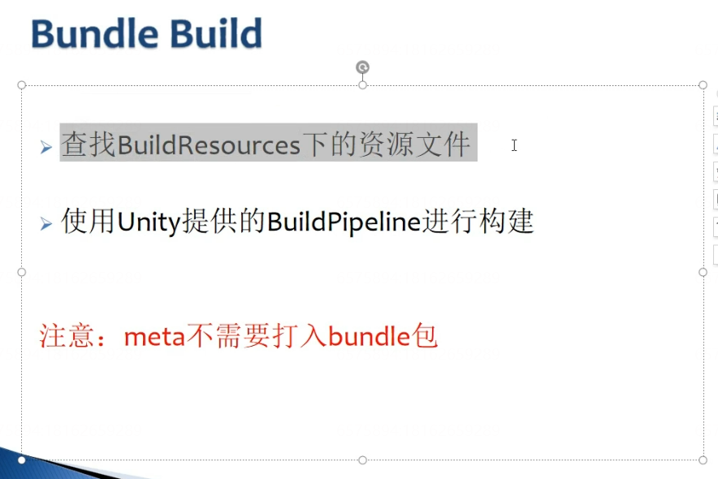
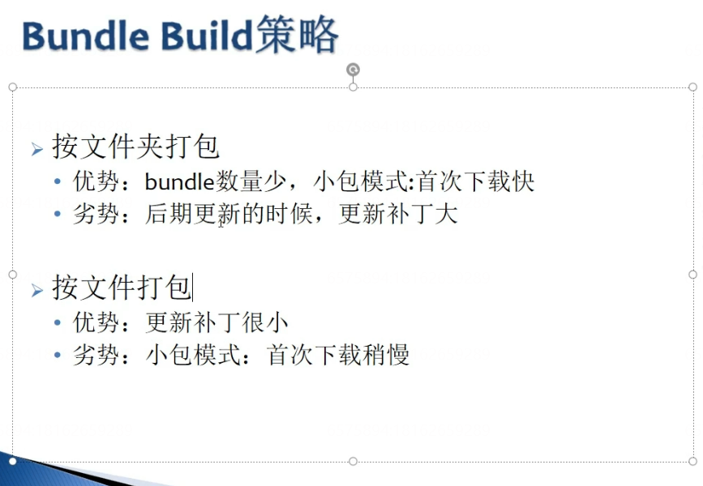

---
layout: post
title: Unity_Shader入门精要
categories: [unity,游戏开发]
date: 2026-01-31
---

# Unity Shader入门精要

- [第4章 学习Shader所需的数学基础]()
    - [4.2 笛卡尔坐标系]()
    - [4.3点和矢量]()
    - [4.6坐标空间]()

# 第4章 学习Shader所需的数学基础

## 4.2 笛卡尔坐标系

基矢量：坐标轴

标准正交基：3个坐标轴互相垂直且长度为1

正交基：坐标轴互相垂直但长度不为1

旋向性：可以通过旋转的方法让两个坐标系的坐标轴指向重合

左手坐标系：

右手坐标系：

## 4.3点和矢量

1. 矢量和标量的乘除
2. 矢量的加减法
3. 矢量的模
4. 单位矢量
5. 矢量的点积
    点积满足交换律
    投影
    公式一：
    公式二：
    
6. 矢量的叉积
    
    

## 4.6坐标空间

模型空间->世界空间->观察空间->裁剪空间（投影矩阵）->屏幕空间

TOCShader.2.3!.png(en-resourcetabase).....!.png(en-resourcetabase)!.png(en-resourcetabase).!.png(en-resourcetabase)!.png(en-resourcetabase).6----!.png(en-resourcetabase)

