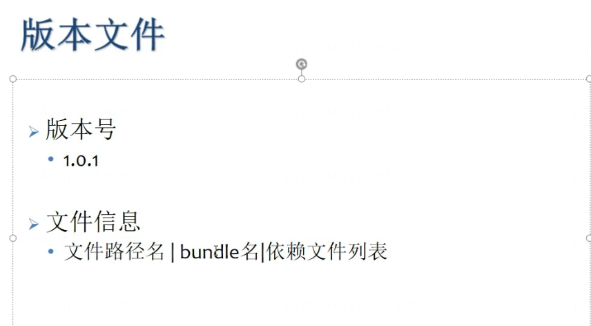

---
layout: post
title: 【唐老狮】Unity热更新解决方案
categories: [unity,游戏开发]
date: 2026-01-31
---

# 【唐老狮】Unity热更新解决方案

[【唐老狮】Unity热更新解决方案](https://www.bilibili.com/medialist/play/79983517?from=space&business=space_series&business_id=602243&desc=1)

本地工程路径：

_E:\CodeProject\UnityProject\BilibiliStudy\ABLesson_

- [【唐老狮】Unity热更新解决方案]()
- [【唐老狮】Unity热更新之AssetBundle]()
    - [P1 AB包理论基础]()
    - [P2 AB包资源打�]()�
    - [P3 AB包资源加载]()
    - [P4 AB包依赖]()
    - [P5 AB包资源管理器-同步加载]()
- [Unity热更新之Lua语法]()
    - [P3 变量]()
    - [P4 字符串]()
    - [P5 运算符]()
    - [P8 函数]()
    - [P9 table表]()
    - [P13 table表的公共操作]()
    - [P14 多脚本执行]()
    - [P16 协同程序]()
    - [P16 协同程序]()
    - [P17 lua面向对象之封�]()�
    - [P18 lua面向对象之继承]()
    - [P19 lua面向对象之多态]()
    - [P22 lua自带库]()
- [出现的一些问题]()

---

# 【唐老狮】Unity热更新解决方案


---

# 【唐老狮】Unity热更新之AssetBundle

## P1 AB包理论基础


## P2 AB包资源打包


打包后会默认打出来一个和Output Path名一样的主包文件以及真正的AB包资源和配置文件

**AssetBundles选项解释**：

Build Target：目标平台

Output Path：输出路径

Clear Folders：打包的时候是否清空文件夹

Copy to StreamingAssets：是否复制到StreamingAssets中

Compression：压缩方式

- No Compression：不压缩
- LZMA：压缩最小，解压缩慢，一个资源就得解压所有
- LZ4：解压缩快，需要哪个资源解压哪个

E T I：资源包中是否包含资源类型信息

F R：重新打包时是否重新构建（不会删除已不存在的旧包）

I T T C：增量构建检查时，忽略类型数的更改

A H：把文件哈希值附加到资源包名上

S M：打包时报错则打包失败

D R B：运行时构建

## P3 AB包资源加载

AB包不能够重复加载，会报错

## P4 AB包依赖

## P5 AB包资源管理器-同步加载

---

# Unity热更新之Lua语法

[【唐老狮】Unity热更新之Lua语法](https://www.bilibili.com/medialist/play/79983517?from=space&business=space_series&business_id=602243&desc=1)

## P3 变量

变量类型

1. nil
2. number
3. string
4. boolean
5. function
6. table
7. userdata
8. thread

## P4 字符串

lua中一个汉字占三个字符

lua支持转义字符

多行打印

`s = [[ 我是 徐航 ]]`

常用字符串方法

```
* string.upper()
* string.lower()
* string.reverse()
* string.find()
* string.sub()
* string.rep() (字符串重复)
* string.gsub() (字符串修改)
* string.byte() (字符转 ASCII码)
* string.char() (ASCII码转 字符)
```

## P5 运算符

- 算术运算符
    `+ - * / % ^(幂运算)`
- 条件运算符
    `> < >= <= == ~=`
- 逻辑运算符
    `&& || !` 对应
    `and or not`
- 位运算符
    lua不支持位运算符
- 三目运算符
    lua不支持三目运算符

## P8 函数

- 变长参数

```
function F7( ... )
    --用一个表存起来再使用变长参数
    arg = { ... }
    for i = 1,#arg do
        print(arg[i])
    end
end
F7(1,"123",true,4,5,6)
```

- 闭包
    函数返回函数

```
function f9(x)
    return function(y)
        return x + y
    end
end
```

## P9 table表

`#表的坑`


## P13 table表的公共操作


## P14 多脚本执行

-- 返回值是Boolean 意思是该脚本是否被执行

package.loaded["test"]

-- 卸载已经执行过的脚本

package.loaded["test"] = nil

## P16 协同程序

func = function()

print(123)

end

co = coroutine.create(func) (thread类型)

coroutine.resume() --重启协程

coroutine.yield() --挂起协程

coroutine.status(协程对象) --获取协程状态

dead、suspended、running

coroutine.running() --获取当前正在运行的协程的线程号

co2 = coroutine.wrap(func) (function类型)

## P16 协同程序

- 元表概念
- 特定操作-__tostring（当子表要被当做字符串使用时，会默认调用这个元表中的tostring方法）
- 特定操作-__call（当子表被当做一个函数来使用时，会默认调用__call中的内容）（当希望传参数时，要记住默认第一个参数，是调用者自己）
- 运算符重载-__add（相当于运算符重载，当子表使用+运算符时会调用该方法）
    __sub，__mul，__div，__mod，__pow（+，-，* ，/，%）
    __eq，__lt，__le，__concat（==，<，<=，.. ）
    (如果要用条件运算符来比较两个对象，这两个对象的元表要一致才能准确调用方法)
- 特定操作-__index（当子表中找不到某一个属性时会到元表中__index指定的表去找索引）（__index的赋值，写在表外面来初始化）
    __newindex（当赋值时，如果赋值一个不存在的索引，那么会把这个值赋值到newindex所指的表中，不会修改自己）
- getnetatable
- rawget（只在表内找而不去元表查）
- rawset

## P17 lua面向对象之封装

## P18 lua面向对象之继承

## P19 lua面向对象之多态

## P22 lua自带库

os.time()

os.date()

---

# 出现的一些问题

[创建新项目时出现 2 个错误](https://forum.unity.com/threads/gets-2-errors-while-creating-new-project.1198063/)



---

**问题描述**：

学习【唐老狮】Unity热更新之AssetBundle P3时

点击运行图片没有加载显示出来

**解决方案**：

将图片的TextureType修改为2d/UI模式


Unity(httpswww.bilibili.commedialistplayromspaceusinessspace_seriesusiness_idsc)*EodeProjectUnityProjectilibiliStudyLesson*TOC***Unity!.png(en-resourcetabase)***UnityssetBundleP1!.png(en-resourcetabase)P2!.png(en-resourcetabase)OutputPath**AssetBundles**uildTargetOutputPathlearoldersopytoStreamingAssetsStreamingAssetsompression*Noompression*LZMA*LZ4TIRITTHSMRP3P4P5-***UnityLuaUnityLua(httpswww.bilibili.commedialistplayromspaceusinessspace_seriesusiness_idsc)P3.nil.number.string.oolean.unction.table.userdata.threadP4lualuas*string.upper()*string.lower()*string.reverse()*string.find()*string.sub()*string.rep()()*string.gsub()()*string.byte()(SCII)*string.char()(ASCII)P5*-*()*~*!ndornot*lua*luaP8*unction(...)--rg...orirgoprint(argi)ndnd(1true)*unction(x)returnunction(y)returnxyndndP9table!.png(en-resourcetabase)!.png(en-resourcetabase)P13table!.png(en-resourcetabase)!.png(en-resourcetabase)P14--ooleanpackage.loadedtest--package.loadedtestnilP16uncunction()print(123)ndooroutine.create(func)(thread)oroutine.resume()--oroutine.yield()--oroutine.status()--suspendedrunningoroutine.running()--o2oroutine.wrap(func)(function)P16**-__tostringtostring*-__call__call*-__add__sub__mul__div__mod__pow-*__eq__lt__le__concat..()*-__index__index__index__newindexnewindex*getnetatable*rawget*rawsetP17luaP18luaP19luaP22luaos.time()os.date()***(httpsorum.unity.comthreadsgets-2-errors-while-creating-new-project.1198063)!.png(en-resourcetabase)*******UnityssetBundleP3****TextureTypeUI!.png(en-resourcetabase)

