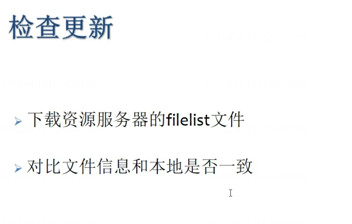
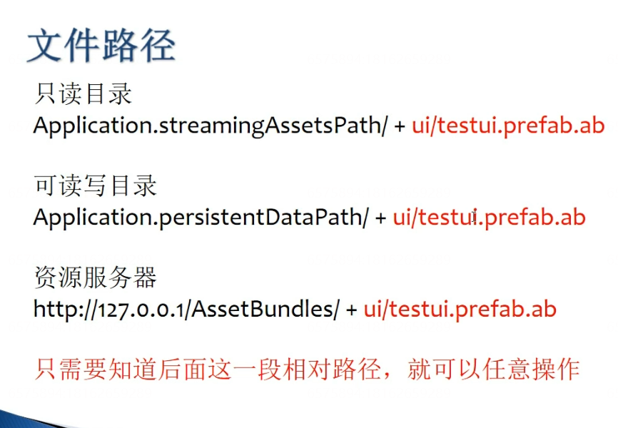
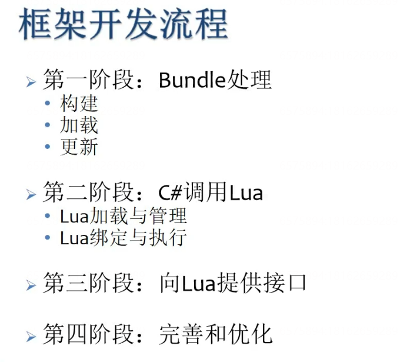
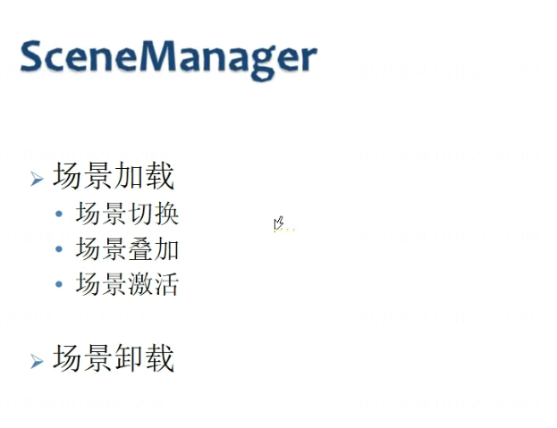
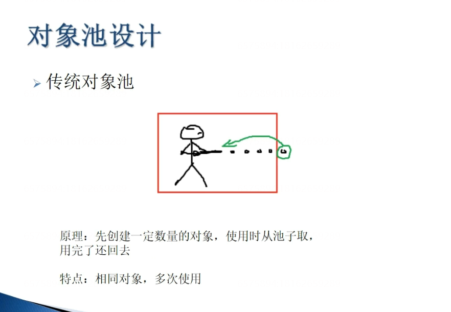
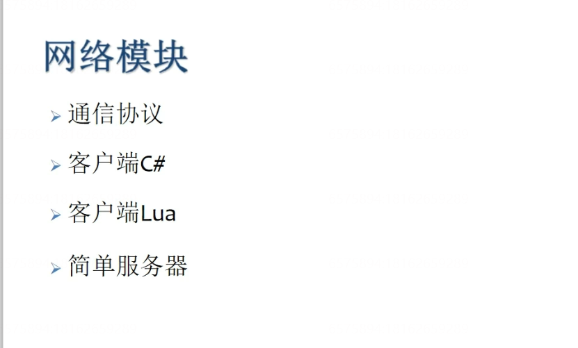

---
layout: post
title: （视频）【热更新专题】从0搭建XLua热更新框架
categories: [unity,游戏开发]
date: 2026-01-31
---

# （视频）【热更新专题】从0搭建XLua热更新框架

- [1.资源目录划分]()
    - [热更新]()
- [2.Bundle构建工具]()
- [3.完善BuildTool]()
- [4.资源加载]()
- [5.资源路径规划]()
- [6.编辑器模式加载资源]()
- [7-1.热更新流程]()
- [7-2.热更新细节分析]()
- [7-3.热更新需要做哪些事]()
- [7-5.热更新测试]()
- [8.Lua管理器]()
- [9-1.LuaBehaviour]()
- [9-2.UILogic]()
- [9-3.UI层级]()
- [10-1.实体管理与场景管理]()
- [10-2.场景管理测试]()
- [11.声音管理器_1]()
- [12.事件管理器_1]()
- [13-1.对象池_1]()
- [13-2.对象池测试_1]()
- [13-3.AssetBundle卸载_1]()
- [14-1.编译Xlua第三方库_1]()
- [14-2.网络客户端（C#）_1]()
- [14-3.网络客户端（Lua）_1]()
- [14-4.测试网络部分_1]()
- [15-1.真机调试（1）_1]()
- [15-2.真机调试（2）_1]()

# 1.资源目录划分

## 热更新

# 2.Bundle构建工具

# 3.完善BuildTool

加载的资源图片是丢失的

# 4.资源加载

# 5.资源路径规划

# 6.编辑器模式加载资源

# 7-1.热更新流程

# 7-2.热更新细节分析

# 7-3.热更新需要做哪些事

# 7-5.热更新测试

可读写目录：

C:\Users\xuhang\AppData\LocalLow\DefaultCompany\XLuaFrameWork

# 8.Lua管理器

# 9-1.LuaBehaviour

# 9-2.UILogic

# 9-3.UI层级

# 10-1.实体管理与场景管理

# 10-2.场景管理测试

# 11.声音管理器_1

# 12.事件管理器_1

# 13-1.对象池_1

# 13-2.对象池测试_1

# 13-3.AssetBundle卸载_1

# 14-1.编译Xlua第三方库_1

# 14-2.网络客户端（C#）_1

# 14-3.网络客户端（Lua）_1

# 14-4.测试网络部分_1

# 15-1.真机调试（1）_1

# 15-2.真机调试（2）_1

TOC.!.png(en-resourcetabase)!.png(en-resourcetabase).Bundle!.png(en-resourcetabase)!.png(en-resourcetabase)!.png(en-resourcetabase).uildTool!.png(en-resourcetabase)!.png(en-resourcetabase)!.png(en-resourcetabase).!.png(en-resourcetabase)..-1.!.png(en-resourcetabase)!.png(en-resourcetabase)-2.!.png(en-resourcetabase)!.png(en-resourcetabase)!.png(en-resourcetabase)-3.!.png(en-resourcetabase)-5.UsersxuhangppDataLocalLowultCompanyXLuaFrameWork.Lua!.png(en-resourcetabase)!.png(en-resourcetabase)-1.LuaBehaviour-2.UILogic-3.UI!.png(en-resourcetabase)!.png(en-resourcetabase)-1.!.png(en-resourcetabase)!.png(en-resourcetabase)-2.._1!.png(en-resourcetabase)._1-1._1!.png(en-resourcetabase)!.png(en-resourcetabase)-2._1-3.AssetBundle_1!.png(en-resourcetabase)!.png(en-resourcetabase)-1.Xlua_1!.png(en-resourcetabase)!.png(en-resourcetabase)-2._1-3.Lua_1!.png(en-resourcetabase)-4._1-1._1-2._1

