---
layout: post
title: 项目相关问题
categories: [工作]
date: 2026-01-31
---

# 项目相关问题

**问题描述**：

使用Unity时打开C# 弹出opening visual studio一直停在这个界面

**解决方案**：

- 查看项目路径是否有中文
- 工程比较大，里面有一些文件错了，导致这里卡住建议先关闭unity，然后把Library文件夹，obj文件夹全部删除掉，然后重新打开
- 先打开visual studio，再双击打开c#

---

**问题描述**：

修改lua UI代码后没生效

**解决方案**：

需要在initUI()里添加

---

**问题描述**：

Unity报错

**解决方案**：

因为打开的prefab没有被正确释放，没有被unity正确的Destroy掉，所以报错

重新启动游戏即可

---

**问题描述**：

点击事件无反应

**解决方案**：

添加ListItem的时候要给生成出来的Item添加点击事件，而不是预制体上的

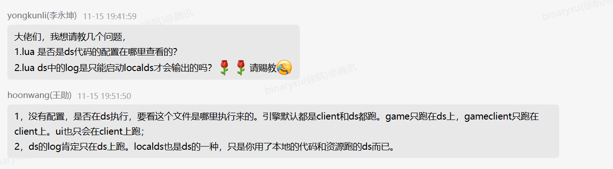

---

**问题描述**：

研究所点击后不断报错

**解决方案**：

不需要调用removeAllChildren方法

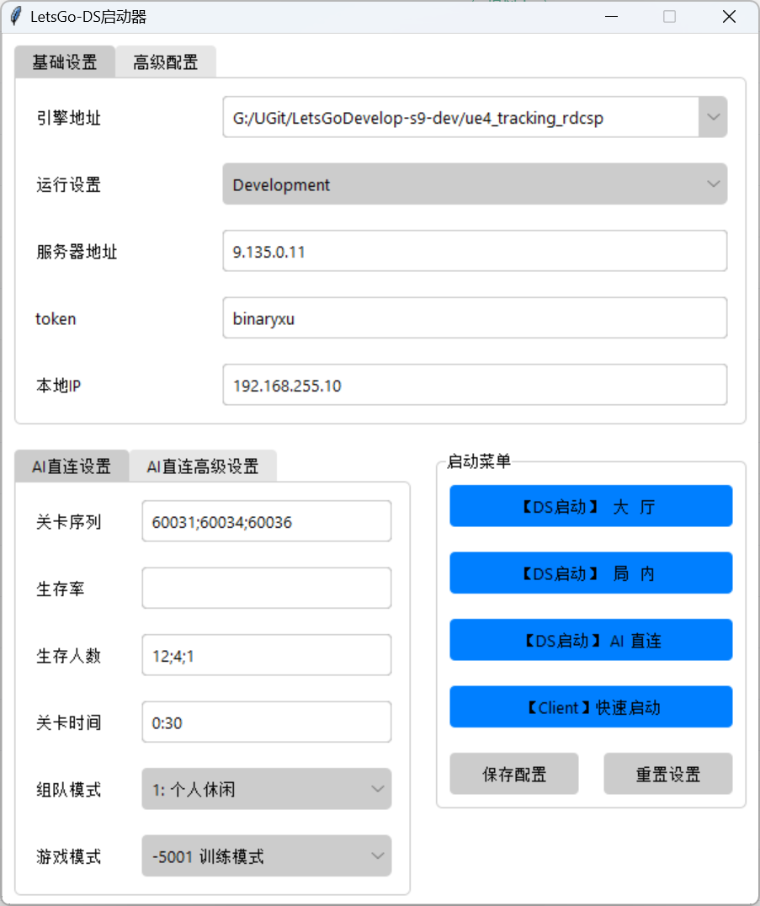

---

**问题描述**：

addChild参数错误

**解决方案**：

使用gameObject

---

**问题描述**：

图片显示较暗，字未显示

**解决方案**：

字体问题是因为字体框大小太小了，

图片显示问题需要调整Button的Transition模式（调成纯白）

然后再修改回SpriteSwap

---

**问题描述**：

虚拟列表最下面一排没有平滑显现出来

**解决方案**：

因为列表子项位置和锚点有问题，在子项中添加Vertical layout Group来自动排版

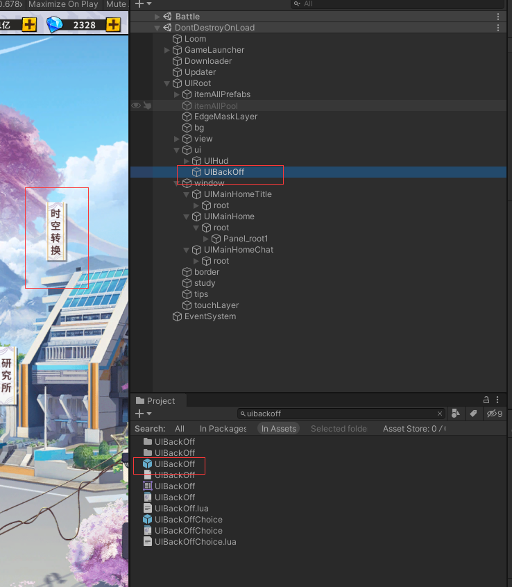

---

**问题描述**：

UI打不开，发现场景里有同名空物体

**解决方案**：

因为在initUI处createNode的时候，如果没找到prefab，会直接创建一个空物体出来，代码写好，重新启动客户端即可

---

**问题描述**：

打开时空转换报错

**解决方案**：

还没加载完就给删掉了，找不到对象所以报错

---

**问题描述**：

时空转换中Panel_model点击没反应

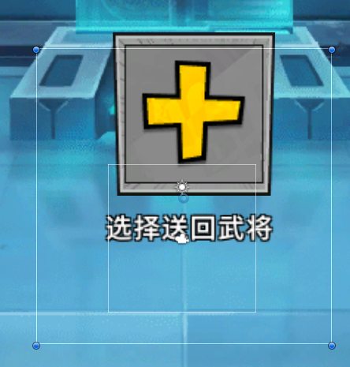

**解决方案**：

点击节点是个空节点，射线检测属性检测不到

加个透明的image即可

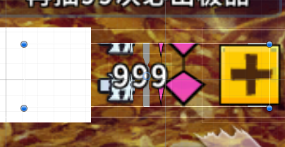

**相关信息**：

[Unity 之 UGUI Button 点击无响应问题汇总](https://blog.csdn.net/weixin_43149049/article/details/108420831)

---

**问题描述**：

图片显示奇怪

**解决方案**：

删除Sliced Filled Image组件

新加个image用之前的图片即可

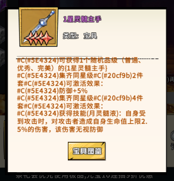

---

**问题描述**：

UGUI中Text文本框的自动调整，字体大小的自适应调节

**解决方案**：

[UGUI中Text文本框的自动调整，字体大小的自适应调节](https://blog.csdn.net/mo_qi_qi/article/details/108071822)

1. UGUI text框大小固定，里面字体大小随着文字增多逐渐变小的设置（很简单）
2. UGUI text框大小不固定，text框随着字数增加逐渐拉长但是字体的大小不变,无背景（需要用到Content Size Fitter组件）
3. UGUI text框大小不固定，text框随着字数增加逐渐拉长字体的大小不变，有背景（需要用到Content Size Fitter和Vertical Layout Group组件）

---

**问题描述**：

列表项未对齐

**解决方案**：

列表子项大小是0.8不是原大小，此处Vertical Layout Group组件要勾选Use Child Scale选项

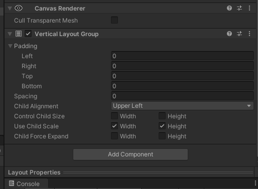

---

**问题描述**：

contentsizefitter会延迟刷新，导致无法及时获得当前属性

**解决方案**：

用LayoutRebuilder.ForceRebuildLayoutImmediate方法刷新后再获取

[Unity功能 解决使用 contentsizefitter 组件后不能获取大小的问题](https://blog.csdn.net/cuijiahao/article/details/109259425)

---

**问题描述**：

设置坐标与显示坐标不一致

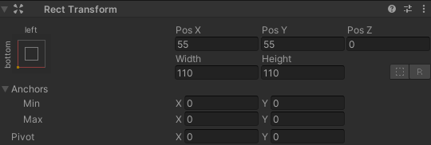

**解决方案**：

原理是因为父物体锚点和子物体锚点不一致

1. Inspector面板中Transform的位置信息显示的是localPosition
2. Inspector面板中RectTransform的位置信息显示的是anchoredPosition3D

[RectTransform中localPosition与anchoredPosition的区别](https://blog.csdn.net/weixin_43112045/article/details/89105049?spm=1001.2101.3001.6650.1&utm_medium=distribute.pc_relevant.none-task-blog-2ultTRLISTRate-1-89105049-blog-98485356.pc_relevant_antiscanv2&depth_1-utm_source=distribute.pc_relevant.none-task-blog-2ultTRLISTRate-1-89105049-blog-98485356.pc_relevant_antiscanv2&utm_relevant_index=2)

---

**问题描述**：

获取text对象并setString时对象为空

但是能获取到image对象且能hide()

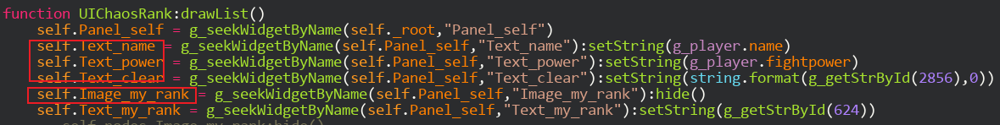

**解决方案**：

原理是因为setString函数没有返回值，而hide()函数有返回值

修改setString返回值为gameObject即可

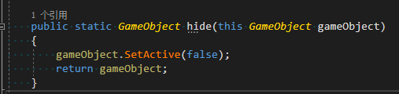

---

**问题描述**：

排序顺序错乱

**解决方案**：

排序依据的伤害值是string类型，所以跟预想的顺序不一致

**问题描述**：

LoopGridView刷新后顺序反了

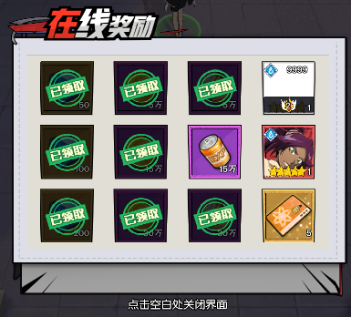

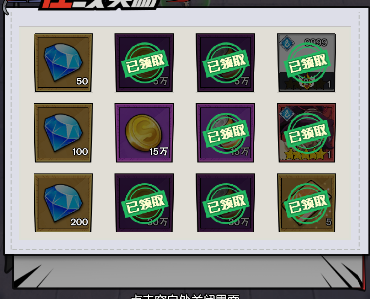

**解决方案**：

因为用的对象池，所以会有残留变化，需要在updateItem时将物体都重新刷掉

**问题描述**：

带空格的文本到unity显示时会变成换行

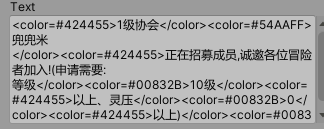

**解决方案**：

这个功能是Unity用于英语等西文的，是为了保证单词不会分开显示，所以第一行空格后面的字被Unity当成一个单词给换行处理了

[Unity Text添加空格导致换行问题](http://t.zoukankan.com/Fflyqaq-p-13545797.html)

****Unityopeningvisualstudio!.png(en-resourcetabase)******unityLibraryobj*visualstudio*******luaUI!.png(en-resourcetabase)****initUI()*******Unity!.png(en-resourcetabase)****prefabunitystroy***********ListItemItem!.png(en-resourcetabase)*******!.png(en-resourcetabase)****removeAllChildren!.png(en-resourcetabase)*******hild!.png(en-resourcetabase)****gameObject!.png(en-resourcetabase)*******!.png(en-resourcetabase)!.png(en-resourcetabase)****uttonTransition!.png(en-resourcetabase)!.png(en-resourcetabase)SpriteSwap*******!.png(en-resourcetabase)****VerticallayoutGroup!.png(en-resourcetabase)*******UI!.png(en-resourcetabase)****initUIreateNodeprefab*******!.png(en-resourcetabase)****!.png(en-resourcetabase)*******Panel_model!.png(en-resourcetabase)!.png(en-resourcetabase)****image!.png(en-resourcetabase)****UnityUGUIutton(httpslog.csdn.netweixin_43149049rticletails)*******!.png(en-resourcetabase)****SlicedilledImageimage!.png(en-resourcetabase)*******UGUIText!.png(en-resourcetabase)****UGUIText(httpslog.csdn.netmo_qi_qirticletails).UGUItext.UGUItexttextontentSizeitter.UGUItexttextontentSizeitterVerticalLayoutGroup*******!.png(en-resourcetabase)****.8VerticalLayoutGroupUsehildScale!.png(en-resourcetabase)!.png(en-resourcetabase)*******ontentsizefitter****LayoutRebuilder.ForceRebuildLayoutImmediateUnityontentsizefitter(httpslog.csdn.netuijiahaorticletails)*******!.png(en-resourcetabase)!.png(en-resourcetabase)****.InspectorTransformlocalPosition.InspectorRectTransformnchoredPosition3DRectTransformlocalPositionnchoredPosition(httpslog.csdn.netweixin_43112045rticletailsspm.2101.3001.6650.1utm_mediumistribute.pc_relevant.none-task-blog-2ultTRLISTRate-1-89105049-blog-98485356.pc_relevant_antiscanv2pth_1-utm_sourceistribute.pc_relevant.none-task-blog-2ultTRLISTRate-1-89105049-blog-98485356.pc_relevant_antiscanv2utm_relevant_index)*******textsetStringimagehide()!.png(en-resourcetabase)****setStringhide()setStringgameObject!.png(en-resourcetabase)!.png(en-resourcetabase)*******!.png(en-resourcetabase)****string****LoopGridView!.png(en-resourcetabase)!.png(en-resourcetabase)****updateItem****unity!.png(en-resourcetabase)!.png(en-resourcetabase)****UnityUnityUnityText(httpt.zoukankan.comlyqaq-p-13545797.html)

